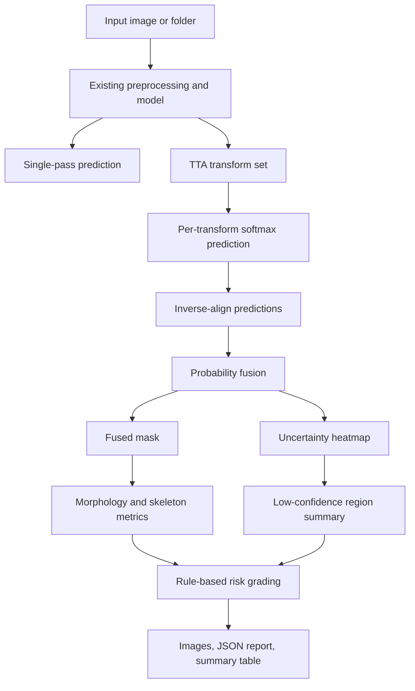

# Tunnel Defect Confidence Risk Plan

## Summary

Implement a Windows-friendly post-inference pipeline for the existing tunnel defect segmentation baseline. The plan covers multi-pose prediction fusion, uncertainty heatmaps, skeleton and morphology measurements, interpretable risk grading, report output, and comparison artifacts while keeping v1 independent of model retraining.

---

## Problem Frame

The current project can train and evaluate a six-class tunnel defect segmentation model, and it can save simple prediction overlays. That is enough to show a mask, but not enough to show whether the mask is reliable, which areas need review, or how a detected defect should be summarized for inspection or patent evidence.

The requirements document chooses a post-inference module rather than a new backbone. This plan keeps that direction: reuse the trained checkpoint, add deterministic inference-time perturbations, fuse aligned predictions, quantify disagreement, measure defect geometry, and produce explainable risk outputs.

---

## Requirements

**Inference and fusion**

- R1. The implementation must reuse the existing trained segmentation checkpoint and preprocessing conventions. Covers origin R1.
- R2. The implementation must support a fixed, small TTA set with reversible transforms suitable for tunnel images. Covers origin R2.
- R3. The implementation must align all TTA predictions back to the original resized inference grid and fuse class probabilities or masks into a final prediction. Covers origin R3.
- R4. The implementation must compute uncertainty from disagreement across TTA predictions and save it as both numeric data and a visual heatmap. Covers origin R4 and R6.

**Morphology and risk**

- R5. The implementation must measure defect-class regions with area ratio, connected components, skeleton length, dominant direction, and fragmentation indicators. Covers origin R5 and R7.
- R6. The implementation must calculate image-level and class-level risk using explainable rules over defect extent, morphology, class type, and uncertainty. Covers origin R8 and R9.
- R7. The implementation must separate uncertain regions from stable defect evidence in the report. Covers origin R6 and R9.

**Artifacts and evaluation**

- R8. The implementation must save fused mask, overlay, uncertainty heatmap, skeleton/morphology view, and a structured per-image report. Covers origin R10 and R13.
- R9. The implementation must support folder-level batch processing and produce an aggregate summary. Covers origin R1 and R10.
- R10. The implementation must compare single-pass prediction with fused prediction where labels are available. Covers origin R11 and R12.
- R11. The implementation must keep v1 runnable on Windows without custom compilation or CUDA extensions. Covers origin success criteria S1 and scope boundaries.

---

## Key Technical Decisions

- **Manual TTA implementation first:** Use local PyTorch/PIL/torchvision transforms rather than adding `ttach` as a hard dependency. `ttach` remains a reference for wrapper shape, but a local implementation avoids Windows package friction and keeps reversible transform handling explicit.
- **Probability fusion over mask voting:** Prefer averaging softmax probabilities after inverse transforms, then derive fused masks from the averaged probabilities. This preserves confidence information for entropy and variance-style uncertainty instead of throwing it away early.
- **Uncertainty as normalized disagreement:** Store uncertainty as normalized entropy and optionally class-disagreement rate. Entropy gives a dense heatmap, while disagreement rate is easy to explain in patent text.
- **Morphology as post-processing, not training loss:** Use OpenCV connected components and scikit-image skeletonization for v1. Training-time topology losses are deferred because they add training cost and Windows complexity.
- **Rule-based risk scoring:** Start with configurable thresholds for area, length, connectedness, class severity, and uncertainty. This is easier to inspect, tune, and describe than a learned risk model.
- **Root-level modules:** Follow the current repo style of small root-level Python scripts and adapters. Avoid introducing a package layout unless implementation shows root-level imports becoming painful.

---

## High-Level Technical Design

The model-loading and preprocessing behavior should stay compatible with `infer_five_images.py` and `train_resnet50.py`. New logic should be separable enough that unit tests can exercise fusion, uncertainty, morphology, and risk scoring without loading the full checkpoint.

---

## Implementation Units

### U1. TTA Prediction and Fusion Core

- **Goal:** Add reusable functions for reversible inference-time transforms, model prediction, inverse alignment, probability fusion, and uncertainty calculation.
- **Files:** `tta_confidence.py`
- **Patterns to follow:** Reuse preprocessing conventions from `infer_five_images.py`; reuse class count and palette conventions from `train_resnet50.py`.
- **Test file:** `tests/test_tta_confidence.py`
- **Test scenarios:**
  - Identity-only TTA returns the same fused mask shape as a single prediction.
  - Horizontal flip TTA can be inverse-aligned back to the original grid.
  - Probability fusion preserves class dimension and produces valid per-pixel probabilities.
  - Entropy uncertainty is low for one-hot probabilities and higher for ambiguous probabilities.
  - Class-disagreement uncertainty increases when transform predictions disagree.
- **Verification:** Unit tests should run without a checkpoint by using synthetic probability tensors and stub predictions.

### U2. Morphology and Skeleton Metrics

- **Goal:** Measure defect regions from a fused mask using Windows-friendly image processing.
- **Files:** `morphology_adapter.py`
- **Patterns to follow:** Keep array inputs and outputs plain `numpy` structures like `metrics_adapter.py`.
- **Test file:** `tests/test_morphology_adapter.py`
- **Test scenarios:**
  - Empty masks return zero area, zero components, zero skeleton length, and no dominant direction.
  - A single horizontal synthetic defect reports one component, nonzero skeleton length, and horizontal-like direction.
  - Two separated components report a higher component count and fragmentation indicator.
  - Background pixels are excluded from defect risk measurements.
  - Small noisy components can be counted or filtered according to a configurable minimum area.
- **Verification:** Tests should use tiny synthetic masks so they are deterministic and fast.

### U3. Explainable Risk Scoring

- **Goal:** Convert morphology and uncertainty summaries into image-level and class-level risk labels with reasons.
- **Files:** `risk_adapter.py`
- **Patterns to follow:** Keep metric computation deterministic and serializable; avoid hidden model state.
- **Test file:** `tests/test_risk_adapter.py`
- **Test scenarios:**
  - No detected defect returns the lowest risk level with a clear reason.
  - Large defect area increases risk compared with a small defect.
  - High uncertainty produces a manual-review suggestion even when morphology is modest.
  - Fragmented or long skeletons increase risk according to configured thresholds.
  - Class severity weighting can rank the same geometry differently by defect class.
- **Verification:** Tests should assert both risk level and explanation fields, not only numeric scores.

### U4. Batch Runner and Artifact Writer

- **Goal:** Provide a user-facing script that runs the full pipeline for one image or a folder and saves patent-friendly artifacts.
- **Files:** `run_confidence_risk.py`
- **Patterns to follow:** Match the simple script style of `infer_five_images.py`; default outputs should live under the active experiment directory unless the user passes another output directory.
- **Test file:** `tests/test_confidence_risk_outputs.py`
- **Test scenarios:**
  - A synthetic or mocked run creates the expected artifact names for one image.
  - The report includes fused prediction stats, uncertainty summary, morphology metrics, risk label, and review suggestions.
  - Folder mode creates one report per image plus an aggregate summary.
  - Missing input paths fail with a clear error rather than silently skipping the whole run.
  - CPU execution path remains valid when CUDA is unavailable.
- **Verification:** Use mocking for model predictions in tests; reserve real checkpoint execution for manual or smoke verification.

### U5. Evaluation and Comparison Support

- **Goal:** Add a small evaluation helper for comparing single-pass and fused predictions on labeled samples.
- **Files:** `evaluate_confidence_risk.py`
- **Patterns to follow:** Reuse `data_adapter.py` for sample discovery and `metrics_adapter.py` for confusion-matrix metrics.
- **Test file:** `tests/test_confidence_risk_eval.py`
- **Test scenarios:**
  - The evaluator can compare synthetic single-pass and fused masks against a synthetic label mask.
  - Per-class IoU and aggregate mIoU are reported for both prediction modes.
  - The evaluator records uncertainty summary statistics alongside segmentation metrics.
  - Weak-class slices such as horizontal or blocky can be filtered or summarized separately.
  - Missing labels are reported as unsupported for metric comparison but still allow artifact generation.
- **Verification:** Add a small synthetic test path first; use the real dataset for an optional smoke run after implementation.

### U6. Documentation and Patent-Figure Guidance

- **Goal:** Document how to run the module and which outputs support patent disclosure.
- **Files:** `README.md`, `docs/patent-notes/tunnel-defect-confidence-risk.md`
- **Patterns to follow:** Keep README additions concise and operational, with longer patent-oriented explanation in the docs note.
- **Test file:** `tests/test_docs_artifact_contract.py`
- **Test scenarios:**
  - The documented artifact names match what the runner writes.
  - The patent notes mention the full method chain: TTA consistency, uncertainty, morphology, risk, and review suggestion.
  - The documentation does not claim structural safety diagnosis beyond image-based risk guidance.
- **Verification:** Lightweight text-contract tests are enough; no browser or UI verification is needed.

---

## Acceptance Examples

- AE1. Stable defect result
  - **Covers:** R1, R3, R4, R6, R8
  - **Given:** A defect is predicted consistently across the configured TTA variants.
  - **When:** The runner processes the image.
  - **Then:** The fused mask contains the defect, the uncertainty heatmap is low in the defect core, and the report assigns risk mainly from morphology rather than uncertainty.

- AE2. Weak-class inconsistent result
  - **Covers:** R4, R5, R7, R10
  - **Given:** A horizontal or blocky region shifts class or location across TTA variants.
  - **When:** Predictions are aligned and fused.
  - **Then:** The uncertainty heatmap highlights the region and the report recommends manual review for that class or region.

- AE3. Batch patent artifact export
  - **Covers:** R8, R9
  - **Given:** A folder of representative tunnel inspection images.
  - **When:** The batch runner completes.
  - **Then:** The output folder contains per-image visual artifacts, per-image structured reports, and an aggregate summary suitable for selecting patent figures.

- AE4. Label-based comparison
  - **Covers:** R10
  - **Given:** A labeled dataset sample discovered through the existing adapter.
  - **When:** The evaluator compares single-pass and fused predictions.
  - **Then:** It reports metrics for both modes without changing the existing training code.

---

## Scope Boundaries

- Keep v1 as a post-inference feature; do not retrain or redesign the segmentation model.
- Do not add a web app, desktop UI, or inspection-management platform.
- Do not add custom CUDA, C++ extensions, or persistent-homology dependencies.
- Do not claim actual structural safety diagnosis; report image-based risk and review guidance.
- Do not make real-time video or multi-date disease progression part of this plan.

### Deferred to Follow-Up Work

- Training-side weak-class loss weighting or topology-aware losses.
- Multi-date defect growth comparison.
- A GUI or report dashboard.
- A learned risk model trained from expert labels.

---

## System-Wide Impact

- **Training pipeline:** No change required for v1.
- **Inference behavior:** Adds a slower but richer inference path; existing single-pass inference can remain unchanged.
- **Outputs:** Adds new visual and structured artifacts under experiment output folders.
- **Testing posture:** Introduces a `tests/` folder and synthetic tests for pure logic, reducing dependence on checkpoint availability during validation.
- **Patent support:** Creates a repeatable artifact chain that can support method-flow figures and qualitative comparison figures.

---

## Risks and Dependencies

- **Runtime cost:** TTA multiplies inference time by the number of transforms. Mitigation: keep the default transform set small and configurable.
- **Transform mismatch:** Aggressive rotations or brightness changes can create unrealistic tunnel images. Mitigation: start with conservative flips, small rotations, and mild brightness perturbations.
- **Skeleton noise:** Skeletonization can exaggerate tiny false positives. Mitigation: use minimum-area filtering and report uncertainty alongside skeleton metrics.
- **Threshold arbitrariness:** First-pass risk thresholds may feel subjective. Mitigation: make thresholds configurable and surface the reasons in every report.
- **Checkpoint availability:** Full smoke verification depends on the trained checkpoint. Mitigation: unit tests use synthetic data and mocked predictions.

---

## Verification Plan

- Run synthetic unit tests for TTA fusion, uncertainty, morphology, risk scoring, artifact contracts, and evaluator behavior.
- Run a smoke inference on the existing five-image style sample or a small local folder to verify real artifact generation.
- Run an optional labeled-data comparison on a small subset to confirm single-pass and fused metrics are both emitted.
- Inspect one complete output bundle manually: fused mask, overlay, uncertainty heatmap, skeleton/morphology view, JSON report, and aggregate summary.

---

## Sources and Research

- Origin requirements: `docs/brainstorms/2026-06-01-tunnel-defect-confidence-risk-requirements.md`
- Existing project context: `README.md`
- Existing model and evaluation pipeline: `train_resnet50.py`
- Existing inference pattern: `infer_five_images.py`
- Existing dataset loading: `data_adapter.py`
- Existing metrics adapter: `metrics_adapter.py`
- Current baseline report: `experiments/ResNet50_FCN_6cls_fixed/eval_report.txt`
- TTA uncertainty basis: [Aleatoric uncertainty estimation with test-time augmentation for medical image segmentation](https://arxiv.org/abs/1807.07356)
- TTA implementation reference: [qubvel/ttach](https://github.com/qubvel/ttach)
- Skeletonization reference: [scikit-image skeletonize documentation](https://scikit-image.org/docs/0.21.x/auto_examples/edges/plot_skeleton.html)
- Connected-component reference: [OpenCV connectedComponentsWithStats documentation](https://docs.opencv.org/3.4/d3/dc0/group__imgproc__shape.html)
- Crack morphology support: [A Crack Segmentation Model Combining Morphological Network and Multiple Loss Mechanism](https://pmc.ncbi.nlm.nih.gov/articles/PMC9919181/)
- Crack skeleton/connectivity support: [Beyond Conventional Losses: Skeleton-Based Loss for Preserving Connectivity in Crack Segmentation](https://www.mdpi.com/2673-7590/5/4/177)
