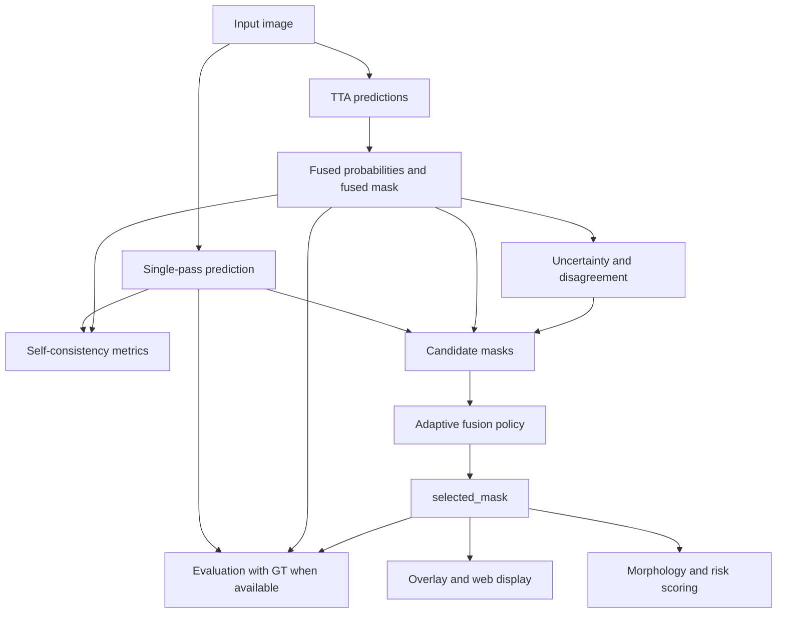

# Adaptive Fusion mIoU Recovery Plan

## Summary

Add an adaptive fusion layer on top of the existing confidence-risk pipeline so the system no longer blindly replaces the single-pass mask with the TTA-fused mask. The selected output should preserve the interpretability gains from uncertainty, disagreement, skeleton morphology, and risk scoring while preventing fused-mask shrinkage from lowering mIoU when labels are available.

---

## Problem Frame

The current confidence-risk module implemented the original post-inference requirements: TTA prediction, fused mask, uncertainty heatmap, skeleton/morphology metrics, and risk scoring. Full evaluation showed that fixed TTA fusion is more conservative than the single-pass prediction:

| Scope | Samples | Single mIoU | Fused mIoU | Delta |
|---|---:|---:|---:|---:|
| `test` split | 150 | 0.3305 | 0.3165 | -0.0140 |
| `all` data | 1000 | 0.3725 | 0.3287 | -0.0438 |

This does not invalidate the confidence-risk direction, because the module's primary value is reliability explanation and review guidance. But for a stronger demo and patent story, the pipeline should select or construct an output mask adaptively: use fused evidence when it helps, retain single-pass evidence when fusion removes small defects, and report self-consistency when no ground truth is available.

---

## Requirements

**Adaptive mask selection**

- R1. The pipeline must keep `single_mask` and `fused_mask` as explicit artifacts and add a separate `selected_mask` artifact for the mask chosen by adaptive fusion.
- R2. The adaptive policy must choose between `single`, `fused`, and at least one `hybrid` candidate using only inference-time evidence: self IoU, foreground area ratio, uncertainty, disagreement, and morphology.
- R3. The policy must protect small defect regions from being erased by fusion when the fused foreground area shrinks sharply relative to the single-pass foreground area.
- R4. The policy must still prefer fused output when single and fused are stable and consistent, because fused output remains useful for uncertainty-aware review.

**Metric correctness**

- R5. The evaluator must report `single_mIoU`, `fused_mIoU`, and `selected_mIoU` when ground-truth labels are available.
- R6. The web app and JSON report must continue to show `N/A` for real mIoU on user-uploaded images without ground-truth labels.
- R7. For unlabeled uploads, the system may report `Self IoU` or `Single/Fused agreement`, but it must clearly state that these are model self-consistency metrics rather than true segmentation accuracy.

**Risk and artifact compatibility**

- R8. Risk scoring, morphology, skeleton view, overlay, and web display must use `selected_mask` by default after adaptive fusion ships.
- R9. The report must preserve backward compatibility by still exposing existing `single_prediction_stats`, `fused_prediction_stats`, uncertainty summaries, and risk reasons.
- R10. The implementation must remain Windows-friendly and must not require retraining or custom compiled extensions.

---

## Key Technical Decisions

- **Selected mask is a new output, not a rename of fused mask:** Keeping `fused_mask` lets reviewers inspect what TTA produced, while `selected_mask` becomes the practical output for mIoU recovery and downstream risk scoring.
- **Real mIoU remains label-only:** mIoU must compare prediction against ground-truth masks. Upload-only images cannot produce true mIoU, so the web UI should keep `N/A` and add self-consistency metrics instead of fabricating accuracy.
- **Conservative adaptive policy first:** A policy that falls back to `single_mask` when fusion looks risky can match the single-pass baseline by construction, then selectively use fused/hybrid masks where evidence supports it.
- **Tune on validation, report on test/all:** Thresholds for area shrinkage, self IoU, and uncertainty should be selected using `val` or a small labeled calibration split, then evaluated on `test` and `all` without changing them.
- **Hybrid means defect-preserving merge:** The first hybrid candidate should recover high-confidence single-pass defect pixels that fusion removed, while avoiding uncertain low-confidence fragments. This is simpler and more inspectable than a learned combiner.

---

## High-Level Technical Design

Candidate masks should be computed from existing tensors already produced by `run_confidence_risk.py` and `tta_confidence.py`:

- `single_mask`: current single-pass argmax.
- `fused_mask`: current TTA probability average argmax.
- `hybrid_mask`: fused mask plus protected single-pass defect pixels that satisfy confidence and uncertainty gates.

The adaptive selector then emits:

- `selected_mask`
- `selection_mode`: `single`, `fused`, or `hybrid`
- `selection_reasons`: human-readable factors such as foreground shrinkage, low self IoU, or high uncertainty.

---

## Implementation Units

### U1. Adaptive Fusion Policy Core

- **Goal:** Add pure functions that compute candidate mask statistics, create a defect-preserving hybrid candidate, and select the final mask.
- **Files:** `adaptive_fusion.py`
- **Patterns:** Follow the plain `numpy` data-in/data-out style used by `morphology_adapter.py` and `risk_adapter.py`.
- **Test file:** `tests/test_adaptive_fusion.py`
- **Test scenarios:**
  - When `single_mask` and `fused_mask` are identical, the selector chooses `fused` or returns an equivalent selected mask with a stable reason.
  - When `fused_mask` removes most single-pass foreground and uncertainty is not high, the selector preserves single-pass or hybrid defect pixels.
  - When single-pass output has tiny fragmented low-confidence noise, the selector does not blindly preserve those fragments.
  - When self IoU is low and disagreement is high, the selector emits a review-oriented reason.
  - Hybrid output keeps class ids valid in the six-class label space.
- **Verification:** Unit tests use synthetic masks and uncertainty arrays; no checkpoint is required.

### U2. Runner Integration and Artifact Contract

- **Goal:** Integrate adaptive fusion into artifact generation so `selected_mask` becomes the default overlay, morphology, skeleton, and risk input while legacy artifacts remain available.
- **Files:** `run_confidence_risk.py`
- **Patterns:** Extend `write_result_artifacts()` rather than adding a parallel runner.
- **Test file:** `tests/test_confidence_risk_outputs.py`
- **Test scenarios:**
  - Reports include `selected_mask`, `selected_overlay`, `selection_mode`, and `selection_reasons`.
  - Existing artifacts remain present: `single_mask`, `fused_mask`, `overlay`, `uncertainty_heatmap`, `disagreement_heatmap`, `skeleton`, and `report`.
  - Morphology and risk metrics are computed from `selected_mask`.
  - Self-consistency metrics remain present and are not described as true mIoU.
  - Missing or unsupported input still fails with clear errors.
- **Verification:** Synthetic artifact tests should assert both backward compatibility and new selected-output fields.

### U3. Evaluation With Selected mIoU

- **Goal:** Extend labeled evaluation to compare `single`, `fused`, and `selected` outputs and to support threshold search on validation data.
- **Files:** `evaluate_confidence_risk.py`
- **Patterns:** Reuse `segmentation_report()`, `compare_predictions()`, and aggregate logic already in the evaluator.
- **Test file:** `tests/test_confidence_risk_eval.py`
- **Test scenarios:**
  - Synthetic masks report separate metrics for `single`, `fused`, and `selected`.
  - `delta_selected_vs_single_mIoU` is computed when labels exist.
  - Missing target masks still return unsupported metric comparison but keep uncertainty and self-consistency summaries.
  - Aggregate output includes `selected_mIoU`, `selected_mDice`, and selection-mode counts.
  - Validation threshold search does not read the test split.
- **Verification:** Unit tests cover synthetic masks; manual full runs should update `experiments/confidence_risk_eval_test_full.json` and `experiments/confidence_risk_eval_all_full.json`.

### U4. Web Demo and Upload UI Updates

- **Goal:** Show adaptive fusion outputs in the live web app without implying true mIoU exists for unlabeled uploads.
- **Files:** `web_demo/index.html`, `web_app.py`
- **Patterns:** Keep the current static HTML plus Python HTTP server architecture.
- **Test file:** `tests/test_docs_artifact_contract.py` or a new `tests/test_web_report_contract.py`
- **Test scenarios:**
  - The image tabs include `Selected mask` and selected overlay while retaining single and fused views.
  - Upload results show `Single mIoU`, `Fused mIoU`, and `Selected mIoU` as `N/A` when no GT is uploaded.
  - Upload results show `Self IoU` and `selection_mode` as available model-derived indicators.
  - Risk evidence and morphology table reflect the selected mask.
  - The UI copy does not claim self-consistency is ground-truth accuracy.
- **Verification:** Browser smoke check on `http://127.0.0.1:8000` after implementation.

### U5. Documentation and Patent Framing

- **Goal:** Update documentation so the new contribution is framed as adaptive confidence-aware fusion rather than fixed TTA fusion.
- **Files:** `README.md`, `docs/patent-notes/tunnel-defect-confidence-risk.md`
- **Patterns:** Keep README operational; keep patent notes method-oriented and avoid overclaiming structural safety diagnosis.
- **Test file:** `tests/test_docs_artifact_contract.py`
- **Test scenarios:**
  - README documents `selected_mask`, `Self IoU`, and the label-only nature of mIoU.
  - Patent notes describe adaptive selection among single, fused, and hybrid candidates.
  - Documentation states that upload-only images cannot produce true mIoU without GT.
  - Artifact names in docs match runner outputs.
- **Verification:** Text-contract tests should guard key claims and artifact names.

---

## Acceptance Examples

- AE1. Small defect erased by fusion
  - **Covers:** R1, R2, R3, R8
  - **Given:** `single_mask` contains a small defect and `fused_mask` removes most of it.
  - **When:** Adaptive fusion evaluates the masks.
  - **Then:** `selected_mask` preserves the defect through `single` or `hybrid`, and `selection_reasons` mention foreground shrinkage.

- AE2. Stable prediction
  - **Covers:** R2, R4, R8
  - **Given:** Single and fused predictions have high self IoU and low uncertainty.
  - **When:** Adaptive fusion runs.
  - **Then:** `selected_mask` can use fused output, and the report records a stability-based reason.

- AE3. Unlabeled upload
  - **Covers:** R5, R6, R7
  - **Given:** A user drags an image into the web app without a GT mask.
  - **When:** The server returns inference results.
  - **Then:** mIoU fields display `N/A`, `Self IoU` is shown as model consistency, and the UI does not imply true accuracy was measured.

- AE4. Labeled evaluation
  - **Covers:** R5, R8, R9
  - **Given:** The evaluator runs on the labeled test split.
  - **When:** It compares single, fused, and selected masks.
  - **Then:** It reports `selected_mIoU` and selection-mode counts, enabling comparison against the current full-test results.

---

## Scope Boundaries

- Do not retrain the segmentation model in this plan.
- Do not add a learned fusion network or expert-labeled risk model.
- Do not fabricate mIoU for unlabeled uploads.
- Do not remove existing single/fused artifacts; adaptive selection adds a third practical output.
- Do not change dataset split definitions in `data_adapter.py` or training config.

---

## Risks and Dependencies

| Risk | Impact | Mitigation |
|---|---|---|
| Adaptive policy degenerates into always choosing single | It recovers mIoU but weakens the fusion story | Track `selection_mode` counts and require cases where fused/hybrid is chosen when evidence supports it |
| Hybrid preserves false positives | mIoU may still drop or risk may be overstated | Gate recovered pixels by confidence, uncertainty, component size, and class validity |
| Thresholds overfit all data | Test metrics become unreliable | Tune on validation, report on test/all with fixed thresholds |
| UI confuses Self IoU with true mIoU | Users may overread upload metrics | Keep `N/A` for true mIoU and label Self IoU as self-consistency |
| More artifacts confuse users | The demo becomes too busy | Default viewer to selected overlay and keep single/fused views as evidence tabs |

---

## Verification Plan

- Unit tests for `adaptive_fusion.py` synthetic masks.
- Existing test suite with `PYTEST_DISABLE_PLUGIN_AUTOLOAD=1`.
- Labeled evaluation on `test` split with fixed thresholds.
- Full `all` data evaluation as a secondary report, not as the tuning source.
- Browser smoke check for drag-and-drop upload UI after web changes.

Success should be judged in this order:

1. `selected_mIoU` on `test` is at least as good as fixed `fused_mIoU`.
2. `selected_mIoU` on `test` is not meaningfully below `single_mIoU`.
3. Reports still expose uncertainty, disagreement, morphology, risk, and review guidance.
4. Upload UI does not misrepresent unlabeled images as having true mIoU.

---

## Sources and Research

- Origin requirements: `docs/brainstorms/2026-06-01-tunnel-defect-confidence-risk-requirements.md`
- Prior completed plan: `docs/plans/2026-06-01-001-feat-tunnel-defect-confidence-risk-plan.md`
- Existing TTA and uncertainty core: `tta_confidence.py`
- Existing artifact runner: `run_confidence_risk.py`
- Existing evaluator: `evaluate_confidence_risk.py`
- Existing web demo: `web_demo/index.html`
- Existing live server: `web_app.py`
- Current measured evidence: fixed fused mIoU is lower than single mIoU on both `test` and `all`, so adaptive selection is justified before further patent polishing.
