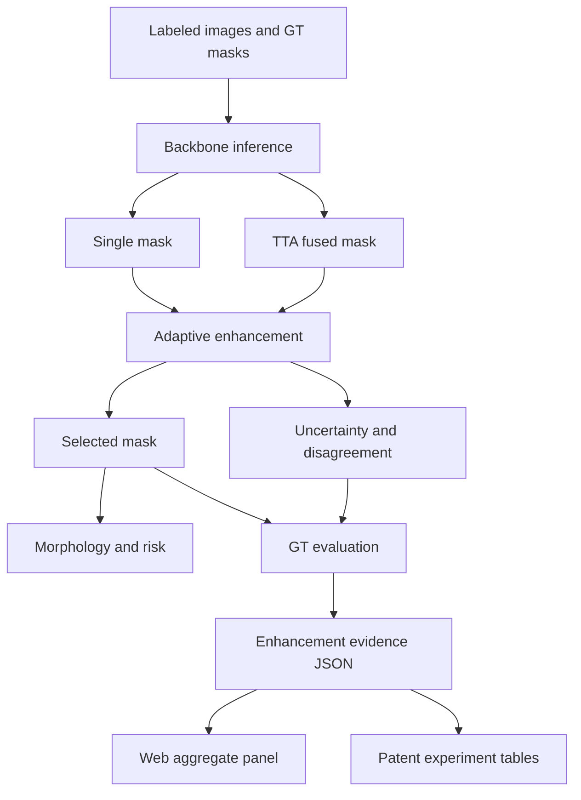

# Enhancement Evidence Optimization Plan

## Summary

Continue optimizing the tunnel defect project by turning the adaptive enhancement module from a strong single-sample demo into a dataset-level evidence package. The work should quantify when the module protects small defects, when it avoids harmful fixed fusion, how uncertainty supports review triage, and how the trained SegFormer checkpoint can feed the same confidence-risk pipeline.

---

## Problem Frame

The current project has two useful but partly separate strengths:

- SegFormer B1 has completed training and reached `mIoU 84.33`, with strong `pipeline`, `vertical`, and `horizontal` performance.
- The adaptive confidence-risk module can produce `single`, `fused`, `selected`, uncertainty, disagreement, morphology, and risk artifacts.

The current patent story is directionally good, but the evidence is still too easy to challenge if it only shows one example where `selected_mask` protects `591 px`. The next optimization should build repeatable evidence over labeled splits and make the web demo present both single-image behavior and aggregate experimental effect.

---

## Requirements

**Dataset-level enhancement evidence**

- R1. The evaluator must report aggregate `single`, `fused`, and `selected` metrics for labeled splits, preserving the existing label-only meaning of true mIoU.
- R2. The evaluator must add enhancement-specific evidence: fused foreground shrinkage rate, protected-pixel counts, selected-vs-fused recovery, and selection-mode distributions.
- R3. The evaluator must break evidence down by class where labels and predictions allow it, especially for `blocky`, because it is the current bottleneck class.
- R4. The output must identify representative examples for patent figures: successful small-defect guard, stable fused output, high-uncertainty review case, and failure/limitation case.

**SegFormer plus enhancement pipeline**

- R5. The confidence-risk pipeline must be able to consume the trained SegFormer result as the mask source, while keeping the enhancement module model-agnostic.
- R6. The web demo must clearly distinguish backbone metrics from enhancement-module metrics: SegFormer validates raw segmentation quality; adaptive enhancement validates output reliability and review evidence.
- R7. Existing ResNet-style inference must remain usable until SegFormer inference integration is fully verified.

**Uncertainty and review evidence**

- R8. The evaluator must measure whether high uncertainty overlaps with likely error regions when GT is available.
- R9. Upload-only images must continue to avoid fake mIoU and should instead show no-GT signals: self IoU, foreground shrinkage, disagreement, uncertainty, morphology, and selection mode.
- R10. Risk/review output must stay interpretable and must not claim structural safety diagnosis.

**Web and documentation**

- R11. The web demo must show aggregate enhancement evidence from generated JSON instead of relying only on hardcoded sample values.
- R12. Patent notes must frame the contribution as confidence-aware adaptive enhancement and review decision support, not as inventing TTA, uncertainty, skeletonization, or SegFormer.
- R13. Tests must protect metric semantics, artifact contracts, and the no-GT UI wording.

---

## Key Technical Decisions

- **Make the claim evidence-first, not novelty-by-component:** TTA, uncertainty, and morphology are known techniques. The defensible contribution is their ordered decision loop for tunnel defect segmentation: consistency check, harmful-fusion detection, adaptive output selection, morphology measurement, and review risk output.
- **Treat SegFormer as the stronger mask provider:** SegFormer improves raw segmentation quality, but the enhancement module remains a post-inference layer. This keeps the patent direction model-agnostic and avoids overclaiming a known backbone.
- **Separate true accuracy from reliability signals:** True mIoU exists only when GT masks are available. For user uploads, the UI should show self-consistency and uncertainty evidence instead of accuracy language.
- **Report both benefit and limitation cases:** A credible experimental section should show that selected output improves over fixed fused output, but may not always beat single-pass output. That honesty makes the patent framing stronger because the claim is reliable selection and review evidence.
- **Prefer generated aggregate JSON over hand-entered demo constants:** The web page can keep a sample report, but stage and enhancement panels should be backed by files generated from evaluation scripts where possible.

---

## High-Level Technical Design

The implementation should preserve the current artifact chain while adding a second evidence layer:

- Per-image report: what happened on this image.
- Aggregate evidence report: how often the enhancement module helps, protects, chooses each mode, or flags review cases across a split.

---

## Implementation Units

### U1. Dataset-Level Enhancement Evidence Report

- **Goal:** Add or extend an evaluator that converts existing per-image adaptive results into a compact aggregate evidence report.
- **Files:** `evaluate_confidence_risk.py`, optionally `enhancement_evidence.py`
- **Patterns:** Reuse the aggregate style already present in `evaluate_confidence_risk.py`; keep JSON fields stable and machine-readable.
- **Test file:** `tests/test_confidence_risk_eval.py`, optionally `tests/test_enhancement_evidence.py`
- **Test scenarios:**
  - Reports `selected_mIoU`, `selected_vs_fused_mIoU`, and selection-mode counts for labeled masks.
  - Computes foreground shrinkage ratio when `single` has defect pixels and `fused` has fewer defect pixels.
  - Computes protected-pixel count as `selected_foreground - fused_foreground` when selection protects small defects.
  - Handles no-defect images without division-by-zero or misleading shrinkage.
  - Produces top examples for at least small-defect guard, high-uncertainty review, stable fused output, and limitation/failure case.
- **Verification:** Existing adaptive evaluation JSON should remain valid; new evidence JSON should summarize `experiments/adaptive_fusion_eval_test_full.json` and `experiments/adaptive_fusion_eval_all_full.json`.

### U2. SegFormer Source Adapter for Confidence-Risk Pipeline

- **Goal:** Let the confidence-risk module run with the trained SegFormer checkpoint or imported SegFormer predictions, without removing the current model path.
- **Files:** `run_confidence_risk.py`, `segformer_tools.py`, optionally `segformer_inference_adapter.py`
- **Patterns:** Keep model-specific inference isolated behind a small adapter so `adaptive_fusion.py`, `morphology_adapter.py`, and `risk_adapter.py` remain model-agnostic.
- **Test file:** `tests/test_confidence_risk_outputs.py`, optionally `tests/test_segformer_tools.py`
- **Test scenarios:**
  - Default behavior still loads the current confidence-risk model path.
  - SegFormer mode can be selected explicitly and reports which backbone produced the mask.
  - Missing SegFormer checkpoint fails with a clear message.
  - Generated report keeps the same artifact contract: `single_mask`, `fused_mask`, `selected_mask`, uncertainty, disagreement, skeleton, and report JSON.
  - Web uploads do not silently claim SegFormer inference unless SegFormer mode is actually active.
- **Verification:** A small smoke image should produce the same report schema under both the legacy source and SegFormer source.

### U3. Uncertainty-to-Error Correlation Metrics

- **Goal:** Quantify whether uncertainty and disagreement are useful review signals, not just visual heatmaps.
- **Files:** `evaluate_confidence_risk.py`, `tta_confidence.py`
- **Patterns:** Keep uncertainty metrics simple and inspectable: overlap ratios, percentile summaries, and high-uncertainty coverage over error pixels.
- **Test file:** `tests/test_confidence_risk_eval.py`, `tests/test_tta_confidence.py`
- **Test scenarios:**
  - Given a synthetic prediction error region and uncertainty map, high uncertainty overlaps the error region as expected.
  - Computes `error_high_uncertainty_fraction` only when GT is available.
  - Keeps upload reports limited to GT-free uncertainty summaries.
  - Handles all-correct and all-background masks without invalid values.
- **Verification:** Aggregate evidence should include a short table showing whether high uncertainty captures a meaningful portion of error pixels.

### U4. Web Demo Aggregate Evidence Integration

- **Goal:** Make the web demo show generated aggregate evidence alongside current per-image evidence.
- **Files:** `web_app.py`, `web_demo/index.html`
- **Patterns:** Keep the current static HTML plus Python HTTP server; add a small API or static JSON fetch rather than introducing a frontend framework.
- **Test file:** `tests/test_docs_artifact_contract.py`, optionally `tests/test_web_report_contract.py`
- **Test scenarios:**
  - The page can render aggregate evidence from a JSON file when present.
  - If aggregate JSON is missing, the page falls back to current sample values and labels them as sample evidence.
  - Upload results still refresh per-image evidence without overwriting aggregate experiment results.
  - No-GT uploads display mIoU as `N/A` and show self-consistency / uncertainty / morphology instead.
  - The enhancement evidence panel explicitly distinguishes selected-vs-fused recovery from selected-vs-single improvement.
- **Verification:** Browser smoke check should cover desktop and mobile widths.

### U5. Patent and Experiment Documentation Package

- **Goal:** Turn the optimized evidence into reusable patent and report material.
- **Files:** `docs/patent-notes/tunnel-defect-confidence-risk.md`, `README.md`, optionally `docs/experiments/enhancement-evidence-summary.md`
- **Patterns:** Keep patent notes method-oriented and avoid claiming final civil-engineering safety decisions.
- **Test file:** `tests/test_docs_artifact_contract.py`
- **Test scenarios:**
  - Patent notes include the adaptive decision loop and the aggregate evidence table.
  - Documentation states that SegFormer is the backbone and the enhancement module is post-inference.
  - Documentation states true mIoU needs GT masks.
  - Artifact list matches actual runner outputs.
  - Limitation cases are documented so the claims stay credible.
- **Verification:** The final doc should provide enough text and tables to support a patent disclosure draft and a project presentation slide.

---

## Acceptance Examples

- AE1. Fixed fusion harms a small defect
  - **Covers:** R1, R2, R4, R11
  - **Given:** A labeled image where fused foreground is much smaller than single foreground.
  - **When:** The enhancement evaluator processes the image.
  - **Then:** It records foreground shrinkage, protected pixels, selected-vs-fused recovery, and marks the image as a representative small-defect guard case.

- AE2. Upload without GT
  - **Covers:** R6, R9, R13
  - **Given:** A user drags a new tunnel image into the web app.
  - **When:** Detection completes.
  - **Then:** The page shows no true mIoU, but still shows selection mode, self IoU, uncertainty, morphology, and review suggestion.

- AE3. SegFormer-backed enhancement
  - **Covers:** R5, R6, R7
  - **Given:** A trained SegFormer checkpoint is available.
  - **When:** The confidence-risk runner uses SegFormer mode.
  - **Then:** The output report keeps the same enhancement artifact schema and clearly identifies SegFormer as the mask source.

- AE4. Patent evidence summary
  - **Covers:** R10, R12
  - **Given:** The evaluator has processed the labeled test split.
  - **When:** Documentation is generated.
  - **Then:** It includes aggregate tables for selected-vs-fused recovery, selection-mode counts, uncertainty review evidence, and representative examples.

---

## Scope Boundaries

- Do not claim the enhancement module invents SegFormer, TTA, entropy uncertainty, or skeletonization.
- Do not claim selected output always beats single-pass mIoU.
- Do not compute or display true mIoU for upload-only images without GT masks.
- Do not replace the current web app with a new frontend framework.
- Do not make structural safety or maintenance-decision claims; keep the output as image-based review support.
- Do not change dataset split definitions while collecting evidence.

---

## Risks and Dependencies

| Risk | Impact | Mitigation |
|---|---|---|
| Selected output mostly chooses single | Weakens a naive fusion-improvement story | Frame the claim as harmful-fusion detection and small-defect protection; report selection-mode counts honestly |
| SegFormer integration takes longer than expected | Web demo may keep showing old model outputs | Keep backbone metrics and enhancement evidence separate; ship aggregate evidence first |
| Uncertainty does not correlate strongly with all errors | Review-triage claim becomes weaker | Report class-specific and case-specific uncertainty evidence; avoid universal claims |
| Aggregate JSON drifts from UI constants | Demo may show stale results | Load generated JSON where possible and label fallback values as sample-only |
| Patent wording overclaims known techniques | Disclosure becomes vulnerable | Emphasize the ordered tunnel-defect decision process and engineering review evidence |

---

## Sources and Research

- Origin requirements: `docs/brainstorms/2026-06-01-tunnel-defect-confidence-risk-requirements.md`
- SegFormer upgrade requirements: `docs/brainstorms/2026-06-02-segformer-backbone-upgrade-requirements.md`
- Prior adaptive plan: `docs/plans/2026-06-02-001-feat-adaptive-fusion-miou-plan.md`
- Current patent notes: `docs/patent-notes/tunnel-defect-confidence-risk.md`
- Core enhancement code: `adaptive_fusion.py`, `run_confidence_risk.py`, `evaluate_confidence_risk.py`
- Web demo: `web_app.py`, `web_demo/index.html`
- Existing adaptive evidence: `experiments/adaptive_fusion_eval_test_full.json`, `experiments/adaptive_fusion_eval_all_full.json`, `experiments/adaptive_fusion_config_search_val_full.json`
- SegFormer training evidence: `experiments/segformer_b1/runs/segformer_b1_6cls/20260604_091543.log.json`
