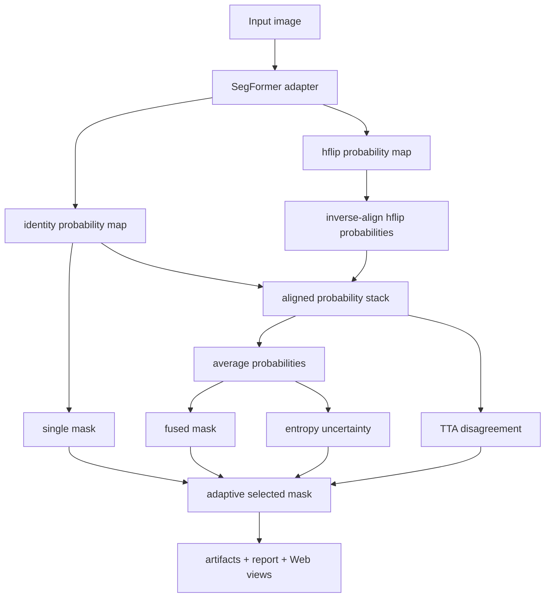

# SegFormer Probability TTA Uncertainty Plan

## Summary

Upgrade SegFormer inference so the confidence-risk pipeline receives real class probabilities, TTA-fused masks, entropy uncertainty, and disagreement maps from the same SegFormer run. This plan keeps the trained checkpoint and Web/report artifact contract stable while replacing the current single-mask placeholder path.

---

## Problem Frame

The current SegFormer adapter produces a good `single_mask`, but it calls the mmseg mask-returning inference API and then fills `fused_mask`, `uncertainty_heatmap`, and `disagreement_heatmap` with single-mask copies or zero-like placeholders. That weakens the project's confidence-risk claim and creates demo risk when masks and heatmaps come from different sources.

The origin requirements call for every visual artifact to be traceable to the same source image and SegFormer checkpoint, while preserving the existing selected-mask, morphology, risk, Web, and JSON report shape.

---

## Requirements

**SegFormer probability source**

- R1. SegFormer inference must expose class probability maps, not only final argmax masks. Covers origin R1.
- R2. The adapter must support a conservative TTA set for tunnel defects, starting with `identity` and `hflip`. Covers origin R2.
- R3. TTA probabilities must be aligned back to the same image coordinate system before fusion and disagreement calculation. Covers origin R3.

**Confidence-risk artifacts**

- R4. `fused_mask` must be derived from averaged aligned SegFormer probabilities when probability TTA is enabled. Covers origin R4.
- R5. `uncertainty_heatmap` must come from normalized entropy of the fused probability tensor. Covers origin R5.
- R6. `disagreement_heatmap` must come from per-pixel disagreement among aligned TTA predictions. Covers origin R6.
- R7. Existing selected-mask, morphology, risk, and report consumers must keep their current high-level artifact names and JSON sections. Covers origin R7 and R8.

**Web and evaluation behavior**

- R8. Upload-only images without GT must not display true mIoU, but may display self-consistency, uncertainty, disagreement, morphology, and selected-mask rationale. Covers origin R9.
- R9. Dataset samples with GT may display label-based metrics separately from uncertainty/disagreement summaries. Covers origin R10.
- R10. Static Web demo assets must not mix legacy heatmaps with SegFormer masks. Covers origin AE1 and S2.

---

## Key Technical Decisions

- **Use mmseg probability inference instead of mask-only `inference_segmentor`:** The external mmseg `EncoderDecoder.inference()` path already returns softmax probabilities before `simple_test()` converts them to argmax masks. The adapter should use that probability-producing path instead of reusing the public mask-only helper.
- **Keep TTA conservative at first:** Start with `identity` and `hflip`. Small rotations can be deferred because they add interpolation artifacts and are not required to satisfy the origin requirements.
- **Average probabilities before argmax:** Reuse the existing confidence module's probability-fusion semantics: align probabilities, average them, then derive `fused_mask` and entropy from the fused probability tensor.
- **Keep report compatibility stable:** `write_result_artifacts()` already accepts `single_mask`, `fused_mask`, `entropy_uncertainty`, and `disagreement_uncertainty`. The implementation should improve SegFormer inputs without changing the artifact contract consumed by Web and docs.
- **Treat old unavailable-copy tests as migration targets:** Tests and docs that currently assert SegFormer uncertainty is unavailable should be updated to assert availability once probability TTA is implemented.

---

## High-Level Technical Design

The plan relies on the existing confidence-risk artifact writer. The new work is concentrated in producing better SegFormer inputs for that writer.

---

## Implementation Units

### U1. Probability-returning SegFormer inference helper

- **Goal:** Add a SegFormer adapter path that returns class probabilities for one image variant without requiring full training or new dependencies.
- **Files:**
  - `segformer_inference_adapter.py`
  - `tests/test_segformer_inference_adapter.py`
- **Pattern references:**
  - `segformer_inference_adapter.py` currently owns SegFormer loading and `predict_confidence_inputs()`.
  - The external mmseg inference flow builds the test pipeline, collates data, scatters to device, and calls the segmentor. The adapter should follow that shape but call the probability-producing inference path rather than mask-only output.
- **Test scenarios:**
  - A fake model that returns a known probability tensor produces a probability array shaped `[C, H, W]`.
  - The helper preserves probability simplex behavior after resizing or conversion.
  - Missing or malformed model output raises a clear error rather than silently falling back to zero uncertainty.
  - CPU-safe fake tests run without importing external mmseg.
- **Verification:** Unit tests prove probability extraction and shape handling without requiring the SegFormer runtime.

### U2. SegFormer probability TTA fusion

- **Goal:** Compute `single_mask`, `fused_mask`, entropy uncertainty, disagreement, and TTA metadata from real SegFormer probabilities.
- **Files:**
  - `segformer_inference_adapter.py`
  - `tta_confidence.py`
  - `tests/test_segformer_inference_adapter.py`
  - `tests/test_tta_confidence.py`
- **Pattern references:**
  - `tta_confidence.py` already defines entropy, probability fusion, and disagreement logic for the legacy torch model path.
  - `run_confidence_risk.py` expects `predict_confidence_inputs()` to return `raw_resized`, `single_mask`, `fused_mask`, `entropy_uncertainty`, `disagreement_uncertainty`, `tta_specs`, and `mask_source`.
- **Test scenarios:**
  - Identity-only SegFormer probability TTA returns `single_mask == fused_mask` and low disagreement.
  - Identity plus hflip with intentionally different fake probabilities returns a non-zero disagreement map.
  - Fused probabilities produce a `fused_mask` from averaged probabilities, not from mask voting.
  - Metadata reports `probability_tta=true`, `uncertainty_available=true`, and `disagreement_available=true` when probability TTA succeeds.
  - `tta_specs` records the variants used, such as `segformer_identity` and `segformer_hflip`.
- **Verification:** Unit tests cover the adapter-level TTA behavior without needing CUDA; existing `tests/test_tta_confidence.py` continues to cover shared probability math.

### U3. Confidence-risk report compatibility

- **Goal:** Ensure existing artifact generation consumes the improved SegFormer probability inputs without changing the public report shape.
- **Files:**
  - `run_confidence_risk.py`
  - `tests/test_confidence_risk_outputs.py`
  - `tests/test_docs_artifact_contract.py`
- **Pattern references:**
  - `write_result_artifacts()` already writes all required image artifacts and report sections.
  - `tests/test_confidence_risk_outputs.py` currently contains a fake SegFormer-like source that marks uncertainty unavailable; that should become a positive availability fixture or be split into available/unavailable cases.
- **Test scenarios:**
  - A fake SegFormer source with probability-backed uncertainty produces report summaries with `available=true`.
  - Risk suggestions no longer include the unavailable-uncertainty warning for probability-backed SegFormer reports.
  - The report still includes `single_prediction_stats`, `fused_prediction_stats`, `selected_prediction_stats`, `self_consistency`, `adaptive_selection`, `uncertainty_summary`, `disagreement_summary`, `morphology`, `risk`, and `artifacts`.
  - The docs artifact contract no longer requires Web copy that says SegFormer uncertainty is unavailable by default.
- **Verification:** Focused tests validate report shape and availability flags.

### U4. Web demo and static sample asset alignment

- **Goal:** Make the default Web demo and drag-and-drop results display same-source SegFormer probability TTA artifacts.
- **Files:**
  - `web_demo/index.html`
  - `web_demo/assets/segformer_t1_1_single_mask.png`
  - `web_demo/assets/segformer_t1_1_fused_mask.png`
  - `web_demo/assets/segformer_t1_1_selected_mask.png`
  - `web_demo/assets/segformer_t1_1_uncertainty_heatmap.png`
  - `web_demo/assets/segformer_t1_1_disagreement_heatmap.png`
  - `web_demo/assets/segformer_t1_1_skeleton.png`
  - `tests/test_docs_artifact_contract.py`
- **Pattern references:**
  - Web views already use a fixed `sampleViews` list and dynamically rendered upload views.
  - The recent demo issue came from mixing legacy heatmaps with SegFormer masks; this unit should make same-source asset generation an explicit contract.
- **Test scenarios:**
  - Static `sampleViews` references only the `segformer_t1_1_*` family for SegFormer-derived views.
  - Web copy no longer states that current SegFormer mode only outputs one mask once probability TTA lands.
  - A generated static sample report has `probability_tta=true` and real uncertainty/disagreement summaries.
  - Thumbnail and main-stage views use the same file URLs for uncertainty/disagreement as the report artifacts.
- **Verification:** HTML contract tests plus one manual Web smoke check on `http://127.0.0.1:8000/` after implementation.

### U5. Documentation and presentation boundary update

- **Goal:** Update user-facing documentation so the project can honestly claim SegFormer-aligned uncertainty without overclaiming GT-free accuracy.
- **Files:**
  - `README.md`
  - `docs/patent-notes/tunnel-defect-confidence-risk.md`
  - `docs/experiments/enhancement-evidence-summary.md`
  - `docs/presentations/tunnel-defect-project-speaker-output/tunnel-defect-project-display.md`
- **Pattern references:**
  - Existing docs separate backbone quality from enhancement-module evidence.
  - Existing docs already warn that self-consistency is not true mIoU; keep that boundary.
- **Test scenarios:**
  - Docs explain that SegFormer probability TTA generates uncertainty/disagreement from model probabilities.
  - Docs still state that upload-only images without GT cannot display true mIoU.
  - Patent notes continue to avoid claiming invention of SegFormer, TTA, entropy uncertainty, or skeletonization.
  - Presentation notes no longer describe SegFormer uncertainty as unavailable once implementation lands.
- **Verification:** Existing docs artifact tests plus targeted text assertions for updated claims.

---

## Scope Boundaries

In scope:

- SegFormer inference adapter probability extraction.
- Identity/hflip probability TTA.
- Real uncertainty and disagreement artifacts for SegFormer mode.
- Report/Web/docs updates needed to remove placeholder semantics.
- Focused tests that do not require a CUDA SegFormer runtime.

Out of scope:

- Retraining SegFormer or changing the 160000-iteration checkpoint.
- Replacing SegFormer B1 with another model.
- Temperature scaling, calibration training, or uncertainty calibration metrics.
- Full rotation/scale TTA in this increment.
- Structural safety diagnosis or engineering maintenance decisions.

---

## Risks & Dependencies

- **External mmseg API coupling:** The adapter will rely on the mmseg segmentor probability path. Keep this isolated in `segformer_inference_adapter.py` so future mmseg differences are localized.
- **Runtime memory:** Probability TTA stores `[T, C, H, W]` tensors. Starting with identity/hflip keeps memory bounded for 384 x 384 images.
- **Web demo consistency:** Static assets must be regenerated from the same run that produced the report JSON; otherwise visual mismatch returns.
- **Test environment:** Repository tests should not require `mmcv`, `mmseg`, CUDA, or the external SegFormer source. Use fake segmentor fixtures for unit coverage.
- **Metric interpretation:** Real uncertainty/disagreement improves review evidence, not true mIoU for upload-only images.

---

## Acceptance Examples

- AE1. Same-source SegFormer sample
  - **Given:** A dataset sample such as `t1_1` is processed through SegFormer probability TTA.
  - **When:** the Web demo shows single, fused, selected, uncertainty, disagreement, and skeleton views.
  - **Then:** all views correspond to the same defect location and no view uses legacy heatmap assets.

- AE2. Real uncertainty map
  - **Given:** the adapter returns aligned class probabilities for `identity` and `hflip`.
  - **When:** uncertainty is generated.
  - **Then:** the heatmap has non-trivial value variation and the report marks `uncertainty_available=true`.

- AE3. Real disagreement map
  - **Given:** TTA predictions disagree at boundaries or weak regions.
  - **When:** disagreement is generated.
  - **Then:** the disagreement map highlights those regions and the report marks `disagreement_available=true`.

- AE4. Upload image without GT
  - **Given:** a user drags an unlabeled tunnel image into the Web app.
  - **When:** inference finishes.
  - **Then:** the app shows real SegFormer uncertainty/disagreement and does not show true mIoU.

---

## Verification Plan

- Run focused unit tests:
  - `python -m pytest tests/test_segformer_inference_adapter.py`
  - `python -m pytest tests/test_tta_confidence.py`
  - `python -m pytest tests/test_confidence_risk_outputs.py`
  - `python -m pytest tests/test_docs_artifact_contract.py`
- Run a SegFormer smoke inference from the `segformer-phase2` environment after implementation to regenerate the default `segformer_t1_1_*` artifacts.
- Open the Web app and manually verify that `single mask`, `fused mask`, `selected mask`, `uncertainty`, `disagreement`, and `skeleton` all align on the same defect.

---

## Sources / Research

- Origin requirements: `docs/brainstorms/2026-06-10-segformer-probability-tta-uncertainty-requirements.md`
- Earlier confidence-risk requirements: `docs/brainstorms/2026-06-01-tunnel-defect-confidence-risk-requirements.md`
- SegFormer backbone requirements: `docs/brainstorms/2026-06-02-segformer-backbone-upgrade-requirements.md`
- Existing adaptive fusion plan: `docs/plans/2026-06-02-001-feat-adaptive-fusion-miou-plan.md`
- Existing evidence plan: `docs/plans/2026-06-04-001-feat-enhancement-evidence-optimization-plan.md`
- Current adapter entry point: `segformer_inference_adapter.py`
- Current artifact writer: `run_confidence_risk.py`
- Shared probability utilities: `tta_confidence.py`
- SegFormer paper: https://arxiv.org/abs/2105.15203
- Test-time augmentation uncertainty paper: https://arxiv.org/abs/1807.07356
