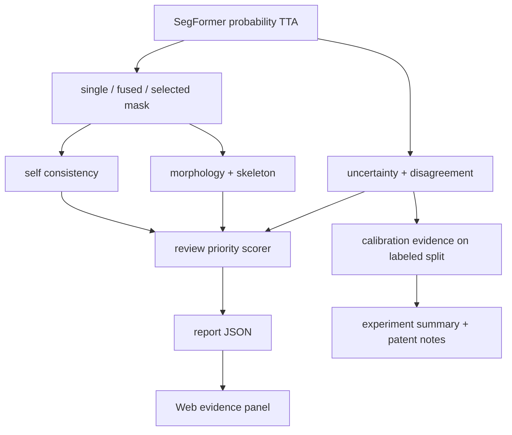

# Review Priority Calibration Plan

## Summary

本计划把现有 confidence-risk 模块升级成更完整的“可信复核系统”：在 SegFormer probability TTA、uncertainty、disagreement、selected mask 和 morphology 基础上，增加置信校准评估、复核优先级、可解释复核理由和阶段证据汇总。

---

## Problem Frame

项目现在已经能输出病害 mask、uncertainty、disagreement、骨架和 risk report，但“风险/复核”仍偏图像级规则：它能说需要复核，却还没有系统回答“这个 uncertainty 是否可信”“哪批样本最应该优先人工看”“复核建议有没有数据证据支撑”。

参考微信文章总结的趋势，2026 年应用型模型不再只卷单一模型分数，而是更关注真实系统里的稳定性、泛化性、不确定性、可解释性和可部署性。对应到本项目，下一阶段最有价值的不是再换一个模型，而是把已有推理证据组织成一个能给老师和专利材料讲清楚的可信复核闭环。

---

## Requirements

**Calibration and review evidence**

- R1. 系统应在有 GT 的验证/测试数据上评估 uncertainty 与真实错误的对应关系，并输出可复用的校准/复核证据。
- R2. 系统应区分无需 GT 的自选图片指标与需要 GT 的真实精度/错误重叠指标，避免把模型自一致性当作 mIoU。
- R3. 系统应保留现有 `pixel_high_uncertainty_threshold` 与 `review_fraction_threshold` 的含义，不把两个阈值混成一个。

**Review priority output**

- R4. 每张图片的报告应给出可解释的 `review priority`，优先级来自 uncertainty、disagreement、self-consistency、morphology、risk level 和 selected-mask rationale。
- R5. 复核优先级应是人工复核排序信号，不应被描述成结构安全结论或最终养护决策。
- R6. 复核理由应能直接用于 Web 展示和 PPT 讲解，例如“缺陷区高不确定”“single/fused 不一致”“小病害可能被 fixed fusion 抹掉”。

**Web and documentation**

- R7. Web 端应显示复核优先级、关键理由和是否缺少 GT，保持自选图片场景下真实 mIoU 为 `N/A`。
- R8. 阶段证据文档应补充 U6 结果表，说明可信复核模块相比当前 risk report 的新增价值。
- R9. 专利说明应更新为“置信校准、自适应输出选择与复核优先级生成”，同时保留不宣称发明 SegFormer/TTA/uncertainty/skeletonization 的边界。

---

## High-Level Technical Design

核心思路是保留现有分割与增强链路，把 U6 做成一个薄的可靠性层：有 GT 时生成校准证据；无 GT 时只使用模型内部证据给复核优先级和理由。这样不会破坏当前 Web 推理，也不会把后处理模块夸成新的 backbone。

---

## Key Technical Decisions

- KTD1. **先做 post-hoc 复核优先级，不先重训模型:** 当前 SegFormer B1 已有 `84.33` mIoU 的主干证据，U6 的价值应落在“哪里不可靠、谁先复核、为什么复核”，避免把计划扩成新一轮训练。
- KTD2. **校准评估优先于复杂校准算法:** 第一版先计算 ECE-like 分桶、uncertainty-error overlap、review precision/coverage 等证据；temperature scaling 或 conformal set 作为后续可选增强，避免过早引入需要 logits/校准集管理的复杂度。
- KTD3. **复核优先级用可解释规则组合:** 现有 `risk_adapter.py` 已有 risk score/review_required 规则，U6 应扩展它或在其旁边增加 review-priority adapter，而不是引入黑盒二级模型。
- KTD4. **Web 展示优先服务老师检查:** 页面应把“为什么建议复核”讲清楚，而不是堆更多指标；专业名词保留英文，解释用中文。
- KTD5. **GT 边界写进报告契约:** `mIoU`、error overlap、校准质量只在有 GT 的数据集样本上出现；上传图片只能显示 self-consistency、uncertainty、disagreement、morphology 和 review priority。

---

## Implementation Units

### U1. Calibration evidence metrics

- **Goal:** 在现有评估链路上增加 uncertainty 校准和复核证据汇总，让“高不确定区域是否真的对应错误”有更完整的数据支撑。
- **Files:**
  - `evaluate_confidence_risk.py`
  - `enhancement_evidence.py`
  - `tests/test_confidence_risk_eval.py`
  - `tests/test_enhancement_evidence.py`
- **Patterns to follow:** 复用 `uncertainty_error_overlap`、`aggregate_comparisons`、`summarize_enhancement_evidence` 的 aggregate summary 风格。
- **Test scenarios:**
  - 有 GT 且 uncertainty 与错误重合时，输出 error coverage、HU precision、分桶校准摘要。
  - 无 GT 时不生成真实错误校准字段，只保留 supported=false 或缺失原因。
  - 高不确定阈值和复核比例阈值分别保留，JSON 字段名不混淆。
  - 空 defect / 全背景样本不会导致除零或 NaN 写入 JSON。
- **Verification:** 运行 `tests/test_confidence_risk_eval.py` 和 `tests/test_enhancement_evidence.py`。

### U2. Review priority adapter

- **Goal:** 给单图报告增加 `review_priority`，把 risk、uncertainty、disagreement、self-consistency 和 morphology 组合成可解释排序信号。
- **Files:**
  - `risk_adapter.py`
  - `run_confidence_risk.py`
  - `tests/test_risk_adapter.py`
  - `tests/test_confidence_risk_outputs.py`
- **Patterns to follow:** 继续使用当前 `RiskConfig`、`score_image`、`reasons` 和 `suggestions` 的结构化输出，不另造一套不可解释评分。
- **Test scenarios:**
  - 缺陷区 uncertainty 高时，priority 升高并出现人工复核理由。
  - single/fused foreground IoU 低或 fused 明显 shrink 时，priority 至少进入复核队列。
  - 面积很小但不确定性高的病害不会因为像素少被压成低优先级。
  - uncertainty unavailable 时，priority 仍可由 morphology 和 selected-mask evidence 给出，但理由明确说明缺少概率证据。
  - 无病害图像输出低优先级或 none，不误报高风险。
- **Verification:** 运行 `tests/test_risk_adapter.py` 和 `tests/test_confidence_risk_outputs.py`。

### U3. Web review-priority presentation

- **Goal:** 在 Web 前端把 U6 结果展示成老师能一眼看懂的面板：复核优先级、触发理由、GT 是否可用、关键证据图。
- **Files:**
  - `web_demo/index.html`
  - `web_app.py`
  - `tests/test_web_app.py`
  - `tests/test_docs_artifact_contract.py`
- **Patterns to follow:** 沿用现有 `renderRisk`、`renderSummary`、`renderAdvantages`、中文解释 + 英文指标名的展示方式。
- **Test scenarios:**
  - 数据集样本有 GT 时，页面展示真实 mIoU 与校准/复核证据。
  - 自选上传图片无 GT 时，真实 mIoU 继续显示 `N/A`，但 review priority 正常显示。
  - uncertainty unavailable 时不显示误导性蓝图或假指标，而是显示清楚的 unavailable 原因。
  - 复核理由长度较长时不撑破卡片或覆盖图片。
- **Verification:** 运行 `tests/test_web_app.py`、`tests/test_docs_artifact_contract.py`，并用浏览器检查本地 Web 页面。

### U4. Evidence documents and patent framing

- **Goal:** 把 U6 阶段结果写入项目文档，让老师检查进度时能看到“新增了可信复核能力”，专利材料也能自然升级。
- **Files:**
  - `README.md`
  - `docs/experiments/enhancement-evidence-summary.md`
  - `docs/patent-notes/tunnel-defect-confidence-risk.md`
  - `docs/presentations/tunnel-defect-project/index.html`
  - `docs/presentations/tunnel-defect-project-speaker-output/tunnel-defect-project-display.md`
- **Patterns to follow:** 继续区分 backbone evidence 与 post-inference enhancement evidence，不混用 SegFormer mIoU 和增强模块 mIoU。
- **Test scenarios:**
  - README 中能找到 U6 启动/评估说明和 GT 边界说明。
  - 专利说明仍保留 non-claim boundary，不宣称结构安全诊断。
  - PPT/演讲稿用通俗语言说明“模型负责画，复核模块负责判断哪里该人工看”。
  - 文档契约测试仍能找到关键 artifact 名、model source、GT/mIoU 边界。
- **Verification:** 运行 `tests/test_docs_artifact_contract.py`。

---

## Acceptance Examples

- AE1. **高不确定缺陷样本:** 给一张有 GT 的样本，模型在缺陷边界附近 uncertainty 高且确实存在误差；评估输出应统计到 error overlap，Web 报告应说明建议复核。
- AE2. **自选上传图片:** 用户拖入无 GT 图片；页面不显示真实 mIoU，但显示 review priority、uncertainty/disagreement、self-consistency、morphology 和复核理由。
- AE3. **fixed fusion 损伤样本:** fused mask 比 single 明显少掉前景；selected mask 保留小病害，review priority 理由中能看到融合不稳定或小病害保护。
- AE4. **稳定低风险样本:** single/fused 一致、uncertainty 低、病害面积小且连通结构简单；系统输出低复核优先级，并解释常规复核即可。
- AE5. **概率证据不可用样本:** 如果使用不支持 probability TTA 的 mask source，报告不伪造 uncertainty，priority 只基于 morphology/selection evidence，并明确提示证据不足。

---

## Scope Boundaries

### In Scope

- 复核优先级和理由生成。
- 有 GT split 上的校准/复核证据评估。
- Web 展示和阶段文档更新。
- 与现有 SegFormer probability TTA、adaptive fusion、risk report 的集成。

### Deferred to Follow-Up Work

- 真正的 temperature scaling 参数学习与 logits 校准。
- conformal segmentation prediction set 或带覆盖率保证的预测集合。
- 新一轮 SegFormer 训练、blocky 类专项训练或新 backbone 对比。
- 跨隧道/跨相机场景漂移评分。

### Outside Product Identity

- 结构安全诊断。
- 养护决策自动化。
- 替代人工验收或专家复核。
- 宣称发明 SegFormer、TTA、entropy uncertainty、skeletonization。

---

## System-Wide Impact

U6 会影响报告 JSON、Web 展示、实验汇总和专利叙述，但不应改变基础分割模型接口和已有 artifact 文件名。已有消费者仍应能读取 `risk`、`uncertainty_summary`、`disagreement_summary`、`adaptive_selection`、`morphology` 等字段；新增复核优先级应是向后兼容的扩展字段。

---

## Risks & Dependencies

- **Risk: 指标过多导致老师更难懂。** Web 端只突出 review priority 与 2-4 条关键理由，完整指标放 JSON 或文档。
- **Risk: 复核优先级被误解为真实安全等级。** 文档和页面文案必须持续说明这是 image-based review signal，不是结构安全结论。
- **Risk: 校准证据依赖 GT。** 数据集样本可展示校准质量，自选图片只能展示模型内部证据；两者必须在 UI 上分清。
- **Risk: 当前概率来源只覆盖 conservative TTA。** 第一版只承诺 identity + hflip 的概率证据，更多增强留到后续。

---

## Documentation / Operational Notes

- README 增加 U6 的一段短说明和评估命令。
- `docs/experiments/enhancement-evidence-summary.md` 增加 review-priority/calibration 结果表。
- `docs/patent-notes/tunnel-defect-confidence-risk.md` 把标题或核心链条扩展到“置信校准与复核优先级”。
- PPT/演讲稿只讲通俗版本：模型画区域，系统判断哪里不可靠、谁优先复核、为什么复核。

---

## Sources / Research

- 微信文章《看了150篇2026时序预测论文，我总结了8个字》：https://mp.weixin.qq.com/s/jUFJBQY-LJbq4VPhpki2Dg
- Temperature scaling / calibration: https://arxiv.org/abs/1706.04599
- TTA uncertainty for segmentation: https://arxiv.org/abs/1807.07356
- Conformal semantic segmentation: https://arxiv.org/html/2405.05145v1
- Existing confidence-risk patent notes: `docs/patent-notes/tunnel-defect-confidence-risk.md`
- Existing enhancement evidence summary: `docs/experiments/enhancement-evidence-summary.md`
- Existing probability TTA plan: `docs/plans/2026-06-10-001-feat-segformer-probability-tta-uncertainty-plan.md`
