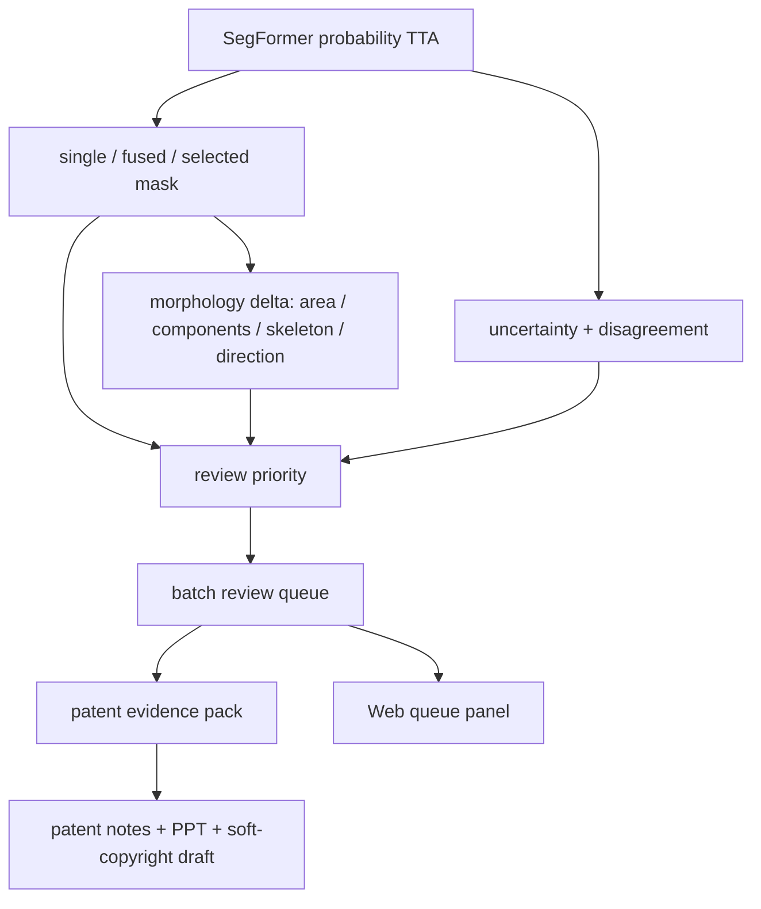

# Patent-Ready Confidence Review Engine Plan

## Summary

本计划把已完成的 SegFormer 分割、probability TTA、adaptive selected mask、uncertainty、disagreement、morphology 和 review priority 继续升级成更适合专利交底、软著登记和老师检查的“可信复核引擎”。重点不是再换 backbone，而是补强证据链：批量复核排序、形态变化解释、专利图例材料包、软著说明材料和可复现实验。

---

## Problem Frame

当前项目已经能训练 SegFormer B1，Web 端也能拖拽图片生成多视图报告。U6 已经补上 `review_priority` 和 uncertainty calibration，让系统不再只是输出 mask，而是能说明“哪里需要人工复核”。下一步的短板是申报材料层面的说服力：单个 Web demo 很直观，但专利/软著更需要可复现的材料包、批量实验表、典型案例索引、形态变化解释和边界清楚的文档。

这个 improve 应该围绕“可信复核闭环”展开：模型画出候选病害区域，增强模块判断候选输出是否稳定，形态模块解释病害形状是否被融合压缩或断裂，复核模块把图片排成优先级队列，导出模块把证据整理成老师、软著材料和专利交底都能直接使用的资产。

---

## Requirements

**Patent-grade evidence**

- R1. 系统应能从已标注 split 生成一份稳定的 patent evidence pack，包含 aggregate 指标、典型案例、图像 artifact 路径、关键阈值和非主张边界。
- R2. evidence pack 应区分 backbone 证据和 post-inference enhancement 证据，不能把 SegFormer `84.33` mIoU 描述成增强模块本身的收益。
- R3. evidence pack 应优先选择非空缺陷案例作为专利/展示图例，避免用全背景稳定样本证明 `stable_fused`。
- R4. 输出应保留 GT 边界：没有 GT 的上传图片不能生成 true mIoU、error overlap 或 calibration 结论。

**Review queue and explainability**

- R5. 系统应在批量样本上生成 review queue，按 `review_priority.score` 或等级排序，并输出触发理由、相关 artifact 和 GT 可用性。
- R6. 批量评估应验证高优先级样本是否更集中地覆盖真实错误、fixed fusion 损伤、小病害保护或高 uncertainty 区域。
- R7. 单图报告应增加 mask 形态变化解释，说明 single/fused/selected 之间的面积、连通域、骨架长度和主方向变化。
- R8. Web 端应把复核队列和形态变化解释展示成“为什么这张图优先看”的证据，不只显示分数。

**Soft-copyright and presentation readiness**

- R9. 仓库应能导出软著材料草稿，包括软件名称、版本号、功能说明、运行环境、模块结构、主要界面截图清单和源代码页选择建议。
- R10. README、PPT、演讲稿和 patent notes 应使用一致术语：`selected mask`、`review priority`、`uncertainty`、`disagreement`、`GT`、`mIoU`。
- R11. 文档应保留明确边界：本系统提供 image-based review signal，不替代结构安全诊断、养护决策或人工验收。

---

## High-Level Technical Design

U7 保持现有推理链路不变，在输出后增加两个薄层。第一层是 evidence layer，把每张图的 mask 差异、uncertainty、disagreement、morphology 和 GT 指标整理成可聚合字段。第二层是 export layer，把批量复核队列、典型案例和材料清单导出给 Web、PPT、专利笔记和软著说明。

---

## Key Technical Decisions

- KTD1. **做证据闭环，不重写模型:** SegFormer B1 已经能承担 mask source；U7 的收益来自把“检测结果是否可信”讲清楚，而不是重新训练一个不稳定的新模型。
- KTD2. **复核队列用可解释规则和已有字段:** 继续复用 `review_priority`、`adaptive_selection`、`uncertainty_summary`、`disagreement_summary` 和 `morphology`，避免引入黑盒二级分类器。
- KTD3. **形态变化解释独立于真实 GT:** 面积、骨架、连通域和方向变化可以从模型候选 mask 直接计算，适合无 GT 上传图片；true mIoU 和 error overlap 仍只在有 GT 的 split 上出现。
- KTD4. **专利材料包从 JSON 生成，不手工挑图:** 典型案例应由规则从 `experiments/*summary.json` 或 full evaluation JSON 中选出，减少 cherry-pick 风险。
- KTD5. **软著材料只整理软件表达，不夸算法授权:** 软著重点是系统功能、代码、界面和说明书；专利重点才是方法链条和技术效果。两套材料共享事实，但主张边界不同。

---

## Implementation Units

### U1. Patent evidence pack exporter

- **Goal:** 生成一份可复用的 `patent_evidence_pack.json` 和 markdown 摘要，用于专利交底、PPT 图例和老师检查。
- **Files:**
  - `enhancement_evidence.py`
  - `evaluate_confidence_risk.py`
  - `docs/experiments/enhancement-evidence-summary.md`
  - `docs/patent-notes/tunnel-defect-confidence-risk.md`
  - `tests/test_enhancement_evidence.py`
  - `tests/test_confidence_risk_eval.py`
- **Patterns to follow:** 复用 `summarize_enhancement_evidence`、`representative_examples` 和 `docs/solutions/best-practices/enhancement-evidence-from-evaluation-json.md` 的聚合方式。
- **Test scenarios:**
  - 有 supported labeled samples 时，导出 aggregate mIoU、selection modes、small-defect guard、uncertainty overlap、calibration bins 和 representative examples。
  - `stable_fused` 首选非空前景样本；只有没有非空 fused 样本时才允许退回全背景稳定样本。
  - 输出明确包含 `backbone_evidence` 与 `enhancement_evidence` 两组字段。
  - 缺少 GT 时，导出 `supported=false` 或 `gt_required=true`，不伪造 true mIoU。
- **Verification:** 运行 `tests/test_enhancement_evidence.py`、`tests/test_confidence_risk_eval.py`。

### U2. Morphology delta explanation

- **Goal:** 对 single、fused、selected 三个候选 mask 计算形态变化，解释 fixed fusion 是否缩小、断裂或改变主方向。
- **Files:**
  - `morphology_adapter.py`
  - `run_confidence_risk.py`
  - `risk_adapter.py`
  - `tests/test_morphology_adapter.py`
  - `tests/test_confidence_risk_outputs.py`
  - `tests/test_risk_adapter.py`
- **Patterns to follow:** 复用现有 morphology 字段和 `score_review_priority` 的 `prediction_stats`，新增字段保持向后兼容。
- **Test scenarios:**
  - fused mask 相比 single 前景面积明显减少时，报告输出 shrink ratio 和解释理由。
  - fused mask 把一个连通缺陷断成多个组件时，报告输出 component delta。
  - selected mask 恢复 fused 丢失前景时，报告输出 protected pixels 和选择原因。
  - 无缺陷或全背景样本不产生误导性“形态恶化”结论。
- **Verification:** 运行 `tests/test_morphology_adapter.py`、`tests/test_confidence_risk_outputs.py`、`tests/test_risk_adapter.py`。

### U3. Batch review queue evaluation

- **Goal:** 在 val/test/all split 上生成按复核优先级排序的样本队列，并评估高优先级样本是否更能覆盖错误、融合损伤和小病害保护事件。
- **Files:**
  - `evaluate_confidence_risk.py`
  - `enhancement_evidence.py`
  - `tests/test_confidence_risk_eval.py`
  - `tests/test_enhancement_evidence.py`
- **Patterns to follow:** 继续沿用 evaluation JSON 的 `samples` + `aggregate` 结构，新增 `review_queue_summary` 而不是改变已有字段。
- **Test scenarios:**
  - 输出 top-k review queue，每项包含 image、priority、score、reasons、selection mode、artifact stems 和 GT availability。
  - 对 high/medium/low priority 分桶统计 error coverage、fixed fusion harmed、selected recovered、protected pixels。
  - 空 split 或全部 unsupported 样本时输出可解释 reason，不写入 NaN。
  - 阈值字段保留 `pixel_high_uncertainty_threshold` 与 `review_fraction_threshold` 的独立语义。
- **Verification:** 运行 `tests/test_confidence_risk_eval.py`、`tests/test_enhancement_evidence.py`。

### U4. Web evidence queue and case browser

- **Goal:** Web 端增加一个“复核队列 / 典型案例”视图，让老师可以从首页直接看到哪些样本最该人工看，以及每个案例为什么入选。
- **Files:**
  - `web_app.py`
  - `web_demo/index.html`
  - `tests/test_web_app.py`
  - `tests/test_docs_artifact_contract.py`
- **Patterns to follow:** 沿用当前中文解释 + 英文专业名词风格，复用 existing evidence summary loading，不改变拖拽检测主流程。
- **Test scenarios:**
  - 有 evidence pack 时，Web 加载 top review cases、small-defect guard、stable fused、high-uncertainty review 和 limitation case。
  - evidence pack 缺失时，页面显示清楚的 fallback 文案，不阻塞拖拽检测。
  - 自选图片无 GT 时，仍显示 morphology delta、review priority 和 self-consistency，不显示 true mIoU。
  - 复核理由较长时，卡片文本不覆盖图片或撑破布局。
- **Verification:** 运行 `tests/test_web_app.py`、`tests/test_docs_artifact_contract.py`，再用浏览器检查 `http://127.0.0.1:8000`。

### U5. Soft-copyright material draft

- **Goal:** 生成软著申请可用的说明材料草稿，覆盖软件功能、技术特点、模块结构、运行环境、界面截图清单和源代码页选择建议。
- **Files:**
  - `README.md`
  - `docs/software-copyright/tunnel-defect-review-system.md`
  - `docs/software-copyright/source-material-checklist.md`
  - `docs/solutions/developer-experience/windows-double-click-segformer-cuda-training.md`
  - `tests/test_docs_artifact_contract.py`
- **Patterns to follow:** 事实来源优先使用 README、Web 页面、PPT 讲稿和启动脚本说明，避免把第三方 SegFormer/mmseg 源码写成自研代码。
- **Test scenarios:**
  - 软著说明书包含软件名称、版本号、开发语言、运行环境、主要功能、操作流程和界面截图清单。
  - 材料明确区分本仓库代码、第三方依赖、训练数据和外部 checkpoint。
  - 文档不出现“自动结构安全诊断”或“替代人工验收”等越界表述。
  - 文档契约测试能找到软著说明入口和关键边界词。
- **Verification:** 运行 `tests/test_docs_artifact_contract.py`。

### U6. Presentation and patent narrative refresh

- **Goal:** 更新 README、PPT 和演讲稿，把 U7 的证据闭环讲成通俗版本：模型画区域，系统判断哪里不可靠、谁优先复核、证据从哪里来。
- **Files:**
  - `README.md`
  - `docs/presentations/tunnel-defect-project/index.html`
  - `docs/presentations/tunnel-defect-project-speaker-output/tunnel-defect-project-display.md`
  - `docs/patent-notes/tunnel-defect-confidence-risk.md`
  - `tests/test_docs_artifact_contract.py`
- **Patterns to follow:** 继续保留专业名词英文，例如 `SegFormer`、`mask`、`GT`、`mIoU`、`uncertainty`、`disagreement`、`review priority`。
- **Test scenarios:**
  - PPT/讲稿能用一句话解释 U7：批量复核队列把最不稳定、最可能需要人工确认的样本排在前面。
  - 专利笔记包含方法流程、技术效果、实验表和 non-claim boundary。
  - README 的项目现状从 U6 更新到 U7，不混淆 completed 与 active work。
  - 文档中所有 mIoU 说明都明确需要 GT。
- **Verification:** 运行 `tests/test_docs_artifact_contract.py`。

---

## Acceptance Examples

- AE1. **Patent evidence pack:** 给定已有 full evaluation JSON，系统导出 aggregate evidence、top cases 和 artifact 路径；老师可以不打开代码就看到增强模块的主要证据。
- AE2. **Fusion shrink explanation:** 某样本 fused mask 明显小于 single mask；报告说明 fixed fusion 可能抑制小病害，并展示 selected 如何恢复前景。
- AE3. **Review queue works:** 在 test split 上，高优先级队列中的样本更集中地包含 high uncertainty、fixed fusion harmed 或 selected recovered 事件。
- AE4. **Upload without GT:** 用户拖入自选图片；页面显示 review priority、morphology delta、uncertainty、disagreement 和 selected-mask 理由，但 true mIoU 仍为 `N/A`。
- AE5. **Soft-copyright draft:** 文档能直接说明系统功能、模块结构、运行环境和界面流程，同时不把第三方依赖写成自研创新。

---

## Scope Boundaries

### In Scope

- 批量复核队列和分桶评估。
- single/fused/selected 的形态变化解释。
- 专利 evidence pack 和典型案例索引。
- 软著说明材料草稿。
- Web、README、PPT、演讲稿和 patent notes 的一致性更新。

### Deferred to Follow-Up Work

- 真正的 temperature scaling 参数学习。
- conformal segmentation prediction set 或覆盖率保证。
- blocky 类专项重训、补标或数据增强实验。
- 多时间序列病害发展追踪。
- 面向真实隧道巡检系统的账号、任务流、数据库和报告审批。

### Outside Product Identity

- 结构安全诊断。
- 自动养护决策。
- 替代人工验收或专家复核。
- 宣称发明 SegFormer、TTA、entropy uncertainty、skeletonization 或 mIoU 指标本身。

---

## System-Wide Impact

U7 会扩展报告 JSON、实验汇总、Web 展示和项目文档，但不应破坏现有 artifact 文件名。已有输出如 `single_mask`、`fused_mask`、`selected_mask`、`uncertainty_heatmap`、`disagreement_heatmap`、`skeleton`、`report.json` 继续保留；新增字段应作为向后兼容扩展写入 `morphology_delta`、`review_queue_summary` 或 evidence pack。

---

## Risks & Dependencies

| Risk | Mitigation |
|---|---|
| 证据包被误读为 selected 一定超过 single | 文档和 Web 明确主张是恢复 fixed fused 损失、复核排序和可解释证据，不是 universally better mIoU。 |
| 软著材料混入第三方代码主张 | 软著说明只描述本系统功能和本仓库自研 glue/enhancement/Web 代码，第三方依赖单独列出。 |
| 典型案例被认为 cherry-picked | 代表案例由 deterministic 规则从 full evaluation JSON 选出，并保留 limitation case。 |
| Web 指标太多导致老师看不懂 | 首页只展示 review queue、关键原因和 2-4 个核心指标，完整 JSON 留给详情。 |
| 无 GT 上传图片被误报真实精度 | 所有 UI 和报告继续把 true mIoU/error overlap/calibration 限定在 GT available 场景。 |

---

## Documentation / Operational Notes

- 新文档建议放在 `docs/software-copyright/` 和 `docs/experiments/`，避免混入运行时 `experiments/web_live/`。
- evidence pack 里的 artifact path 使用 repo-relative path，便于仓库分享和老师检查。
- 如果仓库准备发给老师，可以保留 README、PPT、Web 和软著说明；不要提交大 checkpoint、运行时 web_live 输出或本地 `.codegraph/`。

---

## Sources / Research

- Origin requirements: `docs/brainstorms/2026-06-01-tunnel-defect-confidence-risk-requirements.md`
- Supporting requirements: `docs/brainstorms/2026-06-10-segformer-probability-tta-uncertainty-requirements.md`
- Previous completed plan: `docs/plans/2026-06-13-001-feat-review-priority-calibration-plan.md`
- Evidence summary: `docs/experiments/enhancement-evidence-summary.md`
- Patent notes: `docs/patent-notes/tunnel-defect-confidence-risk.md`
- Evidence best practice: `docs/solutions/best-practices/enhancement-evidence-from-evaluation-json.md`
- Current implementation touchpoints: `enhancement_evidence.py`, `evaluate_confidence_risk.py`, `run_confidence_risk.py`, `risk_adapter.py`, `morphology_adapter.py`, `web_app.py`, `web_demo/index.html`
