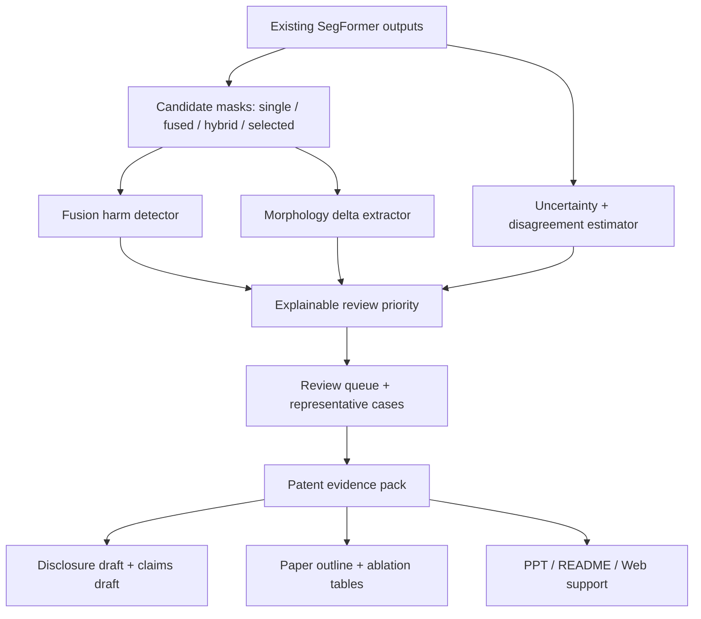

# Patent Algorithm Academic Pipeline Plan

## Summary

本计划把当前“隧道病害分割可信复核”项目从可展示系统继续推进为偏专利、偏算法、可支撑论文的研究管线。核心不是继续强化 Web，而是把多候选 mask、自适应选择、uncertainty、disagreement、morphology_delta 和 review priority 固化为一套可写入专利交底书、可做消融实验、可被老师检查的算法证据链。

---

## Problem Frame

项目已经具备 SegFormer B1 分割、adaptive selected mask、probability TTA uncertainty/disagreement、morphology_delta、review queue、patent evidence pack、Web demo、PPT 和软著材料草稿。当前短板不是“界面不够多”，而是专利与论文语境下的算法表达还需要更硬：需要清楚说明方法步骤、可保护的创新边界、实验变量、消融对照、代表案例和完整性检查。

后续工作应按 academic pipeline 的思路组织，但入口不是从零文献综述，而是从已有项目材料进入“研究证据强化 + 专利交底 + 论文草稿支撑”阶段。每个阶段都要保留可复现材料，避免把 Web demo、SegFormer backbone 指标或少数样例图误写成算法本身的创新。

---

## Requirements

**Patent algorithm definition**

- R1. 方法链必须以 post-inference confidence review 为核心，不能把 SegFormer、TTA、entropy、skeletonization 或 mIoU 指标本身包装成自研发明。
- R2. 专利材料必须给出稳定的方法步骤，至少覆盖候选 mask 生成、概率融合、融合损伤识别、自适应选择、不确定性/分歧度分析、形态变化分析和复核优先级排序。
- R3. 权利要求草稿必须区分方法、系统、计算机可读存储介质三类表达，并保留 non-claim boundary。
- R4. 无 GT 上传场景只能报告 self-consistency、uncertainty、disagreement、morphology_delta 和 review priority，不能报告 true mIoU、error overlap 或 calibration。

**Algorithm and evidence**

- R5. review priority 的输入字段、加权逻辑和触发理由必须可解释、可测试，并能对应到 evidence JSON 中的实际字段。
- R6. morphology_delta 不能只作为界面解释，应作为可测量的算法特征进入专利说明和实验分析，必要时作为 review priority 的候选输入。
- R7. 实验证据必须包含 single、fixed fused、selected 和至少一个 ablation variant，避免只展示最终方法。
- R8. representative cases 必须从 evaluation JSON 或 patent evidence pack 规则化选择，并验证 artifact path contract，避免手工 cherry-pick。

**Academic pipeline and integrity**

- R9. 论文/报告材料必须把研究问题、方法、实验设置、结果解释和 limitations 串起来，Web 仅作为 implementation demo。
- R10. 所有实验表必须标注数据 split、样本数、GT 是否可用、指标来源和阈值语义。
- R11. 每个阶段输出都要经过完整性检查：引用或论文依据不能虚构，实验数字必须来自 committed JSON、日志或可复现脚本。
- R12. 面向老师检查的材料必须用通俗语言说明“在做什么、创新在哪、效果怎么证明”，同时保留必要英文术语如 `mask`、`GT`、`mIoU`、`uncertainty`、`disagreement` 和 `review priority`。

---

## High-Level Technical Design

计划采用“算法证据先行”的组织方式。代码层保留现有推理和 Web 入口，主要补强算法定义、导出字段、消融实验与文档契约。研究层按 academic pipeline 管控：先整理研究问题和方法，再写专利/论文材料，然后做完整性检查和复核修订。

---

## Key Technical Decisions

- KTD1. **专利核心放在可信复核算法链:** backbone 只提供 candidate masks 和 probability maps；创新表达集中在候选结果比较、融合损伤识别、形态变化解释和复核排序。
- KTD2. **先固定方法步骤，再扩展实验:** 权利要求和论文方法部分需要稳定术语与步骤编号，否则后续实验表、PPT 和 Web 展示会继续漂移。
- KTD3. **review priority 保持可解释规则:** 暂不引入黑盒二级分类器；当前更适合专利和老师展示的是可解释、多信号、可复核的规则链。
- KTD4. **morphology_delta 从解释字段升级为算法证据:** 面积、连通域、骨架长度和方向变化是无 GT 场景也可获得的关键技术特征，应进入专利实施例和消融分析。
- KTD5. **论文为专利服务，不喧宾夺主:** 论文/报告用于证明方法有效，重点是 problem-method-evidence-limitation；Web 只证明系统可运行、结果可检查。
- KTD6. **完整性检查作为硬门槛:** 任何 mIoU、error coverage、HU precision、protected pixels、calibration 或 SegFormer `84.33` 指标都必须能追溯到日志、JSON 或文档来源。

---

## Academic Pipeline Entry

本项目不是从空白论文开始，而是从已有工程和实验材料进入 partial pipeline。

| Pipeline Stage | Current Entry | Deliverable in This Plan |
|---|---|---|
| Stage 1 Research | 已有 brainstorm、patent notes、evidence summary、SegFormer 结果 | 研究问题、方法假设、对照实验矩阵、论文依据清单 |
| Stage 2 Write | 已有 README、PPT、软著草稿、专利笔记 | 专利交底书草稿、权利要求草稿、论文大纲 |
| Stage 2.5 Integrity | 已有 committed JSON 和测试 | 数字来源核对、claim-to-evidence matrix、文档边界检查 |
| Stage 3 Review | 由老师或后续 review skill 进入 | 专利新颖性/创造性风险清单、论文逻辑问题清单 |
| Stage 4 Revise | 后续按反馈推进 | 修订后的交底书、论文草稿和展示材料 |

---

## Implementation Units

### U1. Patent method and claims skeleton

- **Goal:** 把当前算法链写成专利可用的方法步骤、系统模块和权利要求雏形。
- **Files:**
  - `docs/patent-notes/tunnel-defect-confidence-risk.md`
  - `docs/patent-notes/confidence-review-disclosure.md`
  - `docs/patent-notes/confidence-review-claims-draft.md`
  - `memory/research-paper-patent-evidence-design.md`
  - `tests/test_docs_artifact_contract.py`
- **Patterns:** 沿用现有 patent notes 的 core method chain 和 non-claim boundary；把 Web 与 SegFormer 降级为实施方式。
- **Test scenarios:**
  - 文档包含 S1-S8 方法步骤，且每步能对应到现有算法字段或输出。
  - 权利要求草稿包含方法、系统、存储介质三类表达。
  - 文档明确 SegFormer 是候选结果来源之一，不是本项目主张发明的 backbone。
  - 文档不出现结构安全诊断、自动养护决策或替代人工验收等越界表述。
- **Verification:** 运行 `tests/test_docs_artifact_contract.py`，人工核对专利术语是否和 README/PPT 一致。

### U2. Review priority formula formalization

- **Goal:** 把 `review_priority` 从“可运行分数”整理成可写论文和专利的可解释公式/规则。
- **Files:**
  - `risk_adapter.py`
  - `run_confidence_risk.py`
  - `enhancement_evidence.py`
  - `docs/patent-notes/confidence-review-disclosure.md`
  - `tests/test_risk_adapter.py`
  - `tests/test_confidence_risk_outputs.py`
  - `tests/test_enhancement_evidence.py`
- **Patterns:** 复用 `score_review_priority` 的 reason 输出，不改变现有报告结构；新增字段应向后兼容。
- **Test scenarios:**
  - 高 uncertainty、高 disagreement、低 self-consistency、fusion shrink 和 morphology degradation 能分别触发可读 reason。
  - 无 GT 上传样本仍可计算 review priority，但 GT-derived error flags 为 `N/A` 或缺省。
  - priority score 的分桶规则稳定，不因缺失某个可选字段产生 NaN。
  - evidence pack 能汇总 high/medium/low priority 分桶及其触发因素。
- **Verification:** 运行 `tests/test_risk_adapter.py`、`tests/test_confidence_risk_outputs.py`、`tests/test_enhancement_evidence.py`。

### U3. Morphology delta as algorithmic evidence

- **Goal:** 将 `morphology_delta` 定义为专利算法中的形态变化分析模块，并评估是否进入 review priority。
- **Files:**
  - `morphology_adapter.py`
  - `risk_adapter.py`
  - `run_confidence_risk.py`
  - `docs/patent-notes/confidence-review-disclosure.md`
  - `tests/test_morphology_adapter.py`
  - `tests/test_risk_adapter.py`
  - `tests/test_confidence_risk_outputs.py`
- **Patterns:** 使用现有 area、components、skeleton length、dominant direction 计算；对 empty mask 和小噪声保持保守解释。
- **Test scenarios:**
  - `single -> fused` 面积明显缩小时，输出 shrink delta 和融合损伤解释。
  - `fused -> selected` 恢复前景时，输出 protected delta 和 selected recovery 解释。
  - 连通域增多或骨架缩短时，输出 fragmentation 或 skeleton degradation 解释。
  - 全背景或极小噪声样本不被误判为严重形态变化。
- **Verification:** 运行 `tests/test_morphology_adapter.py`、`tests/test_risk_adapter.py`、`tests/test_confidence_risk_outputs.py`。

### U4. Patent ablation evidence matrix

- **Goal:** 生成面向专利和论文的消融实验矩阵，证明每个模块不是装饰。
- **Files:**
  - `evaluate_confidence_risk.py`
  - `enhancement_evidence.py`
  - `experiments/patent_evidence_test_pack.json`
  - `docs/experiments/enhancement-evidence-summary.md`
  - `docs/experiments/patent-ablation-summary.md`
  - `tests/test_confidence_risk_eval.py`
  - `tests/test_enhancement_evidence.py`
- **Patterns:** 继续从 evaluation JSON 生成 compact summary；不手工输入实验结果。
- **Test scenarios:**
  - 表格至少包含 `single`、`fixed_fused`、`selected`、`selected_without_morphology` 或等价 ablation、`full_review_priority`。
  - 每个 variant 标注 GT requirement、样本数、split 和来源 JSON。
  - `selected vs fixed fused`、protected events、successful guard events、error coverage、HU precision 等指标能追溯。
  - 缺少某个 ablation 时文档明确标记为 pending，而不是填入估计数字。
- **Verification:** 运行 `tests/test_confidence_risk_eval.py`、`tests/test_enhancement_evidence.py`，人工核对 `docs/experiments/patent-ablation-summary.md` 中数字来源。

### U5. Representative patent case pack

- **Goal:** 生成 5 类代表案例清单和可验证 artifact manifest，支撑专利附图、PPT 和论文结果图。
- **Files:**
  - `enhancement_evidence.py`
  - `run_confidence_risk.py`
  - `experiments/patent_evidence_test_pack.json`
  - `docs/patent-notes/confidence-review-disclosure.md`
  - `docs/experiments/patent-case-pack.md`
  - `tests/test_enhancement_evidence.py`
  - `tests/test_docs_artifact_contract.py`
- **Patterns:** 继承 `artifact_path_templates`、`artifact_exists`、`artifact_paths_verified` 合同，明确 template 与真实图片的区别。
- **Test scenarios:**
  - case pack 包含 fixed fusion harmed、selected recovered、high uncertainty/error overlap、high disagreement、morphology degradation 和 limitation case。
  - 每个案例都有 `artifact_stem`、选择原因、GT availability 和 artifact availability。
  - 非空缺陷案例优先，全背景 stable case 只能作为 fallback。
  - 文档不把不存在的 artifact 写成已生成图片。
- **Verification:** 运行 `tests/test_enhancement_evidence.py`、`tests/test_docs_artifact_contract.py`，抽查 manifest 中路径语义。

### U6. Paper outline and claim-to-evidence matrix

- **Goal:** 形成一份论文/报告大纲，并建立每个研究 claim 对应的证据来源表。
- **Files:**
  - `docs/paper/confidence-review-outline.md`
  - `docs/paper/claim-to-evidence-matrix.md`
  - `docs/experiments/enhancement-evidence-summary.md`
  - `docs/experiments/patent-ablation-summary.md`
  - `docs/patent-notes/confidence-review-disclosure.md`
  - `tests/test_docs_artifact_contract.py`
- **Patterns:** 按 academic pipeline 的完整性要求记录 claim、evidence、source、status、limitation。
- **Test scenarios:**
  - 大纲包含 Introduction、Related Work、Method、Experiments、Results、Limitations 和 Conclusion。
  - 每个核心 claim 至少绑定一个 JSON、日志、测试或文档来源。
  - 未验证 claim 标记为 `pending`，不能写成已证实结果。
  - 论文大纲明确 Web 是 demo，不是方法创新核心。
- **Verification:** 运行 `tests/test_docs_artifact_contract.py`，人工检查 claim-to-evidence matrix 是否无空来源。

### U7. Integrity and review gate

- **Goal:** 在专利/论文材料对外展示前，做一次完整性检查和自审，降低数字错误、过度主张和材料漂移风险。
- **Files:**
  - `docs/paper/claim-to-evidence-matrix.md`
  - `docs/patent-notes/confidence-review-disclosure.md`
  - `docs/patent-notes/confidence-review-claims-draft.md`
  - `README.md`
  - `docs/presentations/tunnel-defect-project-speaker-output/tunnel-defect-project-display.md`
  - `tests/test_docs_artifact_contract.py`
- **Patterns:** 采用 academic pipeline 的 integrity gate：先查数字来源，再查 claim 是否越界，再查术语一致性。
- **Test scenarios:**
  - SegFormer `84.33` mIoU 只作为 backbone evidence，不作为 enhancement gain。
  - selected mIoU 低于 single 的场景被解释为方法边界，不被隐去。
  - true mIoU、error overlap、calibration 均标注 GT-required。
  - README、PPT、paper outline、patent notes 的核心术语一致。
- **Verification:** 运行 `tests/test_docs_artifact_contract.py`，人工完成一轮 claim-faithfulness review。

### U8. Presentation refresh with algorithm-first narrative

- **Goal:** 更新老师展示材料，让非技术老师也能立刻理解“模型先画病害，算法再判断哪里不可靠、谁优先复核”。
- **Files:**
  - `README.md`
  - `docs/presentations/tunnel-defect-project/index.html`
  - `docs/presentations/tunnel-defect-project-speaker-output/tunnel-defect-project-display.md`
  - `docs/paper/confidence-review-outline.md`
  - `tests/test_docs_artifact_contract.py`
- **Patterns:** PPT 和 README 以通俗中文解释业务问题，保留英文专业词；Web 作为“可运行系统界面”而不是创新核心。
- **Test scenarios:**
  - 首页或展示第一页用一句话说明项目目标：隧道图片输入后，输出病害 mask 和复核优先级。
  - 创新点页面突出可信复核算法链，不把页面交互当作创新。
  - 实验结果页区分 backbone quality、enhancement evidence 和 review triage evidence。
  - 演讲稿能解释为什么 selected 不一定超过 single，但仍能恢复 fixed fused 损伤。
- **Verification:** 运行 `tests/test_docs_artifact_contract.py`，人工通读 PPT/讲稿是否能被老师快速理解。

---

## Acceptance Examples

- AE1. **Patent disclosure ready:** 打开 `docs/patent-notes/confidence-review-disclosure.md`，能看到 S1-S8 方法步骤、系统模块、技术效果、实施例和边界声明。
- AE2. **Claims draft traceable:** 打开 `docs/patent-notes/confidence-review-claims-draft.md`，每条权利要求都能映射到方法链或系统模块，且没有把 SegFormer 写成自研发明。
- AE3. **Ablation evidence readable:** 打开 `docs/experiments/patent-ablation-summary.md`，老师能看到 single、fixed fused、selected 和 full method 的差异，以及哪些数字来自 GT split。
- AE4. **Case pack honest:** 打开 `docs/experiments/patent-case-pack.md`，每个代表案例都有选择原因、artifact path template、是否已生成图片和 GT availability。
- AE5. **Paper outline grounded:** 打开 `docs/paper/claim-to-evidence-matrix.md`，每个核心 claim 都有 source 或 pending 标记，不存在无来源实验结论。
- AE6. **Presentation aligned:** PPT、README 和演讲稿都把 Web 描述为 demo，把创新点描述为可信复核算法链。

---

## Scope Boundaries

### In Scope

- 专利方法步骤、系统模块、权利要求草稿和交底书草稿。
- review priority、morphology_delta、uncertainty/disagreement 的算法形式化。
- patent-focused ablation、representative case pack 和 claim-to-evidence matrix。
- 论文/报告大纲、PPT/README/演讲稿的算法优先叙事。
- 文档契约和完整性检查。

### Deferred to Follow-Up Work

- 正式查新报告、正式专利代理文本和最终提交材料。
- 大规模新增训练、blocky 类专项补标或重训。
- conformal segmentation、temperature scaling 参数学习或 learned review ranker。
- 多时序隧道病害发展追踪。
- 数据库、账号、审批流、云部署等完整巡检平台功能。

### Outside Product Identity

- 结构安全诊断。
- 自动养护决策。
- 替代人工验收或专家复核。
- 宣称发明 SegFormer、TTA、entropy uncertainty、skeletonization 或 mIoU 指标。
- 对无 GT 图片输出真实精度结论。

---

## System-Wide Impact

该计划主要影响算法证据层和文档层。`risk_adapter.py`、`morphology_adapter.py`、`run_confidence_risk.py`、`evaluate_confidence_risk.py` 和 `enhancement_evidence.py` 可能新增字段或 ablation 选项，但应保持现有 Web demo 和已提交 JSON 的向后兼容。文档侧会新增 `docs/patent-notes/`、`docs/paper/` 和 `docs/experiments/` 下的研究材料，并同步 README、PPT 和演讲稿。

---

## Risks and Dependencies

| Risk | Mitigation |
|---|---|
| 专利创新被误解为只是换 SegFormer | 所有材料把 SegFormer 写成候选 mask provider，创新点写在可信复核算法链。 |
| selected 没有稳定超过 single 导致老师质疑 | 解释技术效果是恢复 fixed fused 损伤、保护小病害和排序复核，不是 universally better raw mIoU。 |
| representative cases 被认为 cherry-picked | 从 evaluation JSON 和 deterministic 规则选择案例，保留 limitation case 和 artifact availability。 |
| 论文/专利材料出现无来源实验数字 | 通过 claim-to-evidence matrix 和 docs contract 检查所有关键数字来源。 |
| morphology_delta 加入 priority 后误报噪声 | 先作为 evidence feature，若进入 score 必须有阈值和空 mask 测试保护。 |
| Web 继续抢主线 | PPT/README 明确 Web 是实施系统，专利和论文主线是 algorithmic confidence review。 |

---

## Documentation and Operational Notes

- 新增研究材料建议集中在 `docs/patent-notes/`、`docs/paper/` 和 `docs/experiments/`，不要散落在运行时输出目录。
- 小型 summary JSON 和 evidence pack 可以提交；大 checkpoint、临时 Web 输出、`.codegraph/` 和大体积 artifact 不应提交。
- 所有 repo 内路径在文档中保持 repo-relative，方便老师或同学从仓库直接检查。
- 对外展示前至少跑一次 `tests/test_docs_artifact_contract.py`，再人工核对关键数值。

---

## Sources and Research

- Origin design: `memory/research-paper-patent-evidence-design.md`
- Upstream requirements: `docs/brainstorms/2026-06-01-tunnel-defect-confidence-risk-requirements.md`
- Previous completed plan: `docs/plans/2026-06-15-001-feat-patent-ready-confidence-review-engine-plan.md`
- Patent notes: `docs/patent-notes/tunnel-defect-confidence-risk.md`
- Evidence summary: `docs/experiments/enhancement-evidence-summary.md`
- Evidence best practice: `docs/solutions/best-practices/enhancement-evidence-from-evaluation-json.md`
- Artifact contract note: `docs/solutions/documentation-gaps/patent-evidence-artifact-contracts.md`
- Current implementation touchpoints: `adaptive_fusion.py`, `tta_confidence.py`, `morphology_adapter.py`, `risk_adapter.py`, `run_confidence_risk.py`, `evaluate_confidence_risk.py`, `enhancement_evidence.py`, `web_app.py`
