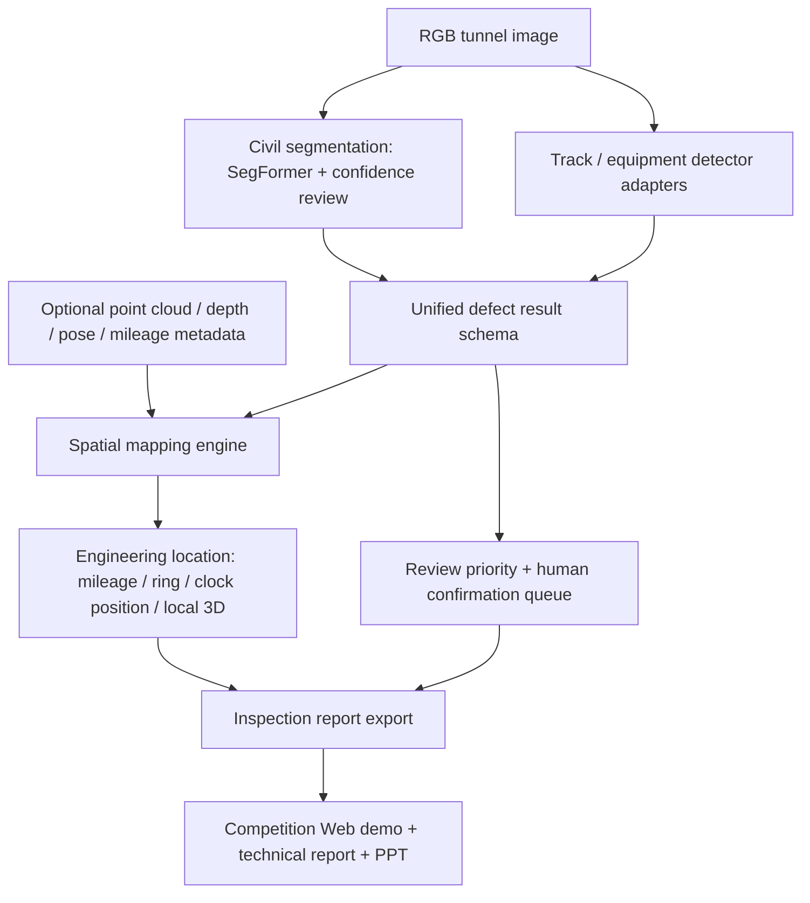

# Metro Multidomain Inspection Competition Plan

## Summary

本计划把现有“隧道病害分割与可信复核分析系统”扩展为面向 CS-202613 比赛的地铁多领域病害综合智能巡检方案。推荐路线是 B+C：以现有土建结构视觉分割和可信复核为核心，补齐轨道/设备多领域检测接口，并加入病害像素到里程、环号、时钟方位和三维坐标的空间语义映射链条。

---

## Problem Frame

比赛要求不是单个 segmentation demo，而是“采集-处理-诊断-报告”的综合巡检系统。评分重点包括多领域覆盖、空间定位、多模态融合、线下测试指标、系统闭环和展示材料。当前项目已经有 SegFormer mask source、adaptive selected mask、uncertainty、disagreement、morphology_delta、review priority、Web 展示和实验材料，最适合作为土建病害识别与可信复核核心继续外扩。

本计划不要求立刻购买硬件或重写模型。第一阶段先用现有图像模型和可配置空间映射完成可展示系统；第二阶段接入比赛方样本或仿真数据，补轨道/设备检测；第三阶段把报告、PPT、技术文档、代码说明整理成可提交作品。

---

## Competition Fit

| 比赛要求 | 当前基础 | 计划补齐 |
|---|---|---|
| 土建裂缝、渗漏水、管片剥落掉块识别 | SegFormer 6 类分割、mask 展示、mIoU 证据 | 重新映射比赛病害 taxonomy，补检出率/召回率报告 |
| 轨道扣件缺失、松动、断裂识别 | 当前没有专门轨道检测 | 增加多领域检测 schema 和轻量检测适配器 |
| 设备支架松脱、异物侵限识别 | pipeline 类与 Web 报告可复用 | 增加设备类标签/检测框/规则化报告 |
| 空间精准定位 | 当前主要是像素级 mask | 增加像素到隧道坐标、里程、环号、时钟方位的映射模块 |
| 多模态融合 | 当前主要是 RGB 图像 | 设计点云/里程/姿态元数据融合接口，先支持仿真或标定参数 |
| 标准化巡检报告 | 已有 report JSON 和 Web 展示 | 增加比赛报告导出、病害清单、位置和复核优先级 |
| 展示与答辩 | 已有 PPT/Web demo | 改造成比赛叙事：多领域、定位、闭环、创新点 |

---

## Requirements

**Competition capability**

- R1. 系统必须以比赛题目中的三大领域组织输出：土建结构、轨道系统、系统设备。
- R2. 土建结构模块必须复用现有 SegFormer 分割能力，并把当前 6 类 mask 映射到比赛病害类型和报告字段。
- R3. 轨道和设备模块必须先提供统一检测结果 schema，即使第一版只接入示例/仿真/轻量 detector，也不能把结果硬编码在页面里。
- R4. 每个病害结果必须包含类型、置信度、像素区域或检测框、空间位置、复核优先级和报告解释。

**Spatial positioning and multimodal fusion**

- R5. 系统必须支持从像素坐标到隧道工程坐标的连续映射，至少输出里程、环号、时钟方位和局部三维坐标中的可用字段。
- R6. 空间映射必须显式区分真实传感器输入、仿真输入和手动标定输入，不能把仿真定位包装成真实外业定位。
- R7. 多模态融合第一版必须提供可扩展接口：RGB 图像、可选深度/点云、相机内参、外参、姿态、里程或环号元数据。
- R8. 无点云数据时，系统可用隧道圆筒/环片参数做仿真定位，但报告必须标注定位来源和精度等级。

**Confidence review and reporting**

- R9. 现有 `uncertainty`、`disagreement`、`morphology_delta` 和 `review_priority` 必须进入比赛报告，作为“人机协同复核”创新点。
- R10. 报告必须区分算法检测结论、可信复核建议和人工确认状态，不能把 review priority 写成结构安全诊断。
- R11. Web 展示必须支持按领域、病害类型、位置和复核优先级筛选或浏览结果。
- R12. 技术报告必须包含系统架构、多领域检测流程、多模态融合/定位算法、实验指标、原型或仿真展示和局限性。

**Open-source and submission packaging**

- R13. `README.md` 必须面向开源和评委展示，避免本机绝对路径；本机 Windows 环境细节转移到单独 local setup 文档。
- R14. 作品包必须包含代码说明、运行入口、示例数据说明、实验结果、演示视频脚本和技术报告材料索引。
- R15. 所有指标必须可追溯到日志、JSON、测试或比赛样本评估；没有官方样本验证前，指标表必须标注为 internal dataset 或 simulation。

---

## High-Level Technical Design

第一版采用“统一结果 schema + 可插拔检测器 + 可解释空间映射”的架构。土建领域先复用现有分割模型；轨道和设备领域先通过 adapter 接入轻量 detector、规则样例或后续比赛样本模型；空间定位模块独立接收像素区域和传感器/仿真元数据，不与某一个模型绑定。

---

## Key Technical Decisions

- KTD1. **以 B+C 为主线:** B 解决比赛的多领域覆盖，C 解决精准定位和专利/算法深度；两者比单纯提高 mIoU 更贴合评分表。
- KTD2. **先统一 schema，再补模型:** 多领域检测最怕每类病害各写一套展示逻辑；先定义统一 defect result，后续 detector 可逐步替换。
- KTD3. **空间定位先支持仿真/标定，再接真实传感器:** 没有真实 LiDAR/INS 数据时也能完成可解释验证，但必须保留数据来源和精度边界。
- KTD4. **可信复核作为差异化创新:** `review_priority` 不取代检测指标，而是让系统说明哪些结果不稳定、哪些需要人工优先确认。
- KTD5. **README 开源化是参赛包装的一部分:** 老师和评委可能直接打开仓库；主 README 要讲清楚项目价值和通用运行方式，本机路径不能成为第一印象。
- KTD6. **指标分层呈现:** SegFormer `mIoU`、比赛检出率、空间定位误差、review queue 覆盖率分别回答不同问题，不能混成一个“效果提升”叙事。

---

## Implementation Units

### U1. Competition Requirements Matrix

- **Goal:** 把比赛 PDF 的评分点转成项目需求矩阵，明确当前已有、计划新增和暂不主张的内容。
- **Files:**
  - `docs/competition/cs-202613-requirements-matrix.md`
  - `docs/plans/2026-06-18-001-feat-metro-multidomain-inspection-plan.md`
  - `README.md`
- **Patterns:** 参考 `docs/paper/claim-to-evidence-matrix.md` 的 claim/evidence/status 写法，避免空泛承诺。
- **Test scenarios:**
  - 矩阵覆盖技术研究报告、核心算法与代码、原型/仿真、评分标准和作品提交要求。
  - 每个比赛要求都有当前状态：supported、planned、simulation-only 或 out-of-scope。
  - 检出率、定位、仿真、报告导出等指标都标注证据来源或待验证状态。
- **Verification:** 文档 review；运行 `tests/test_docs_artifact_contract.py`，确保关键文档锚点存在。

### U2. Multidomain Defect Taxonomy And Unified Result Schema

- **Goal:** 建立三大领域统一病害 taxonomy 和检测结果结构，让土建分割、轨道检测、设备检测进入同一报告链。
- **Files:**
  - `multidomain_schema.py`
  - `run_confidence_risk.py`
  - `web_app.py`
  - `docs/competition/cs-202613-requirements-matrix.md`
  - `tests/test_multidomain_schema.py`
- **Patterns:** 沿用 `risk_adapter.py` 的结构化 dict 输出和 `run_confidence_risk.py` 的 report JSON 合同；新增字段保持向后兼容。
- **Test scenarios:**
  - 土建 mask 结果可转换成统一 defect result，包含 domain、defect_type、geometry、confidence、review_priority。
  - 轨道/设备示例检测结果可进入同一 schema，不需要 Web 特判。
  - 未知病害类型被标记为 `unknown` 或 `other`，不会导致报告生成失败。
  - schema 中可区分 segmentation mask、bbox、point 和 polyline 等几何类型。
- **Verification:** 运行 `tests/test_multidomain_schema.py`、`tests/test_confidence_risk_outputs.py`。

### U3. Civil Defect Competition Mapping

- **Goal:** 将现有 6 类隧道病害输出映射到比赛的土建结构病害表达，并生成检出率/召回率口径说明。
- **Files:**
  - `data_adapter.py`
  - `evaluate_confidence_risk.py`
  - `enhancement_evidence.py`
  - `docs/experiments/enhancement-evidence-summary.md`
  - `docs/competition/civil-defect-evaluation.md`
  - `tests/test_confidence_risk_eval.py`
  - `tests/test_enhancement_evidence.py`
- **Patterns:** 继续从 evaluation JSON 汇总指标，不手工输入数字；沿用 GT/no-GT 边界。
- **Test scenarios:**
  - 现有 `simple`、`blocky`、`pipeline`、`vertical`、`horizontal` 类能映射到比赛可理解的土建病害说明或标记为数据集特有类别。
  - 输出每类召回率、precision、mIoU 或可用替代指标，并说明与比赛“离线检出率”的差异。
  - 对无官方比赛样本的指标标注为 internal dataset，不写成最终比赛指标。
- **Verification:** 运行 `tests/test_confidence_risk_eval.py`、`tests/test_enhancement_evidence.py`，人工核对指标说明。

### U4. Track And Equipment Detector Adapters

- **Goal:** 为扣件状态、管线支架松脱和异物侵限增加可插拔检测适配层，先支持示例/仿真输入，后续接入真实训练集。
- **Files:**
  - `multidomain_detectors.py`
  - `multidomain_schema.py`
  - `run_multidomain_inspection.py`
  - `tests/test_multidomain_detectors.py`
  - `docs/competition/multidomain-detector-notes.md`
- **Patterns:** 不在第一版强行训练多个模型；先定义 detector interface，允许 rule-based sample detector、YOLO-style bbox detector 或 future model adapter。
- **Test scenarios:**
  - 示例扣件缺失结果能输出 domain=`track`、defect_type=`fastener_missing`。
  - 示例支架松脱结果能输出 domain=`equipment`、defect_type=`bracket_loose`。
  - 异物侵限结果能输出 bbox 和侵限区域说明。
  - detector 缺失模型权重时返回清晰 unavailable 状态，不中断土建检测。
- **Verification:** 运行 `tests/test_multidomain_detectors.py`，用小型 fixtures 验证 JSON 合同。

### U5. Spatial Mapping Engine

- **Goal:** 实现病害像素区域到工程坐标的映射，第一版支持相机参数、隧道圆筒模型、里程/环号元数据和可选点云。
- **Files:**
  - `spatial_mapping.py`
  - `multidomain_schema.py`
  - `run_multidomain_inspection.py`
  - `docs/competition/spatial-mapping-method.md`
  - `tests/test_spatial_mapping.py`
- **Patterns:** 使用独立模块接收 geometry 和 calibration metadata；输出来源、置信等级和误差说明，不把定位逻辑散落到 Web 端。
- **Test scenarios:**
  - mask centroid 可映射到归一化图像坐标和隧道时钟方位。
  - 提供里程或环号元数据时，报告输出对应工程位置。
  - 提供相机内参/外参和深度时，输出局部三维坐标。
  - 缺少定位元数据时，输出 `location_status=unavailable` 和可读原因。
  - simulation-only 定位在报告中明确标注为仿真或估算。
- **Verification:** 运行 `tests/test_spatial_mapping.py`，抽查典型像素点对应的时钟方位和坐标范围。

### U6. Inspection Report Export And Web Competition View

- **Goal:** 将多领域检测、空间定位和可信复核结果整合为可展示、可导出的标准巡检报告。
- **Files:**
  - `inspection_report.py`
  - `web_app.py`
  - `web_demo/index.html`
  - `tests/test_inspection_report.py`
  - `tests/test_web_app.py`
  - `docs/competition/report-template.md`
- **Patterns:** 复用现有 report JSON、多视图 artifact 和 Web 拖拽体验；新增比赛视图时保持现有单图检测可用。
- **Test scenarios:**
  - 报告包含病害清单、领域、类型、位置、置信度、review priority、人工复核建议。
  - Web 可按土建、轨道、设备过滤或分组展示结果。
  - 没有轨道/设备模型时，Web 显示模块 unavailable，而不是伪造检测结果。
  - 报告导出不包含本机绝对路径，artifact 路径使用 repo-relative 或下载 URL。
- **Verification:** 运行 `tests/test_inspection_report.py`、`tests/test_web_app.py`，人工在本地 Web 检查比赛视图。

### U7. Competition Experiments And Evidence Pack

- **Goal:** 形成比赛可提交的实验材料包，区分 internal dataset、official samples、simulation 和 demo cases。
- **Files:**
  - `enhancement_evidence.py`
  - `experiments/patent_evidence_test_pack.json`
  - `docs/competition/experiment-summary.md`
  - `docs/competition/demo-case-pack.md`
  - `tests/test_enhancement_evidence.py`
  - `tests/test_docs_artifact_contract.py`
- **Patterns:** 复用 `patent_evidence_test_pack.json` 的 artifact contract，但比赛材料应改名为 competition evidence，而不是 patent-only 叙事。
- **Test scenarios:**
  - 实验表区分土建分割指标、review priority 指标、空间定位误差和多领域示例覆盖。
  - 每个 demo case 标注数据来源、GT 是否可用、是否为仿真定位。
  - 如果获得比赛方样本，新增 official split 字段；未获得前保持 planned 状态。
- **Verification:** 运行 `tests/test_enhancement_evidence.py`、`tests/test_docs_artifact_contract.py`，人工核对实验来源。

### U8. Open-Source README And Local Setup Split

- **Goal:** 清理主 README 中不适合开源展示的本地路径和过细命令，把本机环境细节移动到 local setup 文档。
- **Files:**
  - `README.md`
  - `docs/local-setup-windows.md`
  - `docs/competition/open-source-submission-notes.md`
  - `tests/test_docs_artifact_contract.py`
- **Patterns:** 主 README 面向评委/老师/开源读者；Windows 绝对路径、conda 环境路径和本机 SegFormer 源码路径只放在 local setup。
- **Test scenarios:**
  - `README.md` 不出现用户目录、本机盘符或个人路径。
  - README 提供通用快速开始、项目能力、比赛方向、结果截图/指标和文档索引。
  - `docs/local-setup-windows.md` 保留现有 Windows 训练/推理细节，便于自己继续跑。
  - 文档明确大模型/点云/官方样本等未包含资产的获取边界。
- **Verification:** 运行 `tests/test_docs_artifact_contract.py`，并检查主 README 是否仍包含本机盘符、用户目录或个人工作区路径。

### U9. Technical Report, PPT, And Demo Script

- **Goal:** 产出不少于 8000 字技术报告的大纲和素材索引，并更新 PPT/讲稿为比赛叙事。
- **Files:**
  - `docs/competition/technical-report-outline.md`
  - `docs/competition/demo-script.md`
  - `docs/presentations/tunnel-defect-project/index.html`
  - `docs/presentations/tunnel-defect-project-speaker-output/tunnel-defect-project-display.md`
  - `README.md`
- **Patterns:** 沿用现有 PPT 通俗表达，但改成“多领域综合巡检系统”而不是“单一隧道 mask demo”。
- **Test scenarios:**
  - 技术报告大纲覆盖背景、架构、算法、多模态融合、空间定位、实验、工程可行性和局限性。
  - PPT 至少包含比赛需求映射、系统架构、土建检测效果、空间定位示意、多领域扩展、报告闭环和创新点。
  - 演示脚本能在 5-8 分钟内讲清楚输入、检测、定位、复核和报告导出。
- **Verification:** 人工预演；运行文档契约测试，确认引用的关键文档存在。

---

## Acceptance Examples

- AE1. **比赛要求可追踪:** 打开 `docs/competition/cs-202613-requirements-matrix.md`，能看到每个评分点对应的当前状态和计划交付物。
- AE2. **多领域结果统一:** 对同一张图运行多领域入口后，土建 mask、扣件检测示例和设备检测示例进入同一个 report JSON。
- AE3. **空间定位可解释:** 某个病害 mask 的 centroid 能输出时钟方位、里程/环号字段和定位来源说明。
- AE4. **无传感器数据不造假:** 缺少点云或姿态数据时，报告写明定位 unavailable 或 simulation-only，不输出伪精确三维坐标。
- AE5. **复核创新可见:** Web 和报告都显示 `review_priority`、uncertainty/disagreement 或 morphology_delta，并说明其用于人工复核排序。
- AE6. **README 适合开源:** 主 README 不含本机绝对路径，评委打开仓库能看到项目目标、快速开始、结果和比赛材料索引。
- AE7. **提交材料闭环:** 技术报告、PPT、演示脚本、代码说明和实验材料互相引用一致，不把 pending 指标写成已完成。

---

## Scope Boundaries

### In Scope

- 基于现有 SegFormer 的土建病害识别与可信复核。
- 多领域 defect result schema 和示例/可插拔检测器接口。
- 像素到工程坐标的仿真/标定空间映射。
- Web 端比赛视图、巡检报告导出和开源 README 清理。
- 比赛技术报告、PPT 和 demo script 的工程材料。

### Deferred For Later

- 使用真实 LiDAR/INS 硬件完成外业级定位验证。
- 训练完整轨道扣件和设备异物检测模型。
- Gazebo/Unity 小车仿真和路径规划。
- 自动生成 PDF/Word 格式正式申报书。

### Outside This Product Identity

- 结构承载力评估、维修决策自动化和养护方案生成。
- 替代人工验收或工程安全最终判定。
- 将 Web 交互本身包装为算法创新。

---

## Risks And Dependencies

| Risk / Dependency | Impact | Mitigation |
|---|---|---|
| 官方比赛样本尚未接入 | 多领域检出率无法按比赛口径验证 | 先用 internal/simulation 标注，拿到样本后新增 official split |
| 没有真实点云或惯导数据 | 精准定位只能做仿真或标定演示 | 明确 `location_source` 和 `accuracy_level`，不伪造外业精度 |
| 多领域训练数据不足 | 扣件/设备检测难以达到 95%/97% 指标 | 第一版做 adapter + demo cases，后续按比赛样本训练 |
| README 本机路径过多 | 开源观感差，评委复现困难 | 主 README 通用化，本机路径移入 `docs/local-setup-windows.md` |
| 参赛叙事过散 | 老师难以理解创新点 | 把创新统一为“多领域识别 + 空间定位 + 可信复核 + 报告闭环” |

---

## Documentation And Submission Notes

- 主仓库展示应以 `README.md`、`docs/competition/`、`docs/paper/`、`docs/experiments/` 和 Web demo 为入口。
- 本机训练路径、conda 环境和外部 SegFormer 源码位置只应出现在 `docs/local-setup-windows.md` 或 `AGENTS.md`，不应出现在主 README。
- 技术报告中的指标必须标注数据来源：internal dataset、official sample、simulation 或 manually curated demo。
- 比赛作品压缩包应包含代码、说明文档、示例输入输出、实验 JSON、PPT/讲稿和演示视频脚本。

---

## Suggested Execution Order

1. U1 + U8：先整理比赛矩阵和开源 README，让仓库入口适合给老师看。
2. U2 + U3：建立多领域 schema，并把现有土建模型接入比赛 taxonomy。
3. U5：实现空间定位核心，先完成 simulation/calibration 版本。
4. U4 + U6：接入轨道/设备示例检测和比赛 Web/报告视图。
5. U7 + U9：生成实验材料、技术报告大纲、PPT 和演示脚本。
