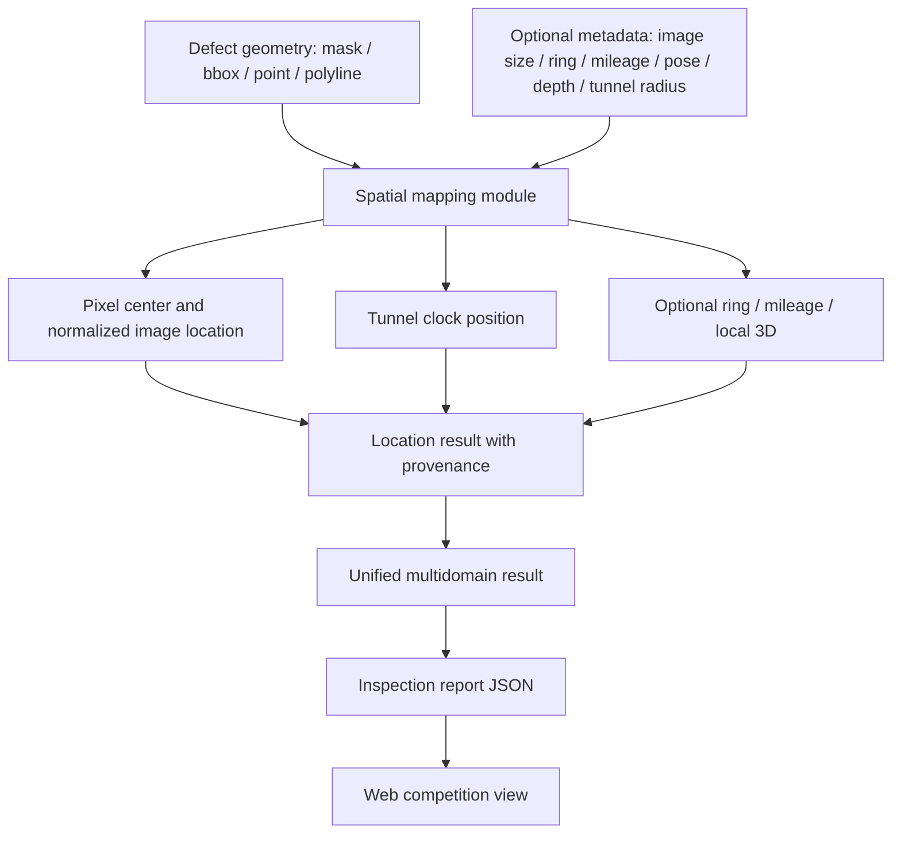

# Spatial Mapping Prototype Plan

## Summary

本计划把“空间定位/工程坐标映射”从比赛总计划中的概念项推进为可运行、可测试、可展示的算法模块。目标不是伪造外业级精准定位，而是把现有 mask / bbox / point 等病害几何结果，映射成工程上容易理解的位置表达：归一化图像位置、隧道时钟方位、可选环号、可选里程、可选局部三维坐标，并且每个位置结果都明确标注 `source`、`accuracy_level` 和局限性。

这条路线偏研究、论文和专利。它把单纯“检测出病害”推进到“病害在哪里、位置如何计算、可信边界是什么”。第一版以 simulation/calibration prototype 为主，后续接入真实相机标定、深度、点云、里程或姿态数据时，可以自然扩展成更强的空间融合算法。

---

## Problem Frame

当前项目已经具备 SegFormer 分割、selected mask、uncertainty、disagreement、review priority、多领域报告 schema 和 Web 展示雏形。现有 `multidomain_schema.py` 已经能接收 `spatial_summary`，Web 端也已经显示 `location_status`，但空间定位本身仍主要停留在 coarse / simulation placeholder：还没有独立算法模块，也没有统一解释“像素区域如何变成工程位置”。

比赛和专利叙事都需要这个能力。比赛侧强调综合巡检、空间定位和报告闭环；专利侧可以主张“基于分割几何、隧道结构先验和可信度约束的病害空间语义定位方法”。边界必须清楚：没有真实标定或传感器数据时，只输出估算/仿真定位，不写成真实测量坐标。

---

## Requirements

**Spatial mapping algorithm**

- R1. 系统必须能从 mask、bbox、point、polyline 等几何结果中提取病害中心、外接范围、像素面积和归一化图像坐标。
- R2. 系统必须能把归一化图像坐标转换成隧道时钟方位，例如 12 点、3 点、6 点、9 点或更细粒度角度。
- R3. 系统必须支持可选工程元数据：环号、里程、相机内参、外参、姿态、深度、隧道半径、图像尺寸。
- R4. 当元数据足够时，系统可以输出局部三维坐标；当元数据不足时，必须降级为图像位置或时钟方位，不能输出伪精确三维坐标。
- R5. 每个定位结果必须包含 `status`、`source`、`accuracy_level`、`method`、`limitations`，明确区分真实传感器、标定估算、仿真输入和不可用状态。

**Integration and report**

- R6. 多领域报告里的每个 defect result 都应尽量挂载 `location` 字段；没有几何或元数据时返回 unavailable 和原因。
- R7. `inspection_report.py` 导出的 JSON 必须保留 spatial summary，Web 展示应能看到时钟方位、环号、里程、来源和精度等级。
- R8. 现有没有 GT 的自选图片流程不能强行显示真实 mIoU；空间定位可以显示 simulation/calibration 结果，但必须标注来源。
- R9. 现有 tests 和 report schema 应保持向后兼容，不能因为新增定位字段破坏拖拽检测和原有报告导出。

**Evidence and documentation**

- R10. 必须补充 `docs/competition/spatial-mapping-method.md`，用通俗语言说明每个位置字段怎么得来。
- R11. 比赛材料和 README 中不能把 simulation-only 定位包装为真实外业定位。
- R12. 后续若用于论文/专利，应保留算法流程、输入输出合同、误差来源和可扩展传感器接口。

---

## High-Level Technical Design

第一版建议新增独立 `spatial_mapping.py`，它只关心“几何 + 元数据 -> 位置结果”，不直接依赖 Web 页面，也不直接绑定某一个模型。`multidomain_schema.py` 负责把这个结果挂到每个 defect result 上；`inspection_report.py` 和 `web_demo/index.html` 负责展示和导出。

---

## Key Technical Decisions

- KTD1. **定位算法独立成模块:** 不把时钟方位、环号、里程计算写在 Web 端。Web 只展示结果，算法逻辑放在 `spatial_mapping.py`，方便测试、论文和专利描述。
- KTD2. **先做 provenance-first 合同:** 定位字段优先说明来源和精度等级，再展示坐标。这样即使第一版是仿真/标定，也不会被质疑为伪造真实测量数据。
- KTD3. **默认支持 simulation/calibration，不默认宣称 field-grade:** 没有真实点云、INS 或里程传感器时，结果只能叫估算或仿真定位。
- KTD4. **从现有 mask 几何出发:** 当前最稳定的数据源是 selected mask 和 segmentation artifact；第一版先用 mask/bbox 几何计算中心、范围和方位，后续再接深度或点云。
- KTD5. **可选 3D 必须 metadata-gated:** 只有当输入包含深度、相机模型或隧道半径等必要信息时，才输出局部三维坐标；否则输出 `unavailable` 或 `not_applicable`。
- KTD6. **比赛展示和专利叙事分层:** Web 展示讲“病害位置表达更直观”；论文/专利讲“基于结构先验和可信边界的空间语义定位方法”。

---

## Implementation Units

### U1. Spatial Mapping Output Contract

- **Goal:** 定义定位结果的统一输出结构，让后续算法、报告和 Web 都使用同一份合同。
- **Files:**
  - `spatial_mapping.py`
  - `tests/test_spatial_mapping.py`
  - `docs/competition/spatial-mapping-method.md`
- **Expected fields:** `status`、`source`、`accuracy_level`、`method`、`pixel_center`、`normalized_center`、`bbox`、`clock_position`、`ring_id`、`mileage`、`local_3d`、`limitations`。
- **Test scenarios:**
  - mask/bbox 输入能输出中心点和归一化坐标。
  - 缺少几何时输出 `status=unavailable` 和可读原因。
  - 每个输出都包含 `source`、`accuracy_level` 和 `method`。
- **Verification:** `python -m pytest tests/test_spatial_mapping.py -q`

### U2. Clock Position Mapping

- **Goal:** 把病害在图像中的位置转换成隧道时钟方位，形成最容易解释的工程位置表达。
- **Files:**
  - `spatial_mapping.py`
  - `tests/test_spatial_mapping.py`
  - `docs/competition/spatial-mapping-method.md`
- **Algorithm idea:** 用病害中心点相对图像中心的方向估计时钟方位。上方对应 12 点附近，右侧对应 3 点附近，下方对应 6 点附近，左侧对应 9 点附近。第一版只做图像平面近似，并标注 `accuracy_level=coarse`。
- **Test scenarios:**
  - 图像上方中心点映射到 12 点附近。
  - 图像右侧中心点映射到 3 点附近。
  - 图像下方中心点映射到 6 点附近。
  - 图像左侧中心点映射到 9 点附近。
- **Verification:** `python -m pytest tests/test_spatial_mapping.py -q`

### U3. Ring And Mileage Metadata Support

- **Goal:** 允许用户或上游系统传入环号、里程等工程元数据，让报告从“图像位置”升级到“工程位置”。
- **Files:**
  - `spatial_mapping.py`
  - `run_multidomain_inspection.py`
  - `tests/test_spatial_mapping.py`
  - `tests/test_run_multidomain_inspection.py`
- **Input metadata examples:** `ring_id=R-0128`、`mileage=K12+340.5`、`camera_id=cam-front-left`、`capture_pose`。
- **Test scenarios:**
  - 提供 `ring_id` 时，定位结果保留环号。
  - 提供 `mileage` 时，定位结果保留里程。
  - 未提供工程元数据时，不影响 clock position 输出。
  - metadata 来源标记进入 `source` 或 `method_detail`。
- **Verification:** `python -m pytest tests/test_spatial_mapping.py tests/test_run_multidomain_inspection.py -q`

### U4. Optional Local 3D Projection

- **Goal:** 为后续论文/专利保留算法深度：当存在深度或相机参数时，输出局部三维坐标；没有参数时明确不可用。
- **Files:**
  - `spatial_mapping.py`
  - `tests/test_spatial_mapping.py`
  - `docs/competition/spatial-mapping-method.md`
- **Algorithm idea:** 输入相机内参和深度时，将像素中心反投影到相机坐标；输入相机外参时，可转换到局部隧道坐标；输入隧道半径但无真实 depth 时，可用圆筒先验做 coarse simulation，但必须标注 simulation。
- **Test scenarios:**
  - 有 depth + intrinsics 时输出 `local_3d`。
  - 有 tunnel radius 但无真实 depth 时输出 simulation 坐标和限制说明。
  - 无必要参数时 `local_3d.status=unavailable`。
- **Verification:** `python -m pytest tests/test_spatial_mapping.py -q`

### U5. Multidomain Report Integration

- **Goal:** 将空间定位模块接入现有 `multidomain_schema.py` 和报告导出链路。
- **Files:**
  - `multidomain_schema.py`
  - `inspection_report.py`
  - `run_multidomain_inspection.py`
  - `tests/test_multidomain_schema.py`
  - `tests/test_inspection_report.py`
- **Test scenarios:**
  - 土建 selected mask 结果能挂载 location。
  - 轨道/设备 demo result 如果有 bbox，也能挂载 location。
  - 没有 spatial metadata 时，location 不再只是泛泛 placeholder，而是明确说明缺什么。
  - `summary.location_status` 统计 available / partial / unavailable。
- **Verification:** `python -m pytest tests/test_multidomain_schema.py tests/test_inspection_report.py -q`

### U6. Web Display Improvements

- **Goal:** 在 Web 展示中把定位结果讲清楚，让老师一眼看到“这个病害在隧道哪个方位、定位依据是什么”。
- **Files:**
  - `web_demo/index.html`
  - `tests/test_web_app.py`
  - `docs/competition/demo-script.md`
- **Display fields:** 时钟方位、环号/里程、定位来源、精度等级、局限说明。
- **Test scenarios:**
  - 有 clock position 时，Web 表格或详情区显示时钟方位。
  - 有 ring/mileage 时，Web 显示工程位置。
  - simulation-only 结果显示“仿真/估算”，不显示“精准定位”。
  - 上传自选图片时，如果缺少元数据，仍能显示图像位置或 unavailable 原因。
- **Verification:** `python -m pytest tests/test_web_app.py -q`，并在 `http://127.0.0.1:8000/` 人工检查一次。

### U7. Method Documentation And Evidence Pack

- **Goal:** 把空间定位模块写成老师、评委和后续专利材料都能读懂的方法说明。
- **Files:**
  - `docs/competition/spatial-mapping-method.md`
  - `docs/competition/cs-202613-requirements-matrix.md`
  - `docs/competition/experiment-summary.md`
  - `docs/paper/claim-to-evidence-matrix.md`
  - `tests/test_docs_artifact_contract.py`
- **Documentation content:**
  - 输入：mask、bbox、图像尺寸、可选工程元数据。
  - 输出：图像位置、时钟方位、环号、里程、局部三维。
  - 流程：几何提取、坐标归一化、方位映射、元数据融合。
  - 边界：simulation-only、calibration-based、field-grade 的区别。
- **Test scenarios:**
  - 文档出现 `simulation-only`、`source`、`accuracy_level`、`clock position` 等关键锚点。
  - 比赛矩阵不再把空间定位标为纯 planned，而是标为 prototype / simulation-supported。
  - 论文证据矩阵只主张已实现和可验证的部分。
- **Verification:** `python -m pytest tests/test_docs_artifact_contract.py -q`

---

## Acceptance Examples

- AE1. 给一张有 mask 的隧道图片，系统能输出病害中心、归一化位置和时钟方位，例如“右上方，约 1-2 点方向”。
- AE2. 给 ring/mileage 元数据，报告能显示“环号 R-0128，里程 K12+340.5，约 2 点方向”。
- AE3. 没有真实传感器数据时，报告显示 `source=simulation` 或 `source=not_provided`，不会写成真实精准坐标。
- AE4. 给 bbox 类型的轨道/设备 demo result，同一个空间映射模块也能为 bbox 输出粗定位，而不是只服务土建 mask。
- AE5. Web 结果页能看到位置、来源、精度等级和局限说明。
- AE6. `docs/competition/spatial-mapping-method.md` 能解释每个位置字段怎么得来，以及为什么第一版是 prototype。

---

## Scope Boundaries

### In Scope

- mask / bbox / point / polyline 到图像位置和时钟方位的映射。
- 可选环号、里程、相机参数、深度、隧道半径的输入合同。
- simulation/calibration 原型定位结果。
- 多领域报告、巡检报告 JSON 和 Web 展示集成。
- 比赛/论文/专利材料中的方法说明和局限说明。

### Deferred For Later

- 真实 LiDAR/INS/里程计接入和外业误差标定。
- 多相机同步、SLAM 建图和全线路空间索引。
- 官方比赛样本上的定位误差评测。
- 维修决策或结构安全等级自动判定。

### Out Of Scope

- 把仿真定位包装成真实工程测量。
- 仅靠模型推理结果计算真实 mIoU。
- 在没有标定数据的情况下输出厘米级或毫米级坐标。

---

## Risks And Mitigations

| Risk | Impact | Mitigation |
|---|---|---|
| 空间定位被质疑不真实 | 影响比赛/答辩可信度 | 所有结果都显示 `source`、`accuracy_level` 和局限性 |
| 图像平面时钟方位过粗 | 不能用于真实施工定位 | 第一版只声明 coarse orientation，后续用标定/深度升级 |
| 缺少 geometry 或 mask artifact | 无法计算位置 | 输出 unavailable 和原因，不中断报告 |
| schema 改动破坏现有 Web | 拖拽检测体验受影响 | 保持字段向后兼容，新增测试覆盖 report/export |
| 专利叙事过宽 | 容易变成泛泛系统方案 | 聚焦“结构先验 + 几何映射 + 来源可信边界”的算法链 |

---

## Suggested Execution Order

1. U1 + U2：先建立定位输出合同和时钟方位映射，形成最小可运行算法。
2. U3：接入环号/里程 metadata，让结果变成工程位置表达。
3. U5：接入 multidomain report 和 inspection report。
4. U6：把 Web 展示补清楚，便于老师检查。
5. U4：在基础稳定后补 optional 3D projection，增强论文/专利算法深度。
6. U7：补方法文档、比赛矩阵和证据矩阵，收束叙事边界。

---

## Verification Matrix

| Unit | Primary command | Manual check |
|---|---|---|
| U1-U4 | `python -m pytest tests/test_spatial_mapping.py -q` | 抽查不同像素位置对应的时钟方位 |
| U5 | `python -m pytest tests/test_multidomain_schema.py tests/test_inspection_report.py -q` | 打开导出的 inspection report JSON |
| U6 | `python -m pytest tests/test_web_app.py -q` | 打开 Web，检查位置来源和精度等级 |
| U7 | `python -m pytest tests/test_docs_artifact_contract.py -q` | 确认文档没有过度承诺真实定位 |

---

## Post-Plan Recommendation

建议下一步直接进入 `/ce-work`，从 U1+U2 开始。原因是 U1+U2 体量小、风险低、展示价值高：一旦能把 mask 中心映射成时钟方位，就可以立刻在 Web 和 PPT 里讲清楚“检测结果不仅有形状，还有工程位置语义”。随后再接环号/里程和报告导出。
