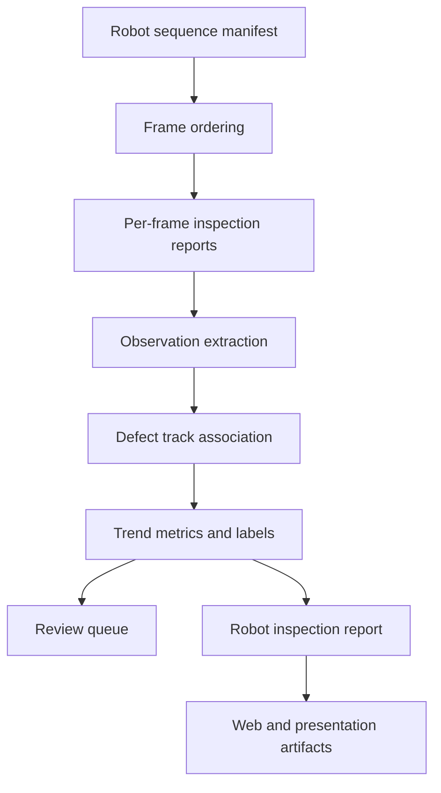

# Robot Spatiotemporal Defect Monitoring Plan

## Summary

在现有单帧隧道病害检测和工程报告能力之上，新增机器人巡检序列的时空监测层。第一版消费现有 per-frame inspection report，完成序列排序、observation 抽取、defect track 聚合、增长/变形趋势判断，并导出 route-level robot inspection report。

---

## Problem Frame

当前项目已经能回答单张图的检测结果、mask 质量、不确定性、形态特征和工程位置摘要，但机器人巡检场景需要回答线路级问题：同一病害是否在连续帧或多次巡检中反复出现，位置是否稳定，面积或骨架是否增长，哪些点需要优先复核。

本计划覆盖完整 brainstorm 范围，但把真实机器人 middleware、SLAM/LiDAR、深度时序预测放到后续阶段。当前阶段先实现可测试、可解释、可写进专利/比赛材料的时空轨迹算法层。

---

## Requirements

**Sequence and report contract**

- R1. 系统能读取 robot sequence manifest，并支持 image/report path、timestamp、mileage、ring id、camera id、可选 pose/calibration/depth。
- R2. 系统能复用现有 per-frame inspection report，不重复实现模型推理，也不丢失 selected mask、uncertainty、disagreement、morphology、review priority 和 spatial summary。
- R3. 系统能按 mileage、ring id、timestamp 或 manifest order 形成 route order，并记录 ordering confidence 与 limitations。

**Tracking and trend**

- R4. 系统能把 observations 聚合为 persistent defect tracks，并输出 track confidence 与 association reasons。
- R5. 系统能计算 area delta、skeleton length delta、centroid shift、bbox change、class stability、uncertainty trend 和 risk trend。
- R6. 系统能给出 baseline-only、stable、suspected-growth、suspected-deformation、uncertain 等 explainable trend labels。
- R7. 系统能生成 review queue，优先呈现高风险、高不确定性、疑似增长、疑似变形或定位置信不足的 tracks。

**Engineering and safety**

- R8. 系统输出必须保留 engineering location 字段，包括 mileage、ring id、clock position、normalized center、source、accuracy level 和 limitations。
- R9. 缺失 metadata 时系统不能崩溃，应输出 partial/uncertain status 和 limitation。
- R10. 系统不能在缺少标定和人工复核时宣称厘米级定位或真实结构变形量。
- R11. track history 结构要能支持未来 sequence prediction，但第一版只实现规则化趋势证据。

---

## Key Technical Decisions

- KTD1. **从 per-frame report 开始。** `inspection_report.py` 已经有 assessment、evidence、views、multidomain results 和 spatial summary；新层先消费这些 JSON，而不是改动模型推理入口。
- KTD2. **新增 defect track 作为核心抽象。** track 把多帧 observations 变成一个工程对象，包含位置、趋势、置信度、复核原因和限制说明。
- KTD3. **第一版使用保守规则匹配。** 用 class、mileage/ring proximity、normalized center distance、bbox/morphology similarity 和时间连续性做 association；证据弱时宁可新建 uncertain track。
- KTD4. **趋势标签必须可解释。** suspected-growth 或 suspected-deformation 必须能追溯到 area、skeleton、centroid、bbox、risk 或 uncertainty 的具体变化。
- KTD5. **算法层先于 Web 层。** 先稳定 JSON contract 和 tests，再把 route-level tracks 接入 Web 展示，避免 UI 先行导致算法证据不稳。

---

## High-Level Technical Design



新模块只依赖现有 report contract，不直接改 SegFormer 推理。这样可以先用 fixture reports 写测试，后续再接真实机器人图片序列。

---

## Implementation Units

### U1. Robot sequence input contract

- **Goal:** 定义并解析 robot sequence manifest，形成稳定的 frame order。
- **Files:** `robot_sequence.py`, `tests/test_robot_sequence.py`, `docs/competition/robot-spatiotemporal-monitoring.md`
- **Patterns:** 参考现有报告输出的轻量 JSON contract 风格，保持字段简单、可人工编辑。
- **Test scenarios:**
  - mileage 和 timestamp 完整时按 route order 排序。
  - manifest 无序输入时输出稳定顺序。
  - mileage 缺失时使用 timestamp/manifest order，并记录 limitation。
  - timestamp 缺失时不崩溃，ordering confidence 降级。
- **Acceptance:** 满足 R1、R3、R9。

### U2. Observation extraction from per-frame reports

- **Goal:** 从现有 single-image inspection report 抽取 sequence observation。
- **Files:** `spatiotemporal_monitoring.py`, `tests/test_spatiotemporal_monitoring.py`
- **Patterns:** 复用 `inspection_report.py` 的 report 字段和 `spatial_mapping.py` 的 spatial summary 语义。
- **Test scenarios:**
  - report 含 `spatial_summary` 时 observation 有 location、area、bbox 和 confidence。
  - report 缺少 foreground/location 时 observation 标记为 partial。
  - uncertainty、disagreement、review priority、morphology 字段被保留。
- **Acceptance:** 满足 R2、R8、R9。

### U3. Defect track association

- **Goal:** 将 observations 聚合成 persistent defect tracks。
- **Files:** `spatiotemporal_monitoring.py`, `tests/test_spatiotemporal_monitoring.py`
- **Patterns:** 保守匹配，优先避免误合并；association reasons 需要能被报告展示。
- **Test scenarios:**
  - class 相同、mileage/ring 接近、normalized center 接近时归为一个 track。
  - class 不同或位置差距大时分成多个 tracks。
  - 缺少 location 时 track confidence 降级，不输出高置信合并。
  - 同一序列多帧输入时 track id 稳定且 observations 顺序正确。
- **Acceptance:** 满足 R4、R9、R10。

### U4. Growth and deformation metrics

- **Goal:** 对每个 track 计算可解释 trend metrics 和 trend labels。
- **Files:** `spatiotemporal_monitoring.py`, `tests/test_spatiotemporal_monitoring.py`
- **Patterns:** 规则阈值集中定义，避免魔法数字散落；所有 label 都给出 reason。
- **Test scenarios:**
  - 单 observation 输出 baseline-only。
  - area 或 skeleton length 明显增加时输出 suspected-growth。
  - centroid shift 或 bbox shape 明显变化时输出 suspected-deformation。
  - 指标缺失或 uncertainty 过高时输出 uncertain。
  - 小幅变化低于阈值时输出 stable。
- **Acceptance:** 满足 R5、R6、R10、R11。

### U5. Route-level robot inspection report

- **Goal:** 导出工程可读的 route-level report，包括 tracks、observations、trend、review queue 和 limitations。
- **Files:** `robot_inspection_report.py`, `tests/test_robot_inspection_report.py`
- **Patterns:** 延续 `inspection_report.py` 的 JSON-first 输出方式，字段命名保持直观。
- **Test scenarios:**
  - report 包含 route summary、frame count、track count、review count。
  - review queue 将 suspected-growth/high-uncertainty track 排在 stable track 前。
  - latest location 保留 mileage、ring id、clock position、accuracy level 和 limitations。
  - 缺少 metadata 时 route report 汇总 limitations。
- **Acceptance:** 满足 R7、R8、R9、R10。

### U6. Demo integration and sample artifact

- **Goal:** 让 Web/PPT 可以展示 route-level 结果，但不影响现有拖图单帧检测。
- **Files:** `web_demo/index.html`, `web_app.py`, `docs/presentations/tunnel-defect-project/index.html`
- **Patterns:** 先加载静态 route report JSON 做展示；确认 contract 稳定后再考虑多图上传。
- **Test scenarios:**
  - 现有单图拖拽检测仍可使用。
  - 示例 route report 能展示 track 趋势、位置、review reason 和 evidence link。
  - Web 文案区分 model evidence、engineering location 和 limitations。
- **Acceptance:** 满足 R2、R7、R8。

### U7. Research, patent, and competition documentation

- **Goal:** 把算法创新表达成可用于老师展示、比赛方案和专利交底的材料。
- **Files:** `docs/competition/robot-spatiotemporal-monitoring.md`, `docs/competition/cs-202613-requirements-matrix.md`, `docs/presentations/tunnel-defect-project/index.html`
- **Patterns:** 明确区分已实现能力、规则化趋势证据、未来预测能力，避免把 prototype 说成现场验证系统。
- **Test scenarios:**
  - 文档解释“机器人图像序列 -> 病害轨迹 -> 趋势证据 -> 工程报告”的流程。
  - 文档包含 limitations，不声称无依据的厘米级定位或真实结构变形。
  - PPT/比赛材料能用通俗语言讲清创新点。
- **Acceptance:** 满足 R10、R11。

---

## Scope Boundaries

**In scope**

- Manifest/parser、observation extraction、track association、trend metrics、route-level report、review queue、基础 Web/文档展示。

**Deferred for later**

- 机器人 middleware 接入。
- 多周期真实巡检数据集。
- SLAM/LiDAR/metric 3D fusion。
- 学习型 sequence prediction。
- 现场级变形监测验证。

**Out of scope**

- 机器人运动控制。
- 自动维修决策。
- 结构安全认证。
- 无标定数据的厘米级定位承诺。

---

## System-Wide Impact

- 新增模块应位于现有单帧 pipeline 上层，不改变 SegFormer 训练、推理和已有 Web drag-and-drop 行为。
- 新 JSON contract 会成为后续 Web、PPT、比赛材料、专利交底的共同数据源。
- 缺失 metadata 的处理会影响所有工程化表述，必须在 report 和 Web 中保持一致。

---

## Risks And Dependencies

| Risk | Impact | Mitigation |
| --- | --- | --- |
| 缺少真实多周期机器人数据 | 不能证明真实长期预测效果 | 第一版只承诺规则化 trend evidence，用 synthetic/fixture tests 验证逻辑 |
| metadata 不完整 | 位置和趋势可信度下降 | 使用 source、accuracy level、limitations 和 partial/uncertain status |
| 误把不同病害合成一个 track | 造成错误增长判断 | 保守 association，证据不足时新建 uncertain track |
| Web 范围膨胀 | 延误算法核心 | JSON/report 和 tests 先完成，Web 只展示稳定 contract |
| 专利/比赛表述过度 | 影响可信度 | 文档明确 prototype 边界和未验证能力 |

---

## Acceptance Examples

- AE1. 给定含 timestamp 和 mileage 的 manifest，U1 输出稳定 route order，并记录 ordering confidence。
- AE2. 给定两个位置接近的同类 observations，U3 输出一个 track，U4 输出 area/skeleton deltas。
- AE3. 给定缺少 mileage 的 sequence，U1/U5 不崩溃，并在 route report 中显示 limitation。
- AE4. 给定 track 面积和骨架长度明显增加，U4 输出 suspected-growth，U5 将其加入 review queue 前列。
- AE5. 给定只有一个 observation 的 track，U4 输出 baseline-only，而不是增长预测。

---

## Verification

Focused tests after implementation:

```powershell
python -m pytest --rootdir . tests/test_robot_sequence.py tests/test_spatiotemporal_monitoring.py tests/test_robot_inspection_report.py -q -o cache_dir=.pytest_cache
```

Regression tests for existing report and spatial behavior:

```powershell
python -m pytest --rootdir . tests/test_inspection_report.py tests/test_run_confidence_risk_spatial_mapping.py -q -o cache_dir=.pytest_cache
```

Web integration tests after U6:

```powershell
python -m pytest --rootdir . tests/test_web_app.py -q -o cache_dir=.pytest_cache
```

---

## Documentation And Operational Notes

- `docs/competition/robot-spatiotemporal-monitoring.md` 应作为比赛/专利方向说明的主文档。
- `docs/presentations/tunnel-defect-project/index.html` 只在有实际 route report 示例后更新，避免 PPT 展示先于算法证据。
- 所有 docs 中的路径保持 repo-relative，方便 Gitee 开源展示。

---

## Sources And Research

- `spatial_mapping.py` 已提供 location source、accuracy level、limitations、mileage、ring id、clock position 等工程位置基础。
- `inspection_report.py` 已提供 per-frame structured report，可作为 U2 的输入 contract。
- `docs/brainstorms/2026-06-25-robot-spatiotemporal-defect-monitoring-requirements.md` 是本计划的需求来源。
- `docs/plans/2026-06-20-001-feat-spatial-mapping-prototype-plan.md` 是空间定位能力的上游计划。
