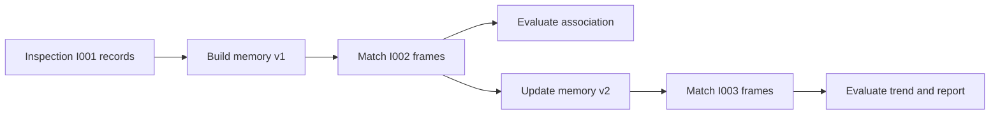

# Fix Robot Inspection System Credibility Plan

## Summary

本计划修复当前机器人隧道巡检系统中最影响可信度的问题：Memory Bank 仍是批处理聚合、Association 仍是规则匹配、Growth 存在未来信息泄漏风险、DAG/Agent 容易显得过度工程。修复方向是最小化改动：保留现有 6 节点 DAG 和 CSV 产物，只新增时间递进评估、增量 memory 更新路径、关联评估报告和更诚实的文档/展示边界。

---

## Problem Frame

当前系统可以跑通完整工程闭环，但严格审查后暴露出三类硬伤。

第一类是科学性硬伤：`memory` 先读取完整工程报告和完整增长分析，再对所有帧做 association，存在 temporal leakage；这不能证明真实在线跨巡检匹配能力。第二类是证据硬伤：Memory Bank 主要按 `disease_id` 聚合，Association 主要是人工权重 heuristic，缺少可量化评估和 baseline。第三类是工程叙事硬伤：Agent/DAG 结构已经存在，但当前任务规模较小，如果继续扩展框架会变成“为架构而架构”。

本计划不做大重构，不加入重模型，不重写 Web，不引入数据库。目标是把系统从“能展示”修成“更诚实、可测试、可答辩”。

---

## Requirements

- R1. 系统必须支持时间递进的评估模式：用早期巡检建立 memory，对下一次巡检做 association，再更新 memory，禁止在匹配阶段读取未来巡检结果。
- R2. Memory Bank 必须明确区分 `batch_rebuild` 和 `incremental_update`，并保留每次更新来源、版本和限制说明。
- R3. Association 必须输出可量化评估结果，包括 baseline、当前规则评分、matched/unmatched、manual review、误匹配风险案例。
- R4. Growth 只能在时间递进或 comparable 证据下输出较强趋势结论；默认展示为工程提示，不宣称真实长期演化。
- R5. DAG/Agent 不再扩张新框架层；只在现有 Agent 内增加最小必要入口和报告。
- R6. README、final report、artifact contract 必须同步更新，避免把静态 KICT + 仿真元数据表述成真实工业预测系统。

---

## Key Technical Decisions

- KTD1. **保留现有 DAG，不再重写 Orchestrator。** 当前 6 节点 DAG 已经够用；修复重点放在数据时序和评估，而不是继续加调度能力。
- KTD2. **新增 offline progressive evaluation，而不是替换主 pipeline。** 主 pipeline 保持演示稳定；新增评估脚本/模式用于证明没有未来信息泄漏。
- KTD3. **Memory 采用轻量增量更新，不引入数据库。** 用 CSV/JSON manifest 记录 memory version、update source、inspection cutoff，避免引入持久化系统。
- KTD4. **Association 先做 baseline/ablation，不急着换算法。** 当前规则匹配只有在和 baseline 对比后才有说服力；没有评估前继续加特征只会堆复杂度。
- KTD5. **文档降调是功能的一部分。** 对老师、比赛、软著材料必须明确“工程闭环原型”，不能写成真实长期预测或工业上线系统。

---

## High-Level Technical Design

关键变化不是增加更多模块，而是改变评估顺序：matching 时只能看到历史 memory，不能看到未来巡检的完整聚合结果。

---

## Implementation Units

### U1. Progressive evaluation dataset split

**Goal:** 增加一个时间递进评估入口，把现有 `robot_kict_frame_records.csv` 按 `inspection_id` 切成历史帧和待匹配帧，生成 progressive evaluation 中间表。

**Dependencies:** 无。

**Files:**

- `scripts/run_progressive_inspection_evaluation.py`
- `tests/test_progressive_inspection_evaluation.py`
- `docs/artifact_contract.md`

**Approach:** 新脚本只读取现有核心表，不下载数据、不训练模型。按 `inspection_id` 排序后，第一轮用最早巡检构建历史 memory，第二轮用下一次巡检作为 query frames，后续轮次逐步追加。输出一个轻量 manifest，记录每一轮的 `history_inspections`、`query_inspection`、`allowed_inputs` 和输出路径。

**Execution note:** 先写 characterization test，证明每一轮 query 不会包含未来巡检数据。

**Test scenarios:**

- 输入含 I001/I002/I003 时，第一轮 history 只有 I001，query 只有 I002。
- 第二轮 history 包含 I001/I002，query 只有 I003。
- 缺少 `inspection_id` 时脚本报出明确错误，不静默排序。
- 输出 manifest 不包含未来 inspection 的 frame rows。

**Verification:** progressive manifest 可复现生成，且测试能证明没有 future inspection 泄漏到当前 query。

---

### U2. Incremental Memory update path

**Goal:** 给 Memory Bank 增加轻量 `incremental_update` 路径，让 memory 可以从历史 memory + 当前已确认/已匹配 records 更新，而不是每次读取全量工程报告重建。

**Dependencies:** U1。

**Files:**

- `orchestrator/agents/memory_agent.py`
- `orchestrator/schema.py`
- `tests/test_memory_agent.py`
- `tests/test_progressive_inspection_evaluation.py`

**Approach:** 保留现有 `batch_rebuild` 作为主 pipeline 兼容模式；新增增量模式只用于 progressive evaluation。增量模式读取上一版 memory 和当前 inspection 的匹配结果，更新 `last_seen_inspection`、area、risk、source_inspection_ids、memory_version 和 confidence。无法安全匹配的新对象创建 provisional memory，并标记 `requires_manual_review`。

**Execution note:** 不引入数据库，不创建复杂 memory store；CSV 足够支撑当前答辩和测试。

**Test scenarios:**

- 已有 memory 匹配到当前 inspection 后，版本递增且 source_inspection_ids 追加当前巡检。
- 未匹配 query frame 生成 provisional memory，confidence 为 `very_low` 或 `low`。
- 同一轮不允许读取未来 inspection 的 growth 结果。
- `batch_rebuild` 旧行为仍保持原有 full pipeline 测试通过。

**Verification:** Memory Bank 同时支持 `batch_rebuild` 和 `incremental_update`，并在 schema 中明确两种模式。

---

### U3. Association baseline and ablation report

**Goal:** 给 Association 增加最小可解释评估，证明当前规则评分相比简单 baseline 是否真的有价值。

**Dependencies:** U1。

**Files:**

- `orchestrator/agents/association_agent.py`
- `scripts/run_progressive_inspection_evaluation.py`
- `outputs/association_evaluation_report.md`
- `tests/test_association_agent.py`
- `tests/test_progressive_inspection_evaluation.py`

**Approach:** 不马上换算法。先在 progressive evaluation 中比较四组策略：same `disease_id` baseline、nearest mileage baseline、area-only baseline、current weighted score。因为当前数据仍是仿真 ID，可以把 `disease_id` 作为 evaluation label，但匹配策略在 query 时不允许一票使用它。报告输出 top-1 accuracy、manual review rate、unmatched rate、conflict count 和典型失败样例。

**Execution note:** 如果真实 label 不足，报告必须写明这是仿真标签评估，不是现场真实 identity benchmark。

**Test scenarios:**

- same-ID baseline、mileage baseline、weighted score 都能在同一输入上输出统计行。
- query 阶段禁用 `disease_id` 时，weighted score 仍能给出候选和 margin。
- 多候选分数接近时进入 manual review。
- 报告包含至少一个 failure/uncertain case section。

**Verification:** 生成 `association_evaluation_report.md`，能看出当前 heuristic 的收益、失败点和人工复核比例。

---

### U4. Growth claim guard and report wording cleanup

**Goal:** 收紧 Growth 和最终报告的表述，避免把规则面积变化写成真实长期增长预测。

**Dependencies:** U1, U2, U3。

**Files:**

- `scripts/analyze_disease_growth.py`
- `orchestrator/agents/final_report_agent.py`
- `README.md`
- `docs/artifact_contract.md`
- `tests/test_analyze_disease_growth.py`
- `tests/test_full_pipeline_runner.py`

**Approach:** Growth 输出增加或复用 `measurement_basis`、`claim_level`、`comparability_status`。默认报告用“面积变化提示”“复检优先级”“工程复核建议”，只有 progressive evaluation 中历史到当前的 comparable record 才允许写“疑似增长”。最终报告保留结果，但降低学术/工业承诺。

**Execution note:** 不改 Web 大布局，只保证现有 Dashboard 读取字段不崩；必要时新增兼容字段而不是删除旧字段。

**Test scenarios:**

- 单次巡检只输出 `数据不足` 或 baseline，不输出强增长结论。
- 非 comparable 数据输出 `requires_review` 或 `rule_evidence_only`。
- comparable progressive case 才能输出较强趋势提示。
- final report 中不出现“真实长期预测”“工业级上线”“结构安全结论”等夸大措辞。

**Verification:** 文档、CSV 和 final report 的 claim level 一致，能经受“这是不是证明真实增长”的追问。

---

## Scope Boundaries

### In Scope

- 时间递进评估。
- 增量 memory 更新路径。
- Association baseline/ablation 报告。
- Growth claim guard。
- README、artifact contract、final report 的诚实表述。

### Out of Scope

- DINOv2、SAM、Grounding DINO、视觉 embedding 重模型。
- 真实机器人 SLAM/IMU/里程计接入。
- Web Dashboard 大改版。
- 数据库化 memory store。
- 重新训练分割模型。

### Deferred to Follow-Up Work

- 视觉特征相似度匹配。
- 真实连续巡检数据接入。
- 人工复核 UI 与人工确认闭环。
- 更严格的统计置信区间和噪声模型。

---

## Risks and Mitigations

- **Risk:** progressive evaluation 仍基于仿真 `disease_id` label。
  **Mitigation:** 报告明确 label 来源，定位为工程原型评估。

- **Risk:** 增量 memory 和 batch memory 并存导致理解成本增加。
  **Mitigation:** 只在 progressive evaluation 使用增量模式，主 pipeline 保持 batch 兼容。

- **Risk:** 加太多评估指标让代码变长。
  **Mitigation:** 只保留 top-1、manual review、unmatched、conflict、failure examples 五类指标。

- **Risk:** 修改 claim wording 影响现有 PPT/Web 文案。
  **Mitigation:** 只改最终报告和 README 主叙事，Web 字段尽量兼容。

---

## Acceptance Criteria

- `python run.py --mode full_pipeline` 继续通过。
- progressive evaluation 可以生成逐巡检评估输出，且测试证明 query 阶段不读取未来巡检。
- Memory Bank 至少有 `batch_rebuild` 和 `incremental_update` 两种清晰模式。
- Association evaluation report 包含 baseline、当前策略、manual review 和失败样例。
- Growth/final report 不再把规则结果表述为真实长期预测。
- 全量测试通过，且新增测试覆盖 temporal leakage、incremental memory、association ablation、claim guard。

---

## Recommended Execution Order

1. U1：先建立时间递进评估切分，解决最大科学性硬伤。
2. U2：在 U1 上做增量 memory，避免继续使用未来聚合表。
3. U3：做 association baseline/ablation，用数据说明当前策略价值。
4. U4：最后收紧 growth/report 表述，保证展示和文档不夸大。

---

## Why This Is the Minimal Reasonable Fix

更激进的方案是重写 tracking 系统、加视觉 embedding、引入数据库和人工复核 UI；这些会让代码膨胀，而且当前数据还不足以支撑复杂模型。更保守的方案只是改 README，但不能解决 temporal leakage。这个计划选择中间路线：不推翻已有工程闭环，只补上最致命的评估和可信度缺口。
