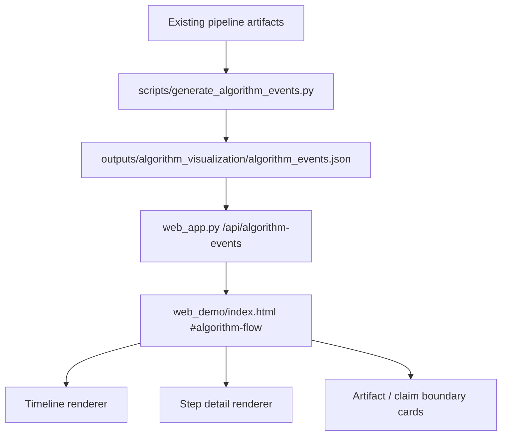

# Algorithm Event Visualizer Web Page Plan

## Summary

Add a lightweight algorithm visualization page to the existing Web Dashboard. The page borrows Algorithm Visualizer's useful mental model, `algorithm step event stream -> tracer -> renderer`, but keeps the implementation scoped to a read-only event replay for the current TunnelDefect pipeline.

This is not a code execution platform, not a new model pipeline, and not a replacement for the existing Disease Memory Bank, no-id Association, Growth Analysis, video demo, or single-image detection pages.

---

## Problem Frame

The project already produces many credible artifacts, but the Web UI mostly shows final tables, charts, videos, and reports. For teacher review, soft-copyright material, and patent-style explanation, it would help to show how the algorithmic process unfolds step by step: how KICT mask features enter the system, how simulation metadata is fused, how memory and no-id association are built, how rule-based growth hints are derived, and how recheck items are generated.

Algorithm Visualizer is useful as a reference because its public design separates the web app, algorithm content, and tracer libraries. The part worth borrowing is the separation between a step event stream and renderer, not the heavier idea of running arbitrary algorithm code in the browser or backend.

---

## Requirements

**Scope and positioning**

- R1. Add a Web Dashboard page named `算法展示` or `Algorithm Flow` that explains the current TunnelDefect processing flow as a step-by-step visual replay.
- R2. The first version must be read-only and artifact-backed; it must not execute arbitrary code, run model inference, train models, upload videos, or mutate pipeline outputs.
- R3. The page must keep the existing project boundary clear: KICT static image / mask plus simulated inspection metadata is an engineering prototype, not a verified real robot online system.

**Event stream contract**

- R4. Introduce a small algorithm event artifact that records ordered steps such as data loading, mask feature extraction, metadata fusion, engineering report generation, memory building, no-id association, growth hint generation, recheck list generation, visualization output, and video demo output.
- R5. Each event must carry enough information for explanation: stable ID, title, stage, short description, input artifacts, output artifacts, claim boundary, and optional metrics or sample records.
- R6. The event stream must be generated from existing files and metadata where practical, not by duplicating core algorithm logic.

**Renderer behavior**

- R7. The renderer should support a timeline, active-step detail card, artifact links or names, and a simple flow diagram using existing Web UI style.
- R8. Missing event artifacts or missing referenced outputs must not crash the page; the UI should show a clear "run full pipeline / demo showcase first" message.
- R9. The algorithm display must not make stronger claims than the existing reports. In particular, Growth remains a rule-based area-change hint, Association remains no-id rule evidence, and Supervision remains an optional visualization layer.

**Compatibility**

- R10. Existing pages and APIs must keep working: dashboard, engineering report, growth analysis, recheck list, visualizations, video analysis, data note, and single-image detection.
- R11. The first implementation must not modify `config/dag.yaml`, AssociationAgent scoring, MemoryAgent update logic, Growth Analysis logic, or `data/simulated/` schema.

---

## Key Technical Decisions

- KTD1. Use static generated events, not executable algorithm scripts: this keeps the page safe, deterministic, and aligned with the current artifact-first project. It avoids the large scope of Algorithm Visualizer's original "visualize algorithms from code" model.
- KTD2. Put the first event generator in `scripts/`, not inside core agents: the visualization is an explanatory layer over existing outputs. Keeping it as a script avoids coupling Memory, Association, Growth, and Web logic.
- KTD3. Serve events through a small Web API: this matches existing patterns such as `/api/video-dashboard`, `/api/project-summary`, and `/api/visualization-assets`, while keeping the frontend read-only.
- KTD4. Render with existing `web_demo/index.html` patterns: reuse the current multi-view navigation, `app-view` switching, panel styling, empty states, and table/card rendering. Do not introduce a new frontend framework.
- KTD5. Treat "tracer" as a conceptual layer for now: the first version can generate event JSON from known artifacts. A formal tracer interface can be deferred until multiple algorithm stories need to share the same contract.

---

## High-Level Technical Design

The design is intentionally one-way. Existing pipeline artifacts are read to generate a narrative event stream. The Web Dashboard reads that event stream and renders it. No UI action should rewrite source CSVs, generated reports, video artifacts, or model outputs.

---

## Implementation Units

### U1. Define and generate algorithm event artifact

- **Goal:** Create a small artifact generator that produces a stable ordered event stream for the current project flow.
- **Files:** `scripts/generate_algorithm_events.py`, `tests/test_algorithm_event_generation.py`
- **Patterns:** Follow existing script style from `scripts/validate_video_artifacts.py` and `scripts/generate_video_frame_metadata.py`: argparse entrypoint, clear validation errors, pathlib, no new dependencies.
- **Event shape:** Include `event_id`, `stage`, `title`, `description`, `inputs`, `outputs`, `claim_boundary`, `status`, and optional `metrics`.
- **Expected output:** `outputs/algorithm_visualization/algorithm_events.json`
- **Test scenarios:**
  - Generates a non-empty event list when standard demo artifacts exist.
  - Missing optional artifacts are represented as unavailable events, not crashes.
  - Required event fields are present for every event.
  - Event order is stable and starts with data input / feature extraction.
  - Claim boundaries include no-id Association, rule-based Growth, and demo video limitations.
- **Acceptance criteria:** The generator can run independently and does not modify `data/simulated/` or any existing output other than its own JSON.

### U2. Add Web API for algorithm events

- **Goal:** Expose the event artifact through a read-only endpoint.
- **Files:** `web_app.py`, `tests/test_algorithm_visualizer_api.py`
- **Patterns:** Follow `_load_video_dashboard()` and `/api/video-dashboard`: safe file reads, clear fallback payload, no crash on missing or malformed JSON.
- **Endpoint:** `/api/algorithm-events`
- **Test scenarios:**
  - Route returns a payload when `algorithm_events.json` exists.
  - Missing event JSON returns a clear message telling the user to generate algorithm visualization events first.
  - Malformed JSON does not crash the server.
  - Endpoint is read-only and does not touch `data/simulated/`.
- **Acceptance criteria:** Existing Web routes continue to pass tests, and the new route returns a stable schema for the frontend.

### U3. Add algorithm flow page to Web Dashboard

- **Goal:** Add a new navigation page that renders the event stream as a timeline plus detail panel.
- **Files:** `web_demo/index.html`, `tests/test_web_app.py`, `tests/test_algorithm_visualizer_page.py`
- **Patterns:** Reuse existing `data-app-view` navigation, `panel`, `data-section`, `robot-empty`, `data-card`, and fetch/render patterns used by video analysis and report pages.
- **UI content:**
  - Top boundary note explaining this is a visualization of generated artifacts.
  - Left or top timeline of algorithm events.
  - Step detail area with inputs, outputs, claim boundary, and metrics.
  - Simple flow diagram or cards; no large custom canvas in v1.
- **Test scenarios:**
  - Navigation includes the new page.
  - Page fetches `/api/algorithm-events`.
  - Missing events show a clear empty state.
  - Event cards render title, stage, input/output artifact names, and claim boundary.
  - Existing pages remain hidden/shown correctly via `app-view`.
- **Acceptance criteria:** The page is usable for teacher explanation without changing current data analysis behavior.

### U4. Documentation and demo instructions

- **Goal:** Document what the algorithm visualization page is and what it is not.
- **Files:** `README.md`, `docs/artifact_contract.md`, optionally `docs/algorithm_visualization_layer.md`
- **Patterns:** Match existing language around `docs/supervision_visualization_layer.md` and video demo boundaries.
- **Documentation points:**
  - The page visualizes the current artifact-backed algorithm flow.
  - It does not run arbitrary algorithm code.
  - It does not participate in Disease Memory Bank, no-id Association, Growth Analysis, model inference, or video processing.
  - Generation command is separate from `run.py --mode full_pipeline` unless a later plan explicitly integrates it.
- **Test scenarios:**
  - Documentation mentions the generated event artifact path.
  - Documentation states the no-code-execution boundary.
  - Documentation keeps KICT static mask plus simulated metadata boundary.
- **Acceptance criteria:** A reviewer can understand the feature without confusing it with a production algorithm execution platform.

---

## Scope Boundaries

**In scope for first implementation**

- Add one generated event JSON artifact.
- Add one read-only API.
- Add one Web Dashboard page.
- Reuse current static HTML / CSS / JS style.
- Cover the existing flow: KICT features, simulated metadata fusion, engineering report, memory, no-id association, growth hints, recheck list, visualization outputs, video demo outputs.

**Deferred for later**

- Interactive stepping controls with playback speed, pause, and rewind.
- Multiple algorithm stories selectable by users.
- Canvas-based graph animation.
- Formal reusable tracer classes.
- Live tracing from inside agents while `run.py` executes.

**Out of scope**

- Running arbitrary user code in the browser or backend.
- Rewriting the Web frontend in React / Vue / modern SPA stack.
- Changing `config/dag.yaml` or core pipeline semantics.
- Training, inference, video upload, real-time stream analysis, or new model integration.
- Claiming real robot online memory or verified long-term prediction.

---

## System-Wide Impact

The change should be additive. It creates a new explanatory artifact and a new UI page, but it should not become an input to existing reports or analysis scripts. The event JSON is a presentation artifact, not a source of truth for Disease Memory Bank or Association. Validation should ensure the new generator does not silently rewrite core outputs.

---

## Risks and Mitigations

- **Risk:** The feature becomes a heavy Algorithm Visualizer clone.
  - **Mitigation:** Keep v1 read-only and artifact-backed. Defer executable DSL, formal tracer classes, and canvas animation.
- **Risk:** The page overclaims algorithm certainty.
  - **Mitigation:** Every event includes `claim_boundary`; renderer surfaces those boundaries near each step.
- **Risk:** The event stream duplicates business logic and drifts from actual outputs.
  - **Mitigation:** Generate events from existing artifact presence, metadata, and small summaries. Do not recompute Memory, Association, or Growth.
- **Risk:** Frontend grows more fragile.
  - **Mitigation:** Reuse current view switching and card/table patterns; add static tests around nav, fetch path, and empty states.

---

## Acceptance Examples

- AE1. When `outputs/algorithm_visualization/algorithm_events.json` exists, opening `#algorithm-flow` shows an ordered timeline and a detail card for the first event.
- AE2. When the event JSON is missing, the page shows a clear message and does not break other dashboard pages.
- AE3. When an event describes no-id Association, the detail card states that `disease_id` is a label/evaluation reference and not a matching score input.
- AE4. When an event describes Growth Analysis, the detail card states that the result is a rule-based area-change hint, not a real long-term prediction.
- AE5. When an event describes video demo outputs, the detail card states that `tunnel_demo.mp4` is synthesized from KICT static images / masks and is not real robot continuous inspection video.

---

## Verification Plan

- Run focused generator tests: `python -m pytest tests/test_algorithm_event_generation.py -q -p no:cacheprovider`
- Run focused API/page tests: `python -m pytest tests/test_algorithm_visualizer_api.py tests/test_algorithm_visualizer_page.py -q -p no:cacheprovider`
- Run existing Web tests: `python -m pytest tests/test_web_app.py tests/test_video_dashboard.py -q -p no:cacheprovider`
- Run artifact validation: `python scripts/validate_artifacts.py --project-root .`
- Run full test suite if the implementation touches shared Web helpers: `python -m pytest -q -p no:cacheprovider`

---

## Sources and Local References

- Algorithm Visualizer public README describes a React web app that interprets visualization commands, separate algorithm repositories, and tracer libraries that extract visualization commands from code.
- Existing Web navigation and view switching live in `web_demo/index.html`.
- Existing read-only video dashboard payload and route live in `web_app.py`.
- Existing video dashboard tests live in `tests/test_video_dashboard.py`.
- Existing optional visualization boundary language lives in `docs/supervision_visualization_layer.md`.
