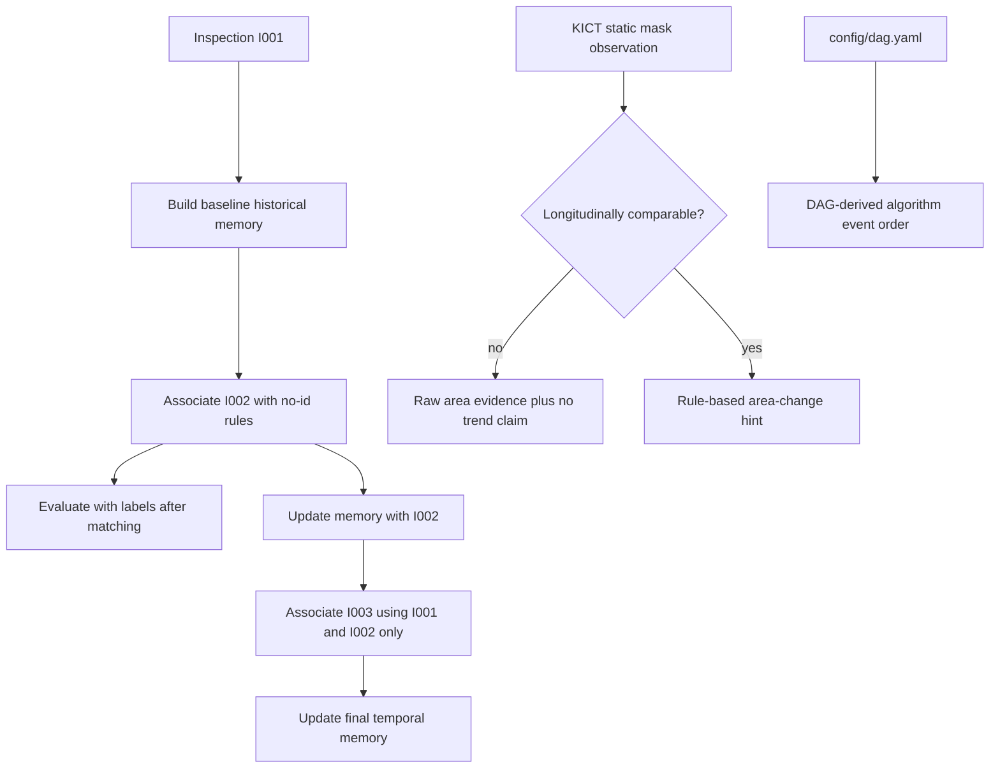

# TunnelDefect Temporal Credibility Patch 0 Plan

## Summary

Repair the temporal credibility of the main TunnelDefect pipeline without changing its model, Web, or deployment scope. The main no-id Association will use only historical memory, KICT static-mask observations will be prevented from producing longitudinal growth claims, progressive evaluation will report label-backed accuracy and failures, and the algorithm event replay will follow the real DAG.

---

## Problem Frame

The project runs end to end, but the current main pipeline builds `disease_memory_bank.csv` from all inspections before associating every frame. This lets current and future observations enter the candidate memory. Separately, `merge_kict_with_simulation.py` assigns KICT samples cyclically, while Growth Analysis interprets their area differences as if they were comparable observations of one longitudinal defect. The existing progressive evaluation avoids future-memory leakage, but it reports match counts and scores rather than correctness. The algorithm event replay also presents a dependency order that differs from `config/dag.yaml`.

Patch 0 fixes these credibility gaps while preserving the existing rule-based, CSV-backed engineering prototype. It does not claim end-to-end label-free tracking: historical memory objects are still initialized from simulated labels, while current query `disease_id` remains excluded from no-id scoring and is used only after matching for evaluation.

---

## Requirements

**History-only main association**

- R1. The first inspection establishes baseline memory and does not match against itself.
- R2. Each later inspection must be associated against a memory snapshot containing only earlier inspections; current and future inspections must never enter candidate memory.
- R3. Current query `disease_id` must remain excluded from no-id scoring, ranking, match type, confidence, conflict checks, and update decisions.
- R4. `data/simulated/disease_association_records.csv` must contain the main history-only no-id results, while with-id remains confined to progressive upper-bound evaluation artifacts.
- R5. Each main association row must expose enough history provenance to verify that its allowed memory inspections precede the query inspection.

**Observation provenance and claim gating**

- R6. `robot_kict_frame_records.csv` must carry `observation_source` and `comparability_status` from the merge stage onward.
- R7. Cyclically assigned KICT static masks must be marked as not longitudinally comparable; they must not produce `明显增长`, `轻微增长`, `基本稳定`, or `面积减小` claims.
- R8. Non-comparable records may retain raw first/last area and delta fields for audit, but reports and downstream summaries must describe them as descriptive evidence only.
- R9. Existing comparable or single-inspection inputs must retain their current guarded behavior, including `baseline_only` and `insufficient_history` semantics.

**Evaluation and validation**

- R10. Progressive no-id and with-id metrics must include evaluable count, top-1 correct count, top-1 accuracy, rejection count/rate, manual-review count/rate, and explicit error cases.
- R11. Accuracy must compare `matched_disease_id` with `label_disease_id` only after matching; labels must not feed the no-id score.
- R12. Artifact validation must reject duplicate or orphan association keys, future inspection IDs in history provenance, and incompatible comparability claims across frame, engineering, and growth artifacts.

**Algorithm event fidelity**

- R13. Core algorithm events must carry `deps` and `execution_layer` derived from `config/dag.yaml` and be emitted in a stable topological order, not from a separately hard-coded causal sequence.
- R14. Preprocessing and optional video events may remain outside the core DAG, but must be visibly identified as input preparation or an independent optional branch.

**Compatibility**

- R15. `python run.py --mode full_pipeline`, progressive evaluation, artifact validation, and existing no-id/with-id file names must remain supported.
- R16. This patch must not modify model training/inference, Web UI/API behavior, video processing, `data/simulated/` input meanings beyond the named provenance fields, or the existing Association scoring formula.

---

## Key Technical Decisions

- KTD1. Use a progressive temporal sequence for the main Association: sort inspections with the existing inspection ordering, seed memory from the first inspection, then repeat `associate query -> update memory`. This is the smallest behavior that prevents current/future leakage.
- KTD2. Extract one lightweight history-only coordinator from the orchestration already proven in `scripts/run_progressive_inspection_evaluation.py`. `AssociationAgent` remains the single-round scorer, `MemoryAgent` remains the memory builder/updater, and no new Agent hierarchy or plugin system is introduced.
- KTD3. Keep the final batch `disease_memory_bank.csv` as a reporting summary, but remove it from the main Association inputs and label it as `final summary only`. Per-round historical snapshots, not the final summary, are the candidate source of truth.
- KTD4. Add a hard comparability gate before trend classification. For `not_longitudinally_comparable`, output `growth_trend=不可比较`, retain guarded `claim_level=rule_evidence_only`, and use a descriptive-only measurement basis; raw deltas remain audit fields and cannot influence a growth claim. `baseline_only` remains reserved for a genuine single-inspection baseline.
- KTD5. Define top-1 accuracy as correct matched label divided by evaluable query records. Rejected queries remain incorrect for top-1 accuracy and are also reported separately through rejection rate; matched-only accuracy may be reported as a secondary diagnostic.
- KTD6. Derive core event order and dependency references through the existing DAG loader and scheduler. Event descriptions remain a small fixed mapping so the patch does not create a generic DSL.
- KTD7. Preserve the distinction between score-level no-id and label-backed evaluation. Historical simulated labels may seed memory identity in this prototype, but current query labels are never an Association input.

---

## High-Level Technical Design

The main Association artifact will contain only query inspections after the baseline inspection. A lightweight per-round manifest or equivalent row-level history provenance will make the allowed history auditable. The final batch memory can still support reporting, but it must not be passed into Association.

---

## Implementation Units

### U1. Propagate observation provenance and enforce comparability

- **Goal:** Prevent cyclic KICT demo samples from being interpreted as longitudinal measurements of one physical defect.
- **Files:** `scripts/merge_kict_with_simulation.py`, `scripts/generate_engineering_report.py`, `scripts/analyze_disease_growth.py`, `orchestrator/schema.py`, `orchestrator/agents/memory_agent.py`, `orchestrator/agents/final_report_agent.py`, `scripts/generate_visualization_and_recheck_list.py`, `tests/test_merge_kict_with_simulation.py`, `tests/test_generate_engineering_report.py`, `tests/test_analyze_disease_growth.py`, `tests/test_memory_agent.py`, `tests/test_final_report_agent.py`, `tests/test_artifact_schema_validation.py`
- **Approach:** Add `observation_source=kict_static_mask_cyclic_demo` and `comparability_status=not_longitudinally_comparable` during merge, propagate the most conservative group status through engineering records, and gate Growth classification before applying area/risk thresholds. Downstream reports must exclude non-comparable records from ranked growth summaries while retaining risk-based recheck priority.
- **Test scenarios:**
  - Cyclic KICT rows receive the two provenance fields and preserve existing paths/geometry.
  - Mixed group provenance resolves to the least comparable status.
  - Non-comparable multi-inspection rows output raw deltas but `growth_trend=不可比较` and no growth percentage claim in descriptions.
  - Single-inspection and explicitly comparable fixture rows retain existing behavior.
  - Memory and final report do not turn `不可比较` back into stable/increasing language.
- **Acceptance criteria:** Current KICT demo output contains no directional growth/stability claim derived from cyclic static samples, while risk and recheck artifacts remain non-empty.

### U2. Make the main Association history-only

- **Goal:** Replace full-memory matching in the main pipeline with the proven `historical memory -> query -> update` sequence.
- **Files:** `orchestrator/history_only_association.py`, `orchestrator/agents/association_agent.py`, `scripts/run_progressive_inspection_evaluation.py`, `config/dag.yaml`, `tests/test_association_agent.py`, `tests/test_progressive_inspection_evaluation.py`, `tests/test_full_pipeline_runner.py`
- **Approach:** Extract the inspection splitting, baseline memory creation, per-round query, and post-query memory update from the progressive script into one small coordinator. Add a `history_only` Association mode that delegates orchestration while preserving the existing single-round scorer and scoring formula. Remove `disease_memory_bank.csv` from main Association inputs and change the DAG dependency so Association cannot consume final batch memory.
- **Generated evidence:** Store a compact main-association manifest under `data/simulated/main_progressive/` with each query inspection, ordered history inspection IDs, memory-before path, association path, and memory-after path. Do not generate a with-id main artifact.
- **Test scenarios:**
  - I001 seeds memory and has no self-association row.
  - I002 receives only I001 memory; I003 receives only I001/I002 memory.
  - A future inspection inserted into an input fixture is absent from earlier candidate snapshots.
  - Main rows remain `use_disease_id_score=false` and `association_mode=no_id`.
  - Existing single-round Association unit tests and score outputs remain unchanged.
  - Repeated runs replace only their own main-progressive artifacts and do not reuse stale rounds.
- **Acceptance criteria:** No main association record can reference a history inspection equal to or later than its query inspection, and full pipeline output no longer includes baseline self-matches.

### U3. Add correctness, rejection, and failure-case metrics

- **Goal:** Make progressive evaluation measure matching correctness rather than only score and match volume.
- **Files:** `orchestrator/history_only_association.py`, `scripts/run_progressive_inspection_evaluation.py`, `tests/test_progressive_inspection_evaluation.py`, `tests/test_progressive_evaluation.py`
- **Approach:** Centralize metric computation beside the shared history-only coordinator. Add label-backed metrics and bounded failure examples to the JSON manifest and Markdown report for both no-id and with-id modes. Error rows should include query identifiers, expected label, matched label or rejection, score, margin, and candidate IDs.
- **Test scenarios:**
  - Correct match increments top-1 correct count.
  - Wrong matched memory appears in error cases and reduces accuracy.
  - Unmatched query increments rejection count/rate and reduces all-query top-1 accuracy.
  - Missing labels are excluded from the evaluable denominator and reported separately.
  - no-id and with-id metrics are computed independently without overwriting main output.
- **Acceptance criteria:** `outputs/association_evaluation_report.md` and the progressive manifest expose denominators, top-1 accuracy, rejection rate, manual-review rate, and inspectable failure cases.

### U4. Add cross-artifact temporal consistency checks

- **Goal:** Make artifact validation reject data that passes column schemas but violates temporal or key relationships.
- **Files:** `scripts/validate_artifacts.py`, `orchestrator/schema.py`, `tests/test_artifact_schema_validation.py`
- **Approach:** Add focused cross-file checks for composite-key uniqueness, Association-to-frame foreign keys, ordered history provenance, and comparability propagation. Keep this validation limited to Patch 0 contracts rather than creating a general relational validation framework.
- **Test scenarios:**
  - Duplicate `(image_id, frame_id, disease_id)` source or association keys fail.
  - Association rows absent from frame records fail.
  - Equal/future history inspection IDs fail.
  - Non-comparable engineering records paired with a comparable/directional Growth claim fail.
  - Current valid progressive no-id and with-id artifacts still pass mode validation.
- **Acceptance criteria:** `validate_artifacts.py` detects future leakage evidence, orphan rows, duplicate keys, and false comparability claims with file/row-specific messages.

### U5. Generate core algorithm events from the actual DAG

- **Goal:** Ensure the explanatory replay cannot contradict the configured execution graph.
- **Files:** `scripts/generate_algorithm_events.py`, `tests/test_algorithm_event_generation.py`, `tests/test_algorithm_visualizer_api.py`
- **Approach:** Load `config/dag.yaml` with `orchestrator.dag.builder`, obtain execution layers from the existing scheduler, and map known task names to concise event descriptions and artifact references. Add `deps` and `execution_layer` to core events so tasks in the same layer are not falsely presented as causally sequential. Keep KICT preparation before the DAG and video visualization as an explicitly independent optional branch.
- **Test scenarios:**
  - Every core DAG dependency appears before its dependent event and matches the event `deps` field.
  - Tasks in the same scheduler layer receive the same `execution_layer` without an invented dependency between them.
  - Growth, Memory, Association, Visualization, and Final Report order matches the patched DAG.
  - Unknown or missing configured tasks produce a clear error rather than a fabricated event.
  - Preprocessing and video events are marked outside the core DAG.
  - Existing event schema, output-path guard, and read-only API checks remain valid.
- **Acceptance criteria:** A test comparing event dependencies with `config/dag.yaml` passes, and no event description claims an input that the corresponding DAG task does not consume.

### U6. Align contracts, generated artifacts, and claim wording

- **Goal:** Make the new temporal and comparability contracts visible in project documentation and regenerated outputs.
- **Files:** `docs/artifact_contract.md`, `docs/association_rule_design.md`, `docs/algorithm_visualization_layer.md`, `README.md`, `outputs/association_evaluation_report.md`, `outputs/final_project_report.md`, `outputs/system_summary.md`, `outputs/key_insights.md`
- **Approach:** Document baseline inspection behavior, score-level no-id limits, history provenance, non-comparable KICT observations, and metric denominators. Regenerate reports through existing commands; do not manually invent result values.
- **Test scenarios:**
  - Documentation contract tests require `observation_source`, the new comparability value, and history-only wording.
  - README does not describe cyclic KICT observations as real growth or main batch memory as matching input.
  - Generated reports contain the actual evaluation metrics and no stale directional claim for non-comparable data.
- **Acceptance criteria:** Code, schemas, reports, README, and algorithm replay use one consistent temporal-credibility vocabulary.

---

## Acceptance Examples

- AE1. Given I001, I002, and I003 records, when the main pipeline runs, then I002 can see only I001 and I003 can see only I001/I002; I001 produces no self-match.
- AE2. Given a query whose `disease_id` equals a future memory label, when no-id matching runs, then the future memory is absent rather than merely assigned a lower score.
- AE3. Given three cyclic KICT static masks under one simulated disease_id, when Growth runs, then areas remain auditable but the trend is `不可比较` and the description contains no growth/stability percentage conclusion.
- AE4. Given one intentionally wrong no-id match and one rejection, when progressive evaluation runs, then both appear in failure cases and the reported top-1 accuracy and rejection rate use explicit denominators.
- AE5. Given a DAG where Growth precedes Memory and Association no longer depends on final batch Memory, when algorithm events are generated, then the event sequence and dependency references reflect that graph.

---

## Scope Boundaries

**In scope**

- History-only orchestration for main no-id Association.
- Provenance and comparability fields required to stop false longitudinal claims.
- Correctness/rejection metrics and bounded failure cases.
- Focused cross-artifact validation for temporal credibility.
- DAG-derived core algorithm event ordering.

**Out of scope**

- New segmentation models, model training, inference changes, or weight downloads.
- LLM planning, multi-Agent expansion, vector databases, SQLite migration, or a new plugin framework.
- Web UI/API redesign, frontend/backend separation, uploads, job queues, or real-time video.
- Hungarian matching, tracker integration, visual embeddings, or score-weight changes.
- Replacing simulated labels with real longitudinal ground truth.

---

## Risks and Mitigations

- **Main association row count will fall:** Baseline inspections no longer self-match. Update assertions and reports to describe baseline/query counts separately rather than preserving an incorrect count.
- **KICT demo may show no growth categories:** This is the intended truthful outcome. Preserve risk-based prioritization and raw area evidence so the demonstration remains useful without a false trend claim.
- **Final batch memory may be mistaken for candidate memory:** Add an explicit final-summary-only limit note and remove its path from Association configuration and algorithm event inputs.
- **Shared coordinator could become a second framework:** Keep it as one function-oriented module using existing Agent calls and CSV contracts; do not add registries, base classes, or new task types.
- **Evaluation labels may be mistaken for score inputs:** Keep label comparison inside metric generation after Association records have been produced, and assert this separation in tests.
- **Existing generated artifacts may be stale:** Main progressive and algorithm-event generators may replace only their own output directories/files and must record source paths and generation metadata.

---

## Verification Plan

- Run focused merge, engineering, Growth, Memory, Association, progressive, schema, algorithm-event, final-report, and full-pipeline tests.
- Regenerate `robot_kict_frame_records.csv`, then run `python run.py --mode full_pipeline` and confirm main Association excludes baseline self-matches.
- Run `python scripts/run_progressive_inspection_evaluation.py` and inspect top-1 accuracy, rejection rate, manual-review rate, and failure cases.
- Run `python scripts/generate_algorithm_events.py` and verify core event dependencies against `config/dag.yaml`.
- Run `python scripts/validate_artifacts.py --project-root .` after regeneration.
- Run `python -m pytest -q -p no:cacheprovider` as the final regression gate.
- Confirm `git diff --name-only` contains no model, Web, video, training, or dependency changes outside the files named by this plan.

---

## Sources and Local References

- `config/dag.yaml` defines the current core task dependency graph.
- `scripts/run_progressive_inspection_evaluation.py` already demonstrates history-before-query memory updates and is the behavior to reuse.
- `scripts/merge_kict_with_simulation.py` currently performs cyclic KICT sample assignment.
- `scripts/analyze_disease_growth.py` owns trend, claim-level, and comparability semantics.
- `orchestrator/agents/association_agent.py` owns the unchanged single-round no-id score.
- `orchestrator/agents/memory_agent.py` owns batch summary and incremental memory updates.
- `orchestrator/dag/builder.py` and `orchestrator/dag/scheduler.py` provide the existing DAG parser and topological execution order.
