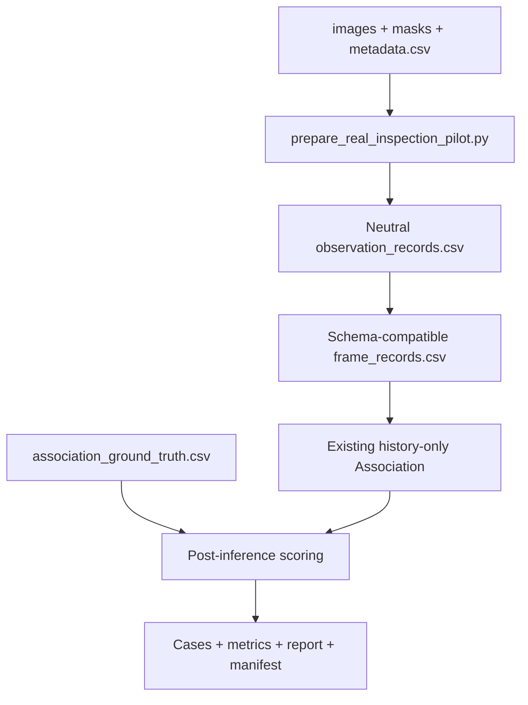

# TunnelDefect Real Inspection Association Pilot Plan

## Summary

实现一个隔离、可审计的真实双轮巡检 Pilot：先验证真实数据合同并生成现有 Association 可消费的兼容记录，再用独立 GT 对 history-only no-id Association 做真实对照评估。该计划不修改主 pipeline，不引入新匹配算法，也不输出真实 Growth 结论。

---

## Problem Frame

现有系统的时序、可比性和报告边界已经收紧，但研究证据仍来自 KICT 静态 mask、仿真巡检元数据和小规模合成 benchmark。生产 `weighted_no_id` 在当前困难 fixture 上未超过 `spatial_only`，因此下一步需要先建立真实输入和独立标签评估，而不是继续调整规则或增加展示层。

---

## Requirements

**Data contract and adaptation**

- R1. Pilot 至少包含一个 `sequence_id` 下的两个按时间排序巡检，每条观测具有 image、mask、工程 metadata 和局部观测标识。
- R2. 复合键和局部观测标识必须唯一；缺文件、重复键、非法时间、非法数值和跨轮顺序错误必须在运行前报错。同一 sequence 的巡检时间区间必须严格不重叠，无法确定先后顺序时拒绝运行。
- R3. mask 非零像素用于提取面积、bbox、中心点和尺寸；空 mask 保留在 observation audit 中并显式标记，但不得进入 Association frame records、候选池或指标分母。任一巡检过滤后没有有效观测时，该 sequence 不得运行 Association。
- R4. `observation_records.csv` 和 `frame_records.csv` 每一行都保留 `observation_source`、源 inspection、局部观测键和 `data_contract_version=real_inspection_pilot_v1`。

**Ground Truth isolation**

- R5. 兼容记录中的 `disease_id` 由 `sequence_id + association_inspection_id + local_observation_id` 生成，不直接使用跨轮标签。
- R6. 跨轮 GT 保存在独立表中，以局部观测键映射到 `global_disease_id`；development/evaluation 分组存放在独立 sequence manifest。正式 GT 必须与 `gt_audit.csv` 的最终裁决逐行一致，manifest 记录审计版本与哈希。
- R7. `global_disease_id` 仅在 Association 完成后用于评估，不进入 score、ranking、match type、confidence、conflict 或候选过滤。

**Evaluation and reporting**

- R8. Adapter 按每个 `sequence_id` 的最早时间生成 `I0001`、`I0002` 等 Association inspection ID，同时保留源巡检 ID；每个 sequence 单独调用现有 history-only coordinator，禁止跨 sequence 候选。
- R9. 同一 Pilot 只比较生产 `weighted_no_id` 与 `spatial_only`；本阶段不生成 with-id upper-bound，避免独立 GT 进入算法路径。
- R10. 报告 top-1 accuracy、accepted accuracy、拒识率、人工复核率、false match、false reject、缺标签数和错误案例，并使用本计划定义的固定分母与 GT 完整性门控。
- R11. 公式与阈值保持冻结，不在同一 Pilot 上调参；若存在多个独立 `sequence_id`，development/evaluation split 必须按 sequence 分组并写入独立 manifest。label-dependent headline 只来自同时满足 evaluation、复核批准、审计完整和 GT 完整的 sequences。

**Credibility and isolation**

- R12. 未完成尺度/配准校准的真实 mask 默认 `not_longitudinally_comparable`。
- R13. Pilot 不生成增长、减小、稳定或长期演化结论；面积只用于 Association 特征和静态审计。
- R14. 所有 Pilot 派生数据、评估产物和测试输出与 `data/simulated/`、正式 benchmark、Web 和主 DAG 隔离。
- R15. 不修改 Association 评分公式、Memory/Growth 核心规则、`config/dag.yaml`、`run.py`、Web、模型或视频链路。

---

## Key Technical Decisions

- **KTD1. Two CLIs, not a plugin framework.** 只提供 `prepare_real_inspection_pilot.py` 和 `run_real_association_pilot.py` 两个入口；校验、转换和产物检查由其内部纯函数完成，不建设 registry、抽象基类或通用数据平台。
- **KTD2. Neutral source plus compatibility projection.** `observation_records.csv` 是中性来源；`frame_records.csv` 只负责把字段投影到现有 Association 链路，避免立即重写下游 KICT 命名合同。
- **KTD3. Normalize only a strict time order.** 原始表保留 `sequence_id` 和 `source_inspection_id`；只有同一 sequence 的巡检时间区间严格不重叠时，Adapter 才按最早 `timestamp` 生成 `association_inspection_id=I0001...`。并列或重叠区间直接报错，不依赖输入行顺序。
- **KTD4. Local observation key replaces answer-bearing identity.** 兼容表中的 `disease_id` 使用 `<sequence_id>::<association_inspection_id>::<local_observation_id>`，保证跨 sequence 唯一但不表达跨轮对应关系。
- **KTD5. GT joins after inference.** `association_ground_truth.csv` 的 `global_disease_id` 仅由评分函数读取；删掉或修改 GT 后，no-id 推理 CSV 必须保持逐字节不变。
- **KTD6. Association-only evidence in this phase.** Pilot 只评估关联；真实 Growth 在配准、尺度和重复测量校准完成前保持不可比较。
- **KTD7. Isolated outputs.** 真实数据派生结果默认位于 `data/real_inspection/<dataset_id>/derived/`，评估结果位于 `outputs/real_inspection/<dataset_id>/association/`；测试始终使用 `tmp_path`。
- **KTD8. Data-first gate.** 自动化前先手工映射一组双轮小样并审计 GT；如果字段或标签无法稳定复核，只交付合同和失败报告，不宣称真实 Pilot 已验证。

---

## High-Level Technical Design



`global_disease_id` 只沿 GT 到 evaluator 的路径流动，不能出现在 D 或 E。

---

## Implementation Units

### U0. Manual two-round sample and GT audit gate

- **Goal:** 在写自动化前，用一组真实双轮小样手工映射现有字段，并复核 GT 是否能稳定回答“是否为同一病害”。
- **Deliverable:** 在 `data/real_inspection/<dataset_id>/audit/` 保存不提交原图的 `field_mapping.md`、`sequence_manifest.csv` 和 `gt_audit.csv`。sequence manifest 至少含 `sequence_id`、`split`、`review_status`；GT 审计至少含 `audit_version`、局部观测复合键、两位复核标识、各自判断、分歧原因、最终 `global_disease_id` 和 `adjudication_status`。
- **Adjudication rule:** 两位复核一致才直接通过；不一致必须由指定裁决记录给出最终标签，未裁决行不能进入 evaluation headline。
- **Gate states:** `review_status` 统一使用 `audit_pending | approved | audit_failed`。`audit_pending` 允许 U1 与 inference-only 运行但不得评分；`approved` 允许进入评分准入检查；`audit_failed` 只允许输出校验/审计错误，禁止为该 dataset 生成推理或评分产物。
- **Acceptance:** 至少一个 `sequence_id`、两轮观测、一个已确认跨轮同病害案例和一个首次出现案例通过人工复核。

### U1. One preparation CLI: contract validation plus thin adapter

- **Goal:** 用一个入口完成 preflight、时间 ID 归一化、mask 几何提取和兼容 frame records 生成。
- **Files:**
  - 新增 `docs/real_inspection_pilot_data_contract.md`
  - 新增 `scripts/prepare_real_inspection_pilot.py`，支持 `--validate-only`
  - 新增 `tests/test_real_inspection_pilot_preparation.py`
- **Raw input contract:**
  - `metadata.csv` 必须包含 `sequence_id`、`source_inspection_id`、`frame_id`、`timestamp`、`mileage_m`、`ring_id`、`clock_direction`、`image_file`、`mask_file`、`local_observation_id` 和 `disease_type`。
  - U1 preparation 可不提供 `sequence_manifest.csv`；但任意 U2 inference/evaluation 调用都必须提供该文件及 `sequence_id`、`split`、`review_status`。`split` 只能是 `development` 或 `evaluation`，`review_status` 只能是 `audit_pending`、`approved` 或 `audit_failed`。
  - `association_ground_truth.csv` 仅在评分时必需；若提供，必须包含 `sequence_id`、`source_inspection_id`、`frame_id`、`local_observation_id` 和 `global_disease_id`。缺失 GT 时只能准备推理输入，不能生成真实评估结论。
  - `camera_id`、`robot_pose` 和标定引用仅作为可选 provenance，不参与本轮打分。
- **GT quarantine inside preparation:**
  - observation/frame 派生纯函数只接收 metadata、images 和 masks，函数签名不接收 GT 或 sequence split。
  - CLI 可在独立步骤审计 GT 引用与 sequence manifest，但该结果不得过滤、增删或改写派生记录；正式 GT 必须与 `gt_audit.csv` 中 `adjudication_status=approved` 的最终裁决一致。
- **Derived outputs:**
  - `derived/observation_records.csv` 保留 source 与 association inspection ID、局部观测键、路径、中性几何字段和固定 `data_contract_version=real_inspection_pilot_v1`；空 mask 行写入 `association_eligible=false` 与 `exclusion_reason=empty_mask`。
  - `derived/frame_records.csv` 必须通过现有 `REQUIRED_SCHEMAS["robot_kict_frame_records"]`，完整包含 `image_id`、`inspection_id`、`frame_id`、`timestamp`、`mileage_m`、`mileage_text`、`ring_id`、`clock_direction`、`disease_id`、`disease_type`、`kict_image_path`、`kict_mask_path`、`kict_area_px`、`kict_bbox_x1`、`kict_bbox_y1`、`kict_bbox_x2`、`kict_bbox_y2`、`kict_center_x`、`kict_center_y`、`has_crack`、`observation_source` 和 `comparability_status`。
  - `frame_records.csv` 只包含非空且 `association_eligible=true` 的观测，并额外保留 `sequence_id`、`source_inspection_id`、`association_inspection_id` 和同一 `data_contract_version`；`inspection_id` 使用 sequence 内按最早 `timestamp` 生成的 `I0001...`，manifest 保存双向映射。
  - `image_id=<sequence_id>::<association_inspection_id>::<frame_id>`；`disease_id=<sequence_id>::<association_inspection_id>::<local_observation_id>`；`observation_source=real_inspection_mask_input`；`comparability_status=not_longitudinally_comparable`。
- **Constraints:** `kict_*` 仅是现有 schema 的兼容别名，manifest 必须明确真实来源；任一算法输入不得包含 `global_disease_id`；不修改原始数据。
- **Test scenarios:**
  - 合法双轮数据通过；单轮、空表、缺列、重复复合键、重复局部键、非法时间、负里程和 GT 孤立引用分别失败。
  - 同一 sequence 的两轮最早时间并列或时间区间重叠时失败，错误不依赖输入行顺序。
  - 无 GT 时仍能生成不含答案的 frame records，并明确标记 `evaluation_ready=false`。
  - 置换 `global_disease_id` 后重新运行完整 preparation，`observation_records.csv` 和 `frame_records.csv` 必须逐字节不变；只允许 GT audit 状态或 source hash 改变。
  - 两张派生表每行都包含相同、受支持的 `data_contract_version`；缺失或未知版本失败。
  - 审计缺行、单人复核、未裁决、GT/最终裁决不一致时，派生仍可完成，但 `evaluation_ready=false`。
  - 同图多病害可通过；空 mask 留在 observation records 但不出现在 frame records、query/candidate 或指标分母，非空 mask 的 area/bbox/center 正确。
  - manifest 记录每个 inspection 的原始、有效与排除行数及原因；任一 inspection 有效行数为 0 时 `inference_ready=false`，runner 明确拒绝该 sequence。
  - 源巡检 ID 无论命名如何，都按 timestamp 稳定映射为 `I0001...`。
  - Adapter 产物通过现有 schema validator，并按 `sequence_id` 分组真实调用现有 `run_history_only_association()` 完成 baseline + query smoke；测试证明另一 sequence 的观测不会进入候选，不得复制 coordinator。
  - 重跑仅覆盖本 dataset 的 `derived/` 或要求 `--overwrite`，不触碰正式目录。
- **Acceptance:** 覆盖 R1-R8、R12-R14；专项测试只使用 `tmp_path`。

### U2. One evaluation CLI: history-only inference, scoring and artifact checks

- **Goal:** 用一个入口复用生产 AssociationAgent 和 history-only coordinator，完成 `weighted_no_id`/`spatial_only` 推理、GT 后连接、指标计算与产物自检。
- **Files:**
  - 新增 `evaluation/real_association_pilot.py`，仅放纯评分与产物校验函数
  - 新增 `scripts/run_real_association_pilot.py`
  - 新增 `tests/test_real_association_pilot.py`
- **Inference boundary:**
  - `weighted_no_id` 直接调用生产 AssociationAgent；`spatial_only` 复用现有 benchmark baseline。
  - runner 按 `sequence_id` 分组，在各自独立 work/output 子目录调用 coordinator；推理完成后才聚合案例和指标，不得把多个 sequence 的 `I0001` 合并为同一轮或共享 memory/history artifact。
  - 每次 runner 调用必须先读取 sequence manifest；缺文件、缺 `review_status` 或非法状态必须在写 inference artifacts 前失败，禁止默认成 `audit_pending`。
  - 不生成 with-id；runner 在没有 `association_ground_truth.csv` 时仍可完成 no-id 推理，只把评分状态标为 unavailable。
  - 删除或任意修改 GT 后，两个策略的原始 inference CSV 必须逐字节不变；只有 metrics/cases 会变化或无法生成。
- **Metric semantics:**
  - `headline_eligible=true` 仅当 `split=evaluation`、`review_status=approved`、`audit_complete=true`、`gt_complete=true` 四项同时成立；未裁决、单人复核、审计缺行或 GT/裁决不一致均不满足。
  - `gt_complete=true`：sequence 中每个 query 与所有可进入历史候选池的观测都有唯一 GT。
  - `match_available_count`：在 headline-eligible sequences 中，同一全局标签至少已在历史候选池出现一次的 query 数。
  - `top1_accuracy`：使用阈值决策前的 rank-1 候选；命中 query 同一全局标签的任一历史局部观测即正确。match-available query 无候选计错误，分母为 `match_available_count`。
  - `accepted_accuracy`：只统计 headline-eligible sequences 中自动接受的记录，分母为这些自动接受记录数。
  - `false_match`：在 headline-eligible sequence 中自动接受错误标签，或自动接受历史 GT 已确认不存在同标签候选的新病害；人工复核不计 false match，rate 分母为自动接受记录数。
  - `false_reject`：match-available query 输出 reject；确认的新病害 reject 是正确拒识，rate 分母为 `match_available_count`。
  - 任一 query 或历史候选缺 GT 时计入 `missing_label_count`，该 sequence 标记 `gt_complete=false`，不进入 label-dependent headline。
  - `rejection_rate` 和 `manual_review_rate` 作为独立 operational metrics，以全部 Association-eligible query records 为分母并按 split 分开报告；空 mask 与被排除观测不进入分母，不得使用 headline accuracy 的样本范围标签。
  - 任一分母为 0 时对应比率写为 `null`，并显式记录 denominator=0，不能写成 0%。
- **Split policy:**
  - 公式和阈值冻结；只有一个 sequence 的首个 Pilot 只能标记为 `evaluation`，不得用于调参。
  - 多 sequence 时由独立 `sequence_manifest.csv` 按完整 `sequence_id` 分配 development/evaluation，任何组不得跨 split；manifest 记录分配与源哈希。
  - headline 只汇总 `headline_eligible=true` sequences；development、不完整 GT、未批准审计和 pooled 指标必须单独标注，不能替代最终结论。
- **Artifacts:** `association_cases.csv`、`association_metrics.json`、`association_report.md`、`association_pilot_manifest.json`；manifest 记录 `data_contract_version`、`sequence_manifest.csv`、`gt_audit.csv` 与正式 GT 的哈希及审计版本。runner 完成前必须校验缺文件、审计/GT 一致性、哈希、history provenance、路径和 split 泄漏。
- **Test scenarios:**
  - 两个 sequence 使用相同 local ID、相同 I0001/I0002 和相近里程时，各自 I001 仍只建 baseline，I002 看不到当前/未来或另一 sequence 候选；future row、重复 query key 和孤立 GT 明确失败。
  - Spy 证明 Association context 无 `global_disease_id`；无 GT 推理成功；修改 GT 后 inference artifacts 哈希不变。
  - set-valued GT、正确/错误匹配、拒识、人工复核、新病害与缺标签进入正确分母，错误案例稳定排序。
  - 同一 sequence 跨 development/evaluation 必须失败；headline 不得混入 development 或 `gt_complete=false` sequence；单 sequence 不得生成调参结论。
  - 状态测试覆盖缺 manifest 阻断、显式 `audit_pending` 放行 inference-only、`approved` 进入评分准入、`audit_failed` 在推理前阻断；任何缺失状态不得隐式回退。
  - 缺任一 artifact、哈希不一致、绝对路径或 stale 文件均失败；正式目录哈希保持不变。
- **Acceptance:** 覆盖 R7-R15，且不建立第三个 CLI 或第二套 validator 框架。

### U3. Documentation and end-to-end Pilot acceptance

- **Goal:** 给出真实数据准备、运行、结果解释和 claim boundary 的最短可执行说明。
- **Files:**
  - 新增 `docs/real_inspection_association_pilot.md`
  - 更新 `README.md` 的真实数据接入章节，仅在功能实现并通过验收后把规划改为已实现。
  - 扩展 `tests/test_documentation_runtime_contract.py`
- **Constraints:** 不添加 Web 页面或上传说明；没有真实样本时明确写“合同测试通过，不等于真实验证完成”。
- **Test scenarios:**
  - 文档命令与 CLI `--help` 一致。
  - 文档明确 GT 仅用于 post-inference evaluation。
  - 文档明确 mask 像素面积不等于物理变化，Pilot 不输出 Growth claim。
  - 文档不出现“生产级、真实长期预测、替代人工检测”等夸大表述。
- **Expected outcome:** 老师或评审能区分“Adapter 可运行”“真实 Pilot 已评估”和“真实长期变化已验证”三个不同状态。
- **Acceptance:** 覆盖 R12-R15。

---

## Sequencing

1. U0 先手工审计真实双轮小样和 GT；`audit_pending` 可继续做 inference-only，`audit_failed` 在推理前阻断该 dataset，只有 `approved` 才进入 headline 准入。
2. U1 用单一 preparation CLI 锁定合同、归一化时间 ID 并生成兼容输入。
3. U2 用单一 evaluation CLI 运行 history-only 策略、GT 后评分和产物自检；任何标签泄漏测试失败即停止。
4. U3 完成文档与端到端验收；真实数据缺失时只宣称合同与工程入口完成。

---

## Risks and Mitigations

| Risk | Consequence | Mitigation |
|---|---|---|
| 没有真实双轮数据 | 只能完成 Adapter 和合同测试 | 把真实 Pilot 指标设为独立验收门槛，不用 synthetic fixture 冒充 |
| GT 进入算法输入 | no-id 指标失真 | 独立 GT 文件、post-inference join、Spy 测试和 manifest allowed inputs |
| 源 inspection ID 无自然排序 | history-only 轮次错误 | 按 sequence 的最早 timestamp 归一化为 `I0001...` 并保留双向映射 |
| 局部 ID 在不同轮次或 sequence 重复 | candidate/result 映射歧义 | 统一生成 `<sequence_id>::<association_inspection_id>::<local_observation_id>` |
| mask 面积受视角和尺度影响 | 形成虚假 Growth 结论 | 默认不可纵向比较，本阶段只做 Association |
| weighted_no_id 仍不优于 spatial_only | 研究假设不成立 | 如实报告，并用错误案例决定是否值得做视觉特征消融 |
| 真实数据含隐私或本机路径 | 无法开源或提交材料 | 只写相对路径、原始数据默认不提交、报告做路径扫描 |

---

## Verification

实施完成后至少运行：

```bash
python -m pytest tests/test_real_inspection_pilot_preparation.py -q -p no:cacheprovider
python -m pytest tests/test_real_association_pilot.py -q -p no:cacheprovider
python scripts/validate_artifacts.py --project-root .
python -m pytest -q -p no:cacheprovider
```

真实 Pilot 数据可用时，还需完成一次隔离的 `prepare --validate-only -> prepare -> run` 闭环，并记录真实样本数、GT 覆盖率、split manifest、策略指标和全部错误案例。没有真实数据时，该项必须标记为未验证，不能用单元测试代替。

---

## Completion Criteria

- U0-U3 的验收项全部通过。
- 算法输入和 Association context 中不存在 `global_disease_id`。
- I001 baseline 与后续 history-only 规则保持不变。
- 同一真实 Pilot 上可复现比较 `weighted_no_id` 与 `spatial_only`。
- Pilot 结果不产生方向性 Growth claim，主 pipeline 和正式 artifacts 无变化。
- 全量测试和现有 artifact validator 通过。

---

## Sources / Research

- `docs/brainstorms/2026-07-15-real-inspection-association-pilot-requirements.md`
- `README.md`
- `config/dag.yaml`
- `orchestrator/history_only_association.py`
- `orchestrator/agents/association_agent.py`
- `evaluation/association_benchmark.py`
- `scripts/run_progressive_inspection_evaluation.py`
- `scripts/generate_engineering_report.py`
- `outputs/association_benchmark/association_benchmark_report.md`
- `tests/test_history_only_association.py`
- `tests/test_association_benchmark.py`
